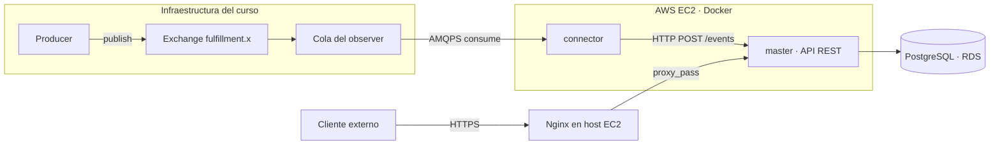

# EnergyShark — IIC2173 · Entrega 0

Plataforma observadora del flujo de energía eléctrica entre ciudades. Consume eventos publicados por la infraestructura del curso en RabbitMQ (AMQP), los persiste en PostgreSQL y expone una API REST para consultar el historial de demanda.

## Estado del proyecto

| Etapa | Estado |
| --- | --- |
| 0 — Plan Maestro | Completado |
| 1 — Preparación del entorno | Completado |
| 2 — Diseño de arquitectura | Completado |
| 3 — PoC RabbitMQ | Verificado localmente (CP-L3) |
| 4 — Servicio `master` (local) | Verificado localmente (CP-L4) |
| 5 — Servicio `connector` (local) | Verificado localmente (CP-L5) |
| 6 — Dockerización + Docker Compose | Verificado localmente (CP-L6) |
| 7 — Infraestructura AWS (EC2 + RDS) | Verificado en producción (CP-P1) |
| 8 — Primer despliegue en EC2 (MVP) | Verificado en producción (CP-P2) |
| 9 — Dominio y DNS | Verificado en producción (CP-P3) |
| 10 — Nginx reverse proxy | Verificado en producción (CP-P4) |
| 11 — HTTPS con Let's Encrypt | Verificado en producción (CP-P5) |
| 12 — Resiliencia y health checks | Verificado en producción (CP-P6) |
| 13 — Trazabilidad y auditoría | Completado (CP-L7) |
| 14 — Documentación de IA y bitácora | Completado (DOC-1) |
| 15 — Entrega final | Completado (CP-P7) |

Índice completo y trazabilidad: [`etapas/README.md`](etapas/README.md) y [`etapas/etapa-00-plan-maestro.md`](etapas/etapa-00-plan-maestro.md).

## Arquitectura



| Componente | Responsabilidad | Tecnología |
| --- | --- | --- |
| `connector` | Consume la cola AMQP del observer, parsea el JSON, se reconecta automáticamente y reenvía cada evento a `master` por HTTP POST | NestJS standalone + amqplib |
| `master` | API REST: recibe eventos, asigna `receivedAt` (UTC), persiste y sirve el historial paginado y filtrable | NestJS + TypeORM |
| PostgreSQL | Persistencia del historial de eventos | RDS en producción, contenedor en desarrollo |
| Nginx | Reverse proxy en el host: dominio → `master`, HTTPS | Nginx + Let's Encrypt/Certbot |

## Stack

- TypeScript · NestJS · amqplib
- PostgreSQL
- Docker · Docker Compose
- AWS EC2 · AWS RDS (Free Tier)
- Nginx (instalado en el host de EC2)
- Dominio Namecheap · Let's Encrypt · Certbot
- Ubuntu en EC2

## Estructura del repositorio

```text
/
├── apps/
│   ├── connector/          ← Consumidor AMQP + reenvío HTTP (NestJS standalone)
│   │   ├── Dockerfile      ← Imagen multi-stage
│   │   └── poc/            ← PoC de la Etapa 3 (referencia)
│   └── master/             ← API REST NestJS
│       └── Dockerfile      ← Imagen multi-stage
├── compose.yaml            ← Docker Compose de desarrollo (master + connector + postgres)
├── etapas/                 ← Documentación por etapas (una etapa = un archivo)
├── ai_docs/prompts/        ← Registro obligatorio del uso de IA
├── docs/bitacora.md        ← Bitácora técnica del proyecto
├── infra/nginx/            ← Configuraciones de Nginx versionadas
└── README.md
```

## Requisitos del enunciado

| ID | Requisito | Estado |
| --- | --- | --- |
| RF1 | Historial de demanda eléctrica | Verificado en producción |
| RF2 | Detalle de un registro (`/history/{id}`) | Verificado en producción |
| RF3 | Paginación (default 25) | Verificado en producción |
| RF4 | Filtros (`type`, `idpk`, `receivedAt`/rangos, `validUntil`, `city`, `unit`, `demand`) | Verificado en producción |
| RNF-1 | Separación de servicios `connector`/`master` | Verificado en producción |
| RNF-2 | `connector` → `master` vía HTTP POST | Verificado en producción |
| RNF-3 | Reconexión automática a RabbitMQ | Verificado en producción |
| RNF-4 | `master` operativo sin RabbitMQ/connector | Verificado en producción |
| RNF-5 | Dockerización + HEALTHCHECK por contenedor | Verificado localmente |
| RNF-6 | Docker Compose (master + connector + postgres local) | Verificado localmente |
| RNF-7 | Despliegue en AWS (EC2 + RDS, Free Tier) | Verificado en producción |
| RNF-8 | Dominio público y DNS hacia EC2 | Verificado en producción |
| RNF-9 | Nginx reverse proxy instalado en el host | Verificado en producción |
| RNF-10 | HTTPS con Let's Encrypt + renovación automática | Verificado en producción |
| DOC, ENT | Documentación de IA, entrega | Completados |

Matriz de trazabilidad completa: `etapas/etapa-00-plan-maestro.md` (sección 5).

## Entrega (E0 · IIC2173 · EnergyShark)

**Dominio (API):** https://persito.online

**IP de la instancia:** 3.216.254.80

**Acceso SSH:**

```bash
ssh -i ~/.ssh/energyshark.pem energyshark@3.216.254.80
```

> El archivo `.pem` se entrega por el **buzón de Canvas** y **no** está en este repositorio (verificado con `git ls-files`).

**Consideraciones generales:**

- Stack: TypeScript · NestJS · TypeORM · amqplib · PostgreSQL · Docker · Nginx · AWS (EC2 + RDS).
- Arquitectura: `connector` (consumidor AMQP + reenvío HTTP) y `master` (API REST + persistencia), desplegados con Docker Compose en una EC2 Free Tier y PostgreSQL en RDS.
- Exposición pública: Nginx en el host (reverse proxy) + HTTPS con Let's Encrypt (renovación automática 2×/día).
- Broker del curso: consumido por `connector` desde `observer.45.q` (AMQPS/TLS).

**Puntos logrados / no logrados:**

| Ámbito | Aspecto | Estado |
| --- | --- | --- |
| Parte mínima | RF1 — Historial de demanda en la API | Logrado (producción) |
| Parte mínima | RF2 — Detalle `/history/:id` | Logrado (producción) |
| Parte mínima | RF3 — Paginación (default 25) | Logrado (producción) |
| Parte mínima | RF4 — Filtros (`type`, `idpk`, `receivedAt`/rangos, `validUntil`, `city`, `unit`, `demand`) | Logrado (producción) |
| Parte mínima | RNF1 — `connector` AMQP + reconexión + master sin broker | Logrado (producción) |
| Parte mínima | RNF2 — Containerizado, `master` recibe de `connector` | Logrado (producción) |
| Parte mínima | RNF3 — Proxy inverso Nginx en el host | Logrado (producción) |
| Parte mínima | RNF4 — Dominio público | Logrado (producción) |
| Parte mínima | RNF5 — EC2 Free Tier | Logrado (producción) |
| Parte mínima | RNF6 — PostgreSQL externo (RDS) | Logrado (producción) |
| Parte mínima | RNF7 — HEALTHCHECK por contenedor | Logrado (producción) |
| Docker-Compose | RNF1 — `master` desde Compose | Logrado |
| Docker-Compose | RNF2 — DB integrada desde Compose | Logrado |
| Docker-Compose | RNF3 — `connector` desde Compose + red con la app | Logrado |
| Variable elegida | HTTPS — SSL Let's Encrypt | Logrado |
| Variable elegida | HTTPS — Redirección HTTP→HTTPS | Logrado |
| Variable elegida | HTTPS — Renovación automática (≥ 2×/día) | Logrado |
| — | Documentación de IA (`ai_docs/prompts`) | Logrado (DOC-1) |
| — | README de entrega | Logrado (DOC-2) |

**Documentación:**

- **Etapas y avance:** [`etapas/README.md`](etapas/README.md)
- **Bitácora técnica:** [`docs/bitacora.md`](docs/bitacora.md)
- **Registro de uso de IA:** [`ai_docs/`](ai_docs/)

## Reglas de seguridad

- Los archivos `.env` **nunca** se versionan (solo `.env.example`).
- El archivo `.pem` de EC2 **jamás** se sube al repositorio.
- Contraseñas y access keys viven únicamente en archivos locales fuera del control de versiones.
- En producción, los secretos se guardan en el host EC2, no en el repositorio.
- El endpoint interno `POST /events` está protegido por un secreto compartido (`INTERNAL_TOKEN`) entre `connector` y `master`.

## Quickstart

### Con Docker Compose (recomendado)

```bash
cp .env.example .env   # completar credenciales (RABBITMQ_URL, DB_*, INTERNAL_TOKEN, etc.)
docker compose up --build -d   # postgres + master + connector (red interna)
docker compose ps              # los tres contenedores deben estar "healthy"
curl http://localhost:3000/health   # { "status": "ok", "db": "up" }
```

> Generar `INTERNAL_TOKEN` con `openssl rand -hex 32` y usar el **mismo valor** en `master` y `connector`.

### Sin Docker (servicios locales)

```bash
# 1. PostgreSQL de desarrollo (contenedor)
docker run -d --name energy-postgres -e POSTGRES_USER=postgres -e POSTGRES_PASSWORD=postgres \
  -e POSTGRES_DB=energy_db -p 5432:5432 -v energy_pgdata:/var/lib/postgresql/data postgres:16

# 2. API master (NestJS)
cd apps/master && npm install && npm run migration:run && npm run start

# 3. Connector (consumo AMQP + reenvío)
cd apps/connector && npm install && npm run start
```

Flujo end-to-end verificado en local y en contenedores: RabbitMQ → connector → master → PostgreSQL.

## Uso de IA

Todo el trabajo asistido por herramientas de IA queda registrado en [`ai_docs/prompts/`](ai_docs/prompts/) según lo exige el enunciado (requisito DOC-1).
