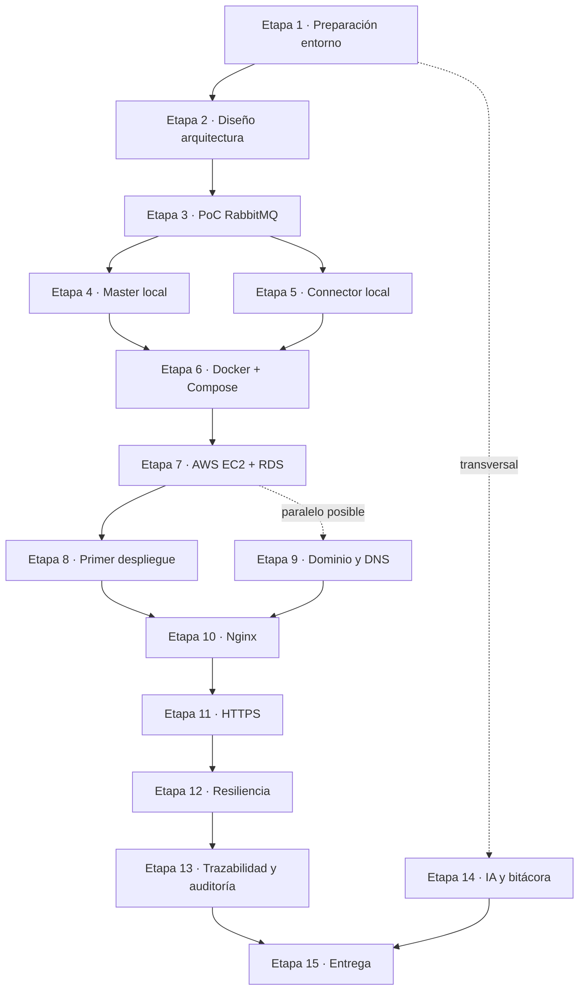

# Etapa 0 — Plan Maestro de Desarrollo (EnergyShark · IIC2173 · Entrega 0)

> **Propósito de este documento:** ser el mapa general del proyecto. Contiene el roadmap completo, la trazabilidad de requisitos, las dependencias entre etapas y los puntos de verificación. **No desarrolla las etapas en profundidad**: cada etapa se desarrolla en su propio archivo dentro de `etapas/`.

---

## 1. Objetivo del proyecto

EnergyShark es una plataforma relacionada con el flujo de energía eléctrica entre ciudades. Para la Entrega 0 se debe construir una aplicación desplegada en la nube que:

1. Se conecte a RabbitMQ mediante AMQP y consuma mensajes de la cola asignada al observer.
2. Parsee los eventos JSON recibidos desde la infraestructura del curso.
3. Registre cada evento en PostgreSQL con un timestamp de recepción `receivedAt` (UTC).
4. Exponga una API REST para consultar el historial de eventos (lista paginada, detalle por id y filtros).

**Arquitectura obligatoria:** `connector` (consumidor AMQP, reconexión automática, reenvía por HTTP POST) + `master` (API REST + persistencia) + PostgreSQL (RDS en producción) + Nginx en el host EC2 (reverse proxy, HTTPS).

**Stack:** TypeScript, NestJS, cliente RabbitMQ (amqplib), PostgreSQL, Docker, Docker Compose, AWS EC2, AWS RDS, Nginx en host, dominio Namecheap, Let's Encrypt/Certbot, Ubuntu en EC2.

---

## 2. Estructura del repositorio

```text
/
├── etapas/                  ← Documentación por etapas (un archivo .md por etapa)
├── ai_docs/prompts/         ← Registro obligatorio del uso de IA
├── apps/
│   ├── master/              ← API REST NestJS
│   └── connector/           ← Consumidor AMQP + reenvío HTTP
├── infra/nginx/             ← Configuraciones de Nginx versionadas
├── docs/                    ← Documentación general del proyecto
└── README.md
```

Reglas:

- `.env` y secretos NO se versionan (`.gitignore`).
- El archivo `.pem` de EC2 **jamás** se sube al repositorio.
- Configuraciones de Nginx se versionan en `infra/nginx/`.

---

## 3. Roadmap completo

### Etapa 1 — Preparación del entorno local y de trabajo
**Archivo:** `etapa-01-preparacion-entorno.md`

- **1.1 Preparación del computador local**
  - Instalar Git, Node.js LTS, npm, Docker Desktop (+ Compose), editor
  - Instalar herramientas de soporte: `psql`, AWS CLI, `curl`, `jq`
  - Verificar versiones de todo
- **1.2 Cuentas y credenciales**
  - GitHub: crear cuenta (si no existe) y repositorio del proyecto
  - AWS: cuenta (Free Tier/Educate), MFA, usuario IAM, access keys, `aws configure`
  - RabbitMQ: host, puerto, credenciales y cola asignada del curso
  - Dominio Namecheap
- **1.3 Estructura del repositorio**
  - Monorepo: `apps/`, `etapas/`, `ai_docs/prompts/`, `infra/nginx/`
  - `.gitignore`, README inicial, bitácora, registro de IA
- **Checkpoint `[L]`:** entorno y cuentas listos

### Etapa 2 — Fundamentos teóricos y diseño de arquitectura
**Archivo:** `etapa-02-diseno-arquitectura.md`

- **2.1 Conceptos esenciales:** AMQP/RabbitMQ, NestJS y DI, Docker/Compose, AWS (VPC/SG/EC2/RDS), Nginx, DNS, HTTPS, health checks, resiliencia, UTC
- **2.2 Arquitectura lógica:** componentes, diagramas de flujo, contrato `connector → master`
- **2.3 Modelo de datos:** decisión columnas vs JSONB, tabla `history`, índices, `receivedAt` en UTC
- **2.4 API REST:** `POST /events`, `GET /history` (paginación + filtros), `GET /history/:id`, `GET /health`
- **2.5 Configuración por entorno:** variables dev/prod, estrategia de secretos
- **Checkpoint `[L]`:** diseño documentado y versionado

### Etapa 3 — Prueba de concepto: conexión a RabbitMQ
**Archivo:** `etapa-03-poc-rabbitmq.md`

- **3.1 Script mínimo AMQP:** conexión al broker, cola asignada, consumo
- **3.2 Parsing JSON:** recibir un evento de prueba y validar estructura
- **3.3 Desconexión/reconexión:** simular caída del broker, verificar reconexión automática
- **Checkpoint `[L]`:** PoC recibe, parsea y se reconecta

### Etapa 4 — Servicio `master` (API REST + PostgreSQL local)
**Archivo:** `etapa-04-master-api-local.md`

- **4.1 Scaffold NestJS** del proyecto `master`
- **4.2 PostgreSQL local** (contenedor Docker para desarrollo)
- **4.3 Entidad y migraciones:** tabla `history`, id propio, `receivedAt`
- **4.4 `POST /events`:** ingesta interna desde `connector`
- **4.5 Consultas:** `GET /history` (RF1, RF3, RF4) y `GET /history/:id` (RF2)
- **4.6 Pruebas manuales con `curl`:** paginación, filtros, detalle
- **Checkpoint `[L]`:** RF1–RF4 verificados localmente

### Etapa 5 — Servicio `connector` (local)
**Archivo:** `etapa-05-connector-local.md`

- **5.1 Scaffold** del servicio standalone
- **5.2 Consumidor AMQP robusto:** reconexión automática con backoff
- **5.3 Reenvío HTTP:** `POST /events` a `master` con reintentos; ack solo tras 2xx
- **5.4 Logging estructurado**
- **5.5 Integración local end-to-end:** RabbitMQ → connector → master → DB
- **Checkpoint `[L]`:** flujo completo en local

### Etapa 6 — Dockerización y Docker Compose
**Archivo:** `etapa-06-docker-compose.md`

- **6.1 Dockerfile de `master`** (multi-stage)
- **6.2 Dockerfile de `connector`**
- **6.3 Docker Compose de desarrollo:** `master` + `connector` + `postgres`, red interna
- **6.4 HEALTHCHECK por contenedor** (API real para `master`; validación operativa para `connector`; `pg_isready` para postgres)
- **6.5 Pruebas con Compose:** build, arranque, comunicación, health checks, logs
- **Checkpoint `[L]`:** sistema completo en contenedores

### Etapa 7 — Infraestructura AWS: EC2 + RDS
**Archivo:** `etapa-07-aws-ec2-rds.md`

- **7.1 Teoría AWS:** VPC, subnets, Security Groups, EC2, RDS
- **7.2 EC2:** key pair `.pem` (fuera del repo), instancia Ubuntu Free Tier, Security Groups (SSH solo mi IP, 80, 443)
- **7.3 Acceso SSH y hardening básico** (usuario propio, actualizaciones)
- **7.4 Docker Engine + Compose plugin en EC2**
- **7.5 Elastic IP** asociada a la instancia
- **7.6 RDS PostgreSQL:** creación Free Tier, SG solo desde EC2, prueba de conexión con `psql`
- **Checkpoint `[P]`:** infraestructura AWS lista

### Etapa 8 — Primer despliegue en producción (MVP en EC2)
**Archivo:** `etapa-08-primer-despliegue.md`

- **8.1 Código en EC2:** clonar repo, `.env` de producción en el host
- **8.2 Compose de producción:** `master` + `connector`, conexión a RDS
- **8.3 Verificación end-to-end en producción** (evento real → RDS → API)
- **8.4 Procedimiento de despliegue/rollback documentado**
- **Checkpoint producción #1 `[P]`:** MVP funcionando en AWS

### Etapa 9 — Dominio y DNS
**Archivo:** `etapa-09-dominio-dns.md`

- **9.1 Dominio en Namecheap**
- **9.2 Registro A** → Elastic IP de EC2
- **9.3 Verificación de propagación** (`dig`, verificadores online)
- **Checkpoint `[P]`:** dominio resuelve a la EC2

### Etapa 10 — Nginx como reverse proxy (en el host)
**Archivo:** `etapa-10-nginx-reverse-proxy.md`

- **10.1 Instalación de Nginx en la EC2** (no en contenedor)
- **10.2 Server block HTTP:** `server_name` del dominio, `proxy_pass` a `master`
- **10.3 Cierre de puertos directos** vía Security Groups
- **10.4 Logs de Nginx**
- **Checkpoint `[P]`:** API accesible por dominio vía Nginx (HTTP)

### Etapa 11 — HTTPS con Let's Encrypt (parte variable elegida)
**Archivo:** `etapa-11-https-letsencrypt.md`

- **11.1 Instalación de Certbot** (plugin Nginx)
- **11.2 Emisión del certificado**
- **11.3 Configuración HTTPS:** server block 443, redirección HTTP → HTTPS
- **11.4 Renovación automática** (timer/cron, chequeo ≥ 2 veces al día, dry-run)
- **11.5 Verificación del certificado** (navegador, `openssl`)
- **Checkpoint producción #2 `[P]`:** HTTPS activo y auto-renovable

### Etapa 12 — Pruebas de resiliencia y health checks
**Archivo:** `etapa-12-resiliencia-healthchecks.md`

- **12.1 Caída/recuperación de RabbitMQ** (connector no termina, reconecta solo)
- **12.2 Reinicios de `connector` y `master`**
- **12.3 Consultas a `/history` durante fallos** (master sigue operativo)
- **12.4 Volumen de datos:** miles de eventos, paginación profunda, filtros + índices
- **12.5 Health checks en producción** (`docker ps`, `docker inspect`)
- **12.6 Revisión de logs** (reconexiones, errores, envíos)
- **Checkpoint `[P]`:** resiliencia verificada en producción

### Etapa 13 — Trazabilidad de requisitos y auditoría
**Archivo:** `etapa-13-trazabilidad-auditoria.md`

- **13.1 Matriz de trazabilidad actualizada** con evidencia por requisito
- **13.2 Auditoría completa contra el enunciado**
- **13.3 Cierre de brechas** detectadas
- **Checkpoint `[L+P]`:** auditoría cerrada

### Etapa 14 — Documentación de uso de IA y bitácora
**Archivo:** `etapa-14-documentacion-ia-bitacora.md`

- **14.1 Registro en `ai_docs/prompts`:** prompts, respuestas e interacciones relevantes
- **14.2 Bitácora técnica completa**
- **14.3 Verificación final del registro de IA**
- **Checkpoint `[L]`:** documentación de IA completa

### Etapa 15 — Preparación de la entrega final
**Archivo:** `etapa-15-entrega-final.md`

- **15.1 README completo** (arquitectura, despliegue, requisitos logrados/no logrados)
- **15.2 Checklist final de producción** (servicios healthy, dominio, HTTPS, RabbitMQ, paginación, filtros)
- **15.3 Accesos para Canvas + archivo `.pem`** (verificar que NO está en GitHub)
- **15.4 Verificación end-to-end final en producción**
- **Checkpoint final `[P]`:** entrega lista

---

## 4. Dependencias entre etapas



Notas:

- Las etapas 4 y 5 pueden desarrollarse en paralelo tras la 3.
- La etapa 9 (dominio/DNS) puede adelantarse durante la 7/8 para esperar la propagación.
- La etapa 14 es transversal: se alimenta continuamente desde la etapa 1 y se cierra antes de la 15.
- La línea punteada indica que se puede iniciar antes de terminar la etapa anterior.

---

## 5. Matriz de trazabilidad de requisitos (estado inicial)

| Requisito | Descripción | Etapa(s) del plan | Estado |
| --- | --- | --- | --- |
| RF1 | Historial de demanda eléctrica (lista con campos relevantes) | 4, 8 | Verificado en producción |
| RF2 | Detalle de un registro (`/history/{id}` con id propio) | 4, 8 | Verificado en producción |
| RF3 | Paginación (default 25, `?page=2&limit=25`) | 4, 12 | Verificado en producción |
| RF4 | Filtros sobre propiedades (incl. `receivedAt` y fechas) | 2, 4, 12 | Verificado en producción |
| RNF-1 | Separación de servicios `connector` / `master` | 4, 5, 6 | Verificado localmente |
| RNF-2 | `connector` → `master` vía HTTP POST | 2, 5 | Verificado localmente |
| RNF-3 | Resiliencia: reconexión automática a RabbitMQ | 3, 5, 12 | Verificado localmente |
| RNF-4 | `master` operativo sin RabbitMQ/connector | 4, 12 | Verificado localmente |
| RNF-5 | Dockerización + HEALTHCHECK por contenedor | 6 | Verificado localmente |
| RNF-6 | Docker Compose (master + connector + postgres local) | 6 | Verificado localmente |
| RNF-7 | Despliegue en AWS (EC2 + RDS, Free Tier) | 7, 8 | Verificado en producción |
| RNF-8 | Dominio público y DNS hacia EC2 | 9 | Pendiente |
| RNF-9 | Nginx reverse proxy instalado en el host | 10 | Pendiente |
| RNF-10 | HTTPS con Let's Encrypt + renovación automática (≥ 2×/día) | 11 | Pendiente |
| DOC-1 | Documentación de uso de IA (`ai_docs/prompts`) | 1, 14 | Pendiente |
| DOC-2 | README completo y requisitos logrados/no logrados | 15 | Pendiente |
| ENT-1 | Accesos para Canvas + `.pem` entregado, NO en GitHub | 15 | Pendiente |

**Estados posibles:** `Pendiente` · `En progreso` · `Verificado localmente` · `Verificado en producción` · `Completado`

> Esta matriz se actualiza en la Etapa 13 (y parcialmente al cierre de cada etapa).

---

## 6. Puntos de verificación local `[L]`

| Checkpoint | Descripción | Etapa |
| --- | --- | --- |
| CP-L1 | Herramientas locales, cuentas y repositorio listos | 1 |
| CP-L2 | Arquitectura diseñada y versionada | 2 |
| CP-L3 | PoC RabbitMQ: conexión, consumo, parsing y reconexión | 3 |
| CP-L4 | RF1–RF4 verificados en local (API + PostgreSQL) | 4 |
| CP-L5 | Flujo end-to-end local (RabbitMQ → connector → master → DB) | 5 |
| CP-L6 | Sistema completo en contenedores con health checks | 6 |
| CP-L7 | Trazabilidad y registro de IA completos | 13, 14 |

## Puntos de verificación en producción `[P]`

| Checkpoint | Descripción | Etapa |
| --- | --- | --- |
| CP-P1 | Infraestructura AWS lista (EC2 operativa + RDS alcanzable) | 7 |
| CP-P2 | MVP desplegado y funcionando en EC2 (evento real → RDS → API) | 8 |
| CP-P3 | Dominio resolviendo correctamente a la EC2 | 9 |
| CP-P4 | Nginx sirviendo la API por el dominio (HTTP) | 10 |
| CP-P5 | HTTPS activo, redirección HTTP→HTTPS, renovación automática | 11 |
| CP-P6 | Resiliencia y health checks verificados en producción | 12 |
| CP-P7 | Verificación end-to-end final y entrega lista | 15 |

---

## 7. Sección opcional — Opcional / Alternativa a HTTPS

> **Balanceo de carga con Nginx** (solo si se reemplaza la parte variable de HTTPS por esta alternativa). No se mezcla con la implementación principal.

Cambios necesarios respecto al plan principal:

1. Levantar **≥ 2 instancias del contenedor `master`** en puertos internos distintos (ej. 3000 y 3001).
2. Nginx (en el host) alcanza cada instancia individualmente y define un bloque `upstream`.
3. Configurar estrategia de distribución (round-robin, least_conn, etc.).
4. Consideraciones: persistencia única en RDS, health checks por instancia, comportamiento ante caída de una réplica.
5. Qué se elimina o simplifica de la Etapa 11 (HTTPS) si se elige esta opción.

**Estado:** No seleccionada. La parte variable elegida es **HTTPS con Let's Encrypt** (Etapa 11).

---

## 8. Reglas de desarrollo progresivo

1. Una etapa a la vez; cada una se desarrolla en su archivo `.md` correspondiente.
2. Al terminar una etapa: actualizar su estado en `etapas/README.md` y en la matriz de trazabilidad.
3. Ninguna funcionalidad se considera terminada solo por funcionar en local: debe verificarse en el entorno correspondiente (`[L]` o `[P]`).
4. Todo cambio relevante se registra en la bitácora y en `ai_docs/prompts`.
5. No se escribe código de aplicación hasta que la etapa correspondiente lo indique explícitamente.
