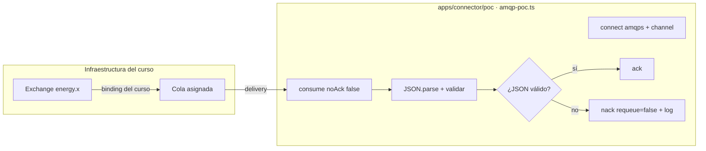
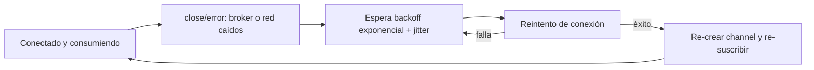

# Etapa 3 — Prueba de concepto: conexión a RabbitMQ

> **Archivo:** `etapas/etapa-03-poc-rabbitmq.md`
> **Estado:** Verificado localmente
> **Checkpoint objetivo:** CP-L3 — PoC RabbitMQ: conexión, consumo, parsing y reconexión

---

## 1. Objetivo de la etapa

Al terminar esta etapa tendremos un **script mínimo de prueba de concepto (PoC)** que:

1. Se conecta al broker del curso por **AMQPS/TLS** (`broker.iic2173.org:5671`, vhost `energy`) con `amqplib`.
2. Consume de la **cola asignada al observer** con ack explícito.
3. Recibe un evento real, lo **parsea como JSON** y valida su estructura contra el modelo de datos de la Etapa 2.
4. **Se reconecta automáticamente** ante caídas del broker o de la red, con backoff exponencial, sin que el proceso termine.

**Alcance:** esto es una validación técnica (RNF-3), **no** el servicio `connector` definitivo. El `connector` real (app NestJS standalone, reenvío HTTP, reintentos) se construye en la Etapa 5 usando como base lo aprendido aquí. El PoC **solo consume**; jamás declara ni publica en exchanges/colas del curso.

**Prerrequisito:** nombre de la cola AMQP asignada (ver Paso 0). El resto de los pasos puede avanzarse sin él.

---

## 2. Requisitos del enunciado que cubre

| Requisito | Cómo se cubre |
| --- | --- |
| RNF-3 (reconexión automática a RabbitMQ) | Es el objetivo central del PoC: se valida la viabilidad con `amqplib` y se fija la estrategia de backoff |
| RF1–RF4 (indirecto) | El parsing y la validación de la estructura del evento confirman los supuestos del modelo de datos de la Etapa 2 (tabla `history`, `packageBody` JSONB) |
| RNF-2 (HTTP POST connector→master) | No aplica aún (Etapa 5), pero el PoC deja lista la lógica de consumo que luego se acoplará al reenvío |
| DOC-1 (registro de IA) | Cada interacción de esta etapa se registra en `ai_docs/prompts/` |

---

## 3. Teoría general necesaria

### 3.1 `amqplib`: API mínima para consumir
- **`connect(url, opts)`**: abre una connection TCP al broker. Con `amqps://` se negocia TLS antes del protocolo AMQP.
- **`createChannel()`**: crea un *channel* (sesión lógica multiplexada sobre la connection). Un channel por consumidor suele bastar.
- **`channel.consume(queue, cb, { noAck })`**: registra un consumidor en modo push. El callback recibe el `msg` (o `null` si el consumidor fue cancelado) con `msg.content` (Buffer), `msg.fields` (incluye `deliveryTag`, `routingKey`, `exchange`) y `msg.properties`.
- **`channel.ack(msg)`**: confirma el mensaje → el broker lo elimina de la cola. **`channel.nack(msg, false, false)`**: rechaza sin reencolar (para mensajes malformados).
- **Eventos de la connection**: `close` (se cerró, motivo en `err`), `error` (error de protocolo/socket) y `blocked` (alerta de recursos del broker). La reconexión se implementa reaccionando a `close`/`error`.

### 3.2 AMQPS y TLS
- El broker del curso expone **TLS en el puerto 5671** (`amqps://`). `amqplib` delega el TLS en Node.js: si el certificado del broker está firmado por una CA pública, funciona sin configuración adicional.
- Si el broker usara un certificado propio, habría que pasar la CA con `{ ca: [...] }` en las opciones. **Nunca** se versionan certificados ni se usa `rejectUnauthorized: false` como solución permanente.

### 3.3 Ack y semántica at-least-once
- Con `noAck: false`, el mensaje permanece en la cola hasta el ack. Si la conexión muere antes del ack, RabbitMQ **reencola** el mensaje → nuestro sistema debe tolerar duplicados (ya definido en la Etapa 2).
- En el PoC el ack se hace **después** de parsear y validar; si el JSON es inválido, se hace `nack(requeue: false)` y se registra el error (evita bucles infinitos de reentrega).

### 3.4 Reconexión con backoff
- Al recibir `close`/`error`, se reintenta la conexión tras una espera creciente (`base * 2^n` con tope), idealmente con *jitter* (aleatoriedad) para evitar tormentas de reconexión.
- El reintento es **infinito** mientras el proceso viva: la caída del broker degrada el servicio, no lo mata (RNF-3).
- Al reconectar, hay que **re-crear el channel y re-suscribir** al consumidor: los channels no sobreviven a la conexión.

### 3.5 Parsing y validación JSON
- `msg.content` es un `Buffer`: se convierte con `toString('utf8')` y `JSON.parse()`.
- La validación verifica la **presencia y tipo** de los campos esperados según el modelo de la Etapa 2 (`idpk`, `type`, `validUntil`, `packageBody`/cuerpo del evento), sin descartar campos extra (el evento se persigue "tal cual" en la Etapa 4).
- `receivedAt` NO viene en el evento: lo asigna `master` al recibir el POST (Etapa 4). En el PoC solo se registra la hora local de recepción (UTC) en el log.

---

## 4. Aplicación específica a EnergyShark

| Concepto | Aplicación en el PoC |
| --- | --- |
| Connection AMQPS | `amqps://observer.45:<pass>@broker.iic2173.org:5671/energy` (URL armada desde variables de entorno; la contraseña vive solo en `.env` local) |
| Channel + consume | Un channel; `basic.consume` sobre la cola asignada con `noAck: false` |
| Ack | Tras parsear y validar el mensaje. Mensaje malformado → `nack(requeue: false)` + log |
| Reconexión | Loop infinito con backoff exponencial + jitter; re-suscripción completa tras cada reconexión |
| Simulación de caída | Destruir el socket subyacente de la conexión (`connection.connection.stream.destroy()`) para forzar un `close` real sin tocar el broker del curso |
| Parsing | `JSON.parse` + validación de campos contra el modelo de la Etapa 2; el cuerpo completo se imprime en log (en la Etapa 4 se persistirá en `packageBody`) |
| Timestamps | El log del PoC registra la hora de recepción en **UTC ISO 8601** (`new Date().toISOString()`) |

**Datos de la infraestructura del curso (no sensibles, de la bitácora):**

| Dato | Valor |
| --- | --- |
| Host | `broker.iic2173.org` |
| Puerto | `5671` (AMQPS/TLS) |
| Virtual host | `energy` |
| Usuario | `observer.45` |
| Exchange | `energy.x` (NO lo tocamos: solo leemos de la cola) |
| Cola asignada | `observer.45.q` (confirmada el 2026-08-29) |

---

## 5. Decisiones técnicas

| # | Decisión | Alternativas | Recomendación y por qué |
| --- | --- | --- | --- |
| 1 | Ubicación del PoC | `apps/connector/poc/` vs carpeta `poc/` en la raíz vs directamente en NestJS | **`apps/connector/poc/`**: es la semilla natural del `connector` real (Etapa 5), mantiene la raíz limpia y respeta la estructura del monorepo |
| 2 | Lenguaje/ejecución del PoC | TypeScript con `tsx` vs JS puro vs NestJS standalone ya | **TypeScript + `tsx`**: mismo lenguaje que el proyecto, cero build config; el PoC **no** es la app NestJS (eso es Etapa 5), mantener el alcance mínimo evita re-trabajo |
| 3 | Cliente RabbitMQ | `amqplib` vs `@golevelup/nestjs-rabbitmq` | **`amqplib`** (decisión #3 de la Etapa 2, se mantiene): control total de reconexión y soporte TLS directo |
| 4 | Modo de ack | `noAck: true` vs `noAck: false` con ack explícito | **`noAck: false`**: mismo comportamiento que tendrá `connector` (ack solo tras éxito) y permite ensayar la semántica at-least-once |
| 5 | Mensaje malformado | Reencolar vs descartar vs terminar | **`nack(requeue: false)` + log**: evita bucles infinitos de reentrega y no pierde el resto de la cola |
| 6 | Backoff de reconexión | Fijo (ej. 5 s) vs exponencial vs exponencial + jitter | **Exponencial con tope y jitter**: estándar de resiliencia; evita saturar al broker en caídas largas y tormentas de reconexión |
| 7 | Simulación de caída del broker | Esperar caída real del curso vs tumbar un broker local vs destruir el socket | **Destruir el socket** (`stream.destroy()`): reproduce un `close` real de forma controlada y reproducible, sin afectar la infraestructura compartida del curso |
| 8 | TLS | Confiar en CAs del sistema vs fijar CA explícita | **CAs del sistema** por defecto; documentar cómo pasar una CA explícita si el broker usa certificado propio. Nunca `rejectUnauthorized: false` como solución final |
| 9 | Configuración | Variables de entorno desde `.env` local | **`.env` local no versionado** (`RABBITMQ_URL`, `RABBITMQ_QUEUE`) cargado con `--env-file` de Node; cero secretos en código ni en el repo |

---

## 6. Diagramas

### 6.1 Flujo del PoC



### 6.2 Ciclo de reconexión



Puntos clave:

- El proceso **nunca termina** por caída del broker: el loop de reconexión es infinito (RNF-3).
- Cada ciclo exitoso pasa por: conexión → channel → `consume` → ack/nack.
- La simulación de caída se hace destruyendo el socket; el comportamiento del script es idéntico al de una caída real del broker.

---

## 7. Sub-etapas

### 7.1 Sub-etapa 3.1 — Script mínimo AMQP
Conexión al broker por AMQPS/TLS, apertura de channel y consumo de la cola asignada.

### 7.2 Sub-etapa 3.2 — Parsing JSON
Recibir un evento de prueba (real o inyectado), parsear el JSON y validar su estructura contra el modelo de la Etapa 2.

### 7.3 Sub-etapa 3.3 — Desconexión/reconexión
Simular la caída del broker, verificar que el script detecta el `close`, reintenta con backoff y vuelve a consumir sin intervención manual.

---

## 8. Pasos concretos — Action Items

### Paso 0 — Confirmar la cola AMQP asignada (prerrequisito)
1. Obtener del enunciado o de la infraestructura del curso el **nombre de la cola asignada al observer**.
2. Registrarlo en la bitácora (Entrada 8) y actualizar la tabla de la sección 4 de este documento.
3. Guardar la URL completa de conexión en el `.env` local del PoC (ver Paso 2). La contraseña **jamás** se documenta.
4. **Verificar:** tienes `RABBITMQ_URL` y `RABBITMQ_QUEUE` completos y el nombre de la cola coincide con lo asignado por el curso.

### Paso 1 — Preparar el directorio del PoC (Sub-etapa 3.1)
1. Crear la carpeta: `mkdir -p apps/connector/poc`.
2. Inicializar el proyecto mínimo: `npm init -y` (dentro de `apps/connector/poc`).
3. Instalar dependencias: `npm install amqplib` y `npm install -D tsx`.
4. **Verificar:** `ls apps/connector/poc` muestra `package.json`, `node_modules/` y `package-lock.json`.

### Paso 2 — Crear el `.env` local (NO versionado)
1. Crear `apps/connector/poc/.env` con:
   ```
   RABBITMQ_URL=amqps://observer.45:<password>@broker.iic2173.org:5671/energy
   RABBITMQ_QUEUE=<nombre-de-la-cola-asignada>
   ```
2. Verificar que el `.gitignore` raíz cubre `.env` (regla `**/.env` o crear `apps/connector/poc/.gitignore` con `.env`).
3. **Verificar:** `git status` NO muestra el `.env`.

### Paso 3 — Script mínimo de conexión (Sub-etapa 3.1)
1. Crear `apps/connector/poc/amqp-poc.ts` con la estructura mínima:
   - Leer `RABBITMQ_URL` y `RABBITMQ_QUEUE` de `process.env` (cargadas con `--env-file`).
   - `await connect(RABBITMQ_URL)` + log de conexión exitosa (timestamp UTC).
   - Manejar `error` y `close` con logs claros (por ahora sin reconexión).
2. Ejecutar: `npx tsx --env-file=.env amqp-poc.ts`.
3. **Verificar:** el log muestra "connected" y el script no lanza excepciones TLS ni de credenciales.

### Paso 4 — Consumo con ack (Sub-etapa 3.1)
1. Abrir un channel y suscribirse: `channel.consume(RABBITMQ_QUEUE, handler, { noAck: false })`.
2. En el handler: log de `fields.deliveryTag`, `fields.routingKey` y longitud del contenido; luego `channel.ack(msg)`.
3. Dejar el script corriendo el tiempo suficiente para recibir al menos un evento real.
4. **Verificar:** aparece al menos un mensaje consumido en el log y el broker lo marca entregado (no se repite en otra ejecución).

### Paso 5 — Parsing y validación JSON (Sub-etapa 3.2)
1. Reemplazar el log crudo por: `JSON.parse(msg.content.toString('utf8'))`.
2. Validar estructura contra el modelo de la Etapa 2: presencia de `idpk` (uuid), `type` (string) y el cuerpo del evento; `validUntil` si viene (string de fecha). Registrar en log: tipo, `idpk` y `receivedAt` local UTC (`new Date().toISOString()`).
3. Si el parse o la validación fallan: log del error con el contenido problemático (truncado) y `channel.nack(msg, false, false)`.
4. Si todo es válido: `channel.ack(msg)`.
5. **Verificar:** con un evento real, el log muestra los campos validados; un JSON inválido inyectado (ver sección 14) termina en nack sin romper el script.

### Paso 6 — Reconexión automática con backoff (Sub-etapa 3.3)
1. Encapsular "conectar + suscribir" en una función `start()` reutilizable.
2. Al recibir `close` o `error`: log + llamar a `scheduleReconnect()`.
3. Implementar el backoff: `delay = min(base * 2^intento, cap) + jitter` (sugerido: base 1 s, cap 30 s, jitter 0–1 s), con intentos infinitos.
4. Al reconectar con éxito: reiniciar contador de intentos y volver a `start()` (channel nuevo + re-suscripción).
5. **Verificar:** cortar la red o destruir el socket produce el ciclo del diagrama 6.2 y el script vuelve a consumir solo.

### Paso 7 — Simular caída del broker de forma controlada (Sub-etapa 3.3)
1. Exponer un disparador en el script (ej. tecla `d` en la terminal o un temporizador configurable) que ejecute `connection.connection.stream.destroy()`.
2. Ejecutar la simulación 2–3 veces y registrar en la bitácora: tiempo de detección, nº de reintentos y tiempo total hasta volver a consumir.
3. **Verificar:** cada simulación muestra `close` → reintentos con backoff creciente → reconexión → re-suscripción.

### Paso 8 — Pruebas de borde y cierre (todas las sub-etapas)
1. Credenciales inválidas a propósito (en un `.env` temporal): el script debe reintentar indefinidamente con backoff, sin salir.
2. Reinicio del proceso con el broker caído: el script conecta en cuanto el broker vuelve.
3. Registrar resultados en la bitácora (Entrada 8) y en `ai_docs/prompts/`.
4. Actualizar el estado de la etapa en `etapas/README.md` y marcar CP-L3.
5. Commit: `git add apps/connector/poc etapas/ docs/ ai_docs/ && git commit -m "feat: poc amqp etapa 3 conexion consumo y reconexion"` (revisar antes que no se versiona el `.env`).

---

## 9. Comandos necesarios

```bash
# Preparación del PoC
mkdir -p apps/connector/poc
cd apps/connector/poc
npm init -y
npm install amqplib
npm install -D tsx

# .env local (nunca versionado)
# RABBITMQ_URL=amqps://observer.45:<password>@broker.iic2173.org:5671/energy
# RABBITMQ_QUEUE=<nombre-de-la-cola-asignada>

# Ejecución del PoC (Node ≥ 20.6)
npx tsx --env-file=.env amqp-poc.ts

# Verificación de que no se versionan secretos
git status
git ls-files | grep -E '\.env|\.pem'   # debe devolver vacío

# Commit del PoC
git add apps/connector/poc etapas/etapa-03-poc-rabbitmq.md docs/bitacora.md ai_docs/
git commit -m "feat: poc amqp etapa 3 conexion consumo y reconexion"
git push
```

---

## 10. Resultados esperados

- El PoC se conecta al broker del curso por AMQPS/TLS con las credenciales del observer.
- Consume al menos un evento real de la cola asignada y lo parsea/valida correctamente.
- Un JSON malformado se rechaza con `nack(requeue: false)` sin interrumpir el consumo.
- Una caída simulada del broker produce reconexión automática con backoff (proceso nunca muere).
- Ningún secreto queda versionado en el repositorio.
- Bitácora y `ai_docs/prompts/` actualizados; checkpoint **CP-L3** verificado.

---

## 11. Métodos de verificación

| Verificación | Cómo realizarla |
| --- | --- |
| Conexión AMQPS correcta | Log "connected" sin errores TLS/credenciales en la ejecución del script |
| Consumo real | Un evento de la cola asignada aparece en el log con `deliveryTag` y campos validados |
| Parsing y validación | El log muestra `type` e `idpk` del evento; un JSON inválido produce nack (ver sección 14) |
| Reconexión | Simulación de caída (Paso 7) muestra: `close` → reintentos crecientes → reconexión → re-suscripción |
| Proceso resiliente | El script sigue vivo tras varios ciclos de caída/reconexión y tras desconectar la red |
| Sin secretos versionados | `git ls-files | grep -E '\.env|\.pem'` devuelve vacío |
| Checkpoint CP-L3 | Evidencia registrada en la bitácora (Entrada 8) con tiempos de detección/reconexión |

---

## 12. Errores comunes y troubleshooting

| Problema probable | Cómo diagnosticarlo / evitarlo |
| --- | --- |
| Error de certificado TLS ("self-signed certificate" / `UNABLE_TO_VERIFY_LEAF_SIGNATURE`) | El broker usa un certificado no público. Obtener la CA del curso y pasarla con `{ ca: [fs.readFileSync('ca.pem')] }`. Nunca versionar certificados; `rejectUnauthorized: false` solo para un test desechable, jamás como solución |
| `ACCESS_REFUSED` | Usuario/contraseña o vhost incorrectos. Verificar que la URL es `amqps://observer.45:<pass>@broker.iic2173.org:5671/energy` y que la contraseña no contiene caracteres que rompan la URL (usar `encodeURIComponent` si es necesario) |
| `404 NOT_FOUND - no queue '<nombre>' in vhost 'energy'` | Cola mal escrita o aún no asignada: confirmar el nombre exacto con el curso (Paso 0) |
| `ECONNREFUSED` / timeout en el puerto | El puerto 5671 puede estar bloqueado por un firewall de red local; probar `openssl s_client -connect broker.iic2173.org:5671` para aislar conectividad vs AMQP |
| El script muere sin log de error | Las promesas no capturadas terminan el proceso: envolver `start()` en `try/catch` y manejar `process.on('unhandledRejection')` |
| La conexión cae sin `close` aparente (silencio) | Fallo de red detectado por heartbeat: el `close` llega tras el timeout de heartbeat. Verificar que el manejador de `close` es lo único que gatilla la reconexión y que no hay un `process.exit` en el camino |
| El consumidor no recibe nada | El exchange `energy.x` enruta hacia la cola asignada: es infraestructura del curso. Verificar que `RABBITMQ_QUEUE` es el nombre correcto y que el script está conectado (no en loop de reconexión) |
| `tsx` no encuentra el `.env` | El flag `--env-file=.env` se pasa junto a `tsx`; ejecutar desde `apps/connector/poc` o usar rutas absolutas |
| Mensajes que reaparecen tras ack | El ack ocurre después de un error no capturado en el handler: el broker reencola. Mantener el handler defensivo (todo `try/catch`) |
| Duplicados ocasionales | Esperable: semántica at-least-once (Etapa 2). El PoC no deduplica; la tolerancia real se implementa en `master`/`connector` |

---

## 13. Checklist de finalización

- [x] Paso 0: cola AMQP asignada confirmada y registrada en bitácora y en la sección 4 (`observer.45.q`).
- [x] Directorio `apps/connector/poc/` creado con `package.json`, `amqplib` y `tsx`.
- [x] `.env` local creado y **no versionado** (verificado con `git status`/`git ls-files`).
- [x] Conexión AMQPS/TLS al broker funcionando (log "connected").
- [x] Consumo de la cola asignada con `noAck: false` y ack explícito.
- [x] Al menos un evento real recibido, parseado y validado (campos `type`, `idpk`, cuerpo).
- [x] Mensaje malformado manejado con `nack(requeue: false)` sin romper el script.
- [x] Reconexión automática con backoff exponencial + jitter implementada.
- [x] Simulación de caída (socket destruido) ejecutada ≥ 2 veces con reconexión exitosa.
- [x] Pruebas de borde: credenciales inválidas y broker caído al inicio (reintentos infinitos).
- [x] Resultados registrados en la bitácora (Entrada 8) con tiempos de detección/reconexión.
- [x] Registro de IA actualizado en `ai_docs/prompts/`.
- [x] Estado de la etapa actualizado en `etapas/README.md` y checkpoint CP-L3 marcado.
- [x] Commit realizado y pusheado.

---

## 14. Pruebas locales

| # | Prueba | Resultado esperado |
| --- | --- | --- |
| 1 | Ejecutar el PoC con credenciales correctas | Log "connected" y script en espera de mensajes |
| 2 | Esperar un evento real del curso | Mensaje consumido con `deliveryTag`, parseado y validado; ack enviado |
| 3 | Inyectar un JSON inválido en el handler (función de prueba en el propio script) | Log de error + `nack(requeue: false)`; el script sigue consumiendo |
| 4 | Destruir el socket (simulación de caída) | Log `close` → reintentos con espera creciente → reconexión → re-suscripción |
| 5 | Ejecutar con credenciales inválidas (`.env` temporal) | Reintentos infinitos con backoff; el proceso no sale |
| 6 | Iniciar el script sin conectividad y luego habilitarla | El script conecta solo cuando la red vuelve |
| 7 | 3 ciclos seguidos de caída/reconexión | El proceso sigue vivo y consumiendo tras cada ciclo |

---

## 15. Pruebas en producción

No aplica en esta etapa: el PoC corre solo en el computador local contra la infraestructura compartida del curso. **Cuidado con el entorno compartido:** el PoC solo consume y hace ack/nack sobre mensajes que le llegan a la cola asignada; jamás declara exchanges/colas, no publica mensajes y no reencola (los `nack` son siempre con `requeue: false`). Las primeras pruebas reales en producción (EC2/RDS) ocurren en las Etapas 7–8.

---

## 16. Registro para la bitácora

Al terminar la etapa, registrar en `docs/bitacora.md`:

- Fecha y objetivo de la etapa (Entrada 8).
- Nombre de la cola asignada confirmada (sin secretos).
- Resultado de la conexión AMQPS/TLS (éxito/fallos y solución, sección 12).
- Estructura del evento real observado (campos presentes, discrepancias con el modelo de la Etapa 2).
- Tiempos de la simulación de caída: detección, nº de reintentos, tiempo hasta reconexión.
- Comportamiento de las pruebas de borde (credenciales inválidas, broker caído).
- Decisiones técnicas de la tabla de la sección 5 adoptadas/modificadas.
- Registros de IA generados (`ai_docs/prompts/`).

---

## 17. Siguiente etapa

**Etapa 4 — Servicio `master` (API REST + PostgreSQL local)** (`etapa-04-master-api-local.md`): scaffold NestJS, PostgreSQL local en Docker, entidad/migraciones de `history`, `POST /events`, `GET /history` (RF1, RF3, RF4) y `GET /history/:id` (RF2), con pruebas manuales `curl`. El conocimiento de la estructura real del evento obtenido aquí alimenta el modelo de datos de esa etapa.
