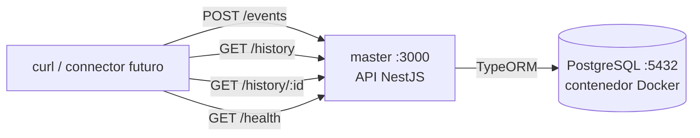
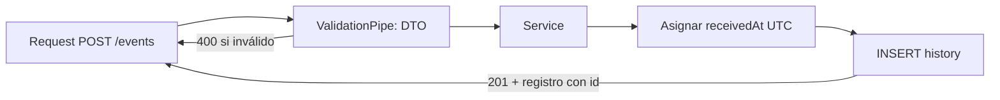

# Etapa 4 — Servicio `master` (API REST + PostgreSQL local)

> **Archivo:** `etapas/etapa-04-master-api-local.md`
> **Estado:** Verificado localmente
> **Checkpoint objetivo:** CP-L4 — RF1–RF4 verificados en local (API + PostgreSQL) — **alcanzado**

---

## 1. Objetivo de la etapa

Al terminar esta etapa tendremos el servicio **`master`** corriendo en local con:

1. Un scaffold NestJS del proyecto `master` (HTTP API).
2. PostgreSQL de desarrollo corriendo en un contenedor Docker.
3. La tabla `history` creada con migraciones (id propio, `receivedAt` en UTC).
4. `POST /events`: ingesta interna desde `connector` (asigna `receivedAt`, responde 201).
5. `GET /history` con paginación y filtros (RF1, RF3, RF4) y `GET /history/:id` (RF2).
6. Pruebas manuales con `curl` que verifican RF1–RF4 en local (checkpoint CP-L4).

**Alcance:** solo entorno local y persistencia en PostgreSQL en contenedor. La dockerización de `master`, el `connector` real y el despliegue en AWS llegan en las Etapas 5–8. Aquí se escribe código de aplicación por primera vez (lo autoriza el plan maestro).

**Prerrequisitos:** Etapa 3 cerrada (estructura real del evento conocida), Docker Desktop operativo, Node.js LTS y npm.

---

## 2. Requisitos del enunciado que cubre

| Requisito | Cómo se cubre |
| --- | --- |
| RF1 (historial de demanda, lista con campos relevantes) | `GET /history` devuelve `{ items, meta }` con los campos de la tabla `history` |
| RF2 (detalle por `id` propio) | `GET /history/:id` usando el `id` generado por el sistema; 404 si no existe |
| RF3 (paginación, default 25) | `GET /history?page=&limit=` con `LIMIT/OFFSET` y default `25` |
| RF4 (filtros sobre propiedades, incl. `receivedAt` y fechas) | Filtros por `type`, `receivedAt` (desde/hasta), `validUntil` (desde/hasta) y opcional `city` |
| RNF-4 (`master` opera sin RabbitMQ/connector) | `master` solo depende de PostgreSQL; se puede probar aislado |
| RNF-5 (parcial) | `GET /health` que verifica API + conexión a DB (health check real) |

---

## 3. Teoría general necesaria

### 3.1 NestJS CLI y estructura de un módulo
- **`@nestjs/cli`**: genera el scaffold con `nest new`. Un módulo agrupa controlador + servicio + repositorio.
- **Controlador**: recibe requests HTTP y delega en el servicio.
- **Servicio (provider)**: lógica de negocio y acceso a datos; se inyecta por DI.
- **`ValidationPipe` global** (con `class-validator`/`class-transformer`): valida automáticamente los DTO de entrada → respuestas 400 sin código manual.
- **`ConfigModule`** (de `@nestjs/config`): carga y valida variables de entorno (`.env`).

### 3.2 TypeORM con NestJS
- **`TypeOrmModule.forRootAsync`**: configura la conexión leyendo de `ConfigService`.
- **Entidad**: clase decorada (`@Entity('history')`) que mapea la tabla.
- **Migraciones**: archivos de SQL/TS versionados que evolucionan el esquema. En dev se puede usar `synchronize: true` solo como bootstrap; el diseño de la Etapa 2 exige migraciones (y en producción **siempre** migraciones, nunca `synchronize`).
- **QueryBuilder**: permite construir `WHERE` dinámico para filtros opcionales de forma segura (sin SQL string concatenado).

### 3.3 Columnas especiales
- **`uuid`**: se usa la extensión `pgcrypto`/`gen_random_uuid()` (PostgreSQL 13+) o generación en app con `crypto.randomUUID()`.
- **`timestamptz`**: guarda un instante con zona horaria; la app trabaja siempre en UTC (`new Date().toISOString()`).
- **`jsonb`**: tipo binario para JSON; permite índices GIN y consultas sobre claves (necesario para `packageBody` y el filtro `city`).

### 3.4 Paginación y filtros
- **`LIMIT/OFFSET`**: `limit` (default 25, tope razonable ej. 100) y `page` (1-based) → `offset = (page - 1) * limit`.
- **Rango de fechas**: filtros `desde`/`hasta` sobre `receivedAt` y `validUntil` usando comparaciones `>=`/`<=` en UTC.

### 3.5 Convenciones HTTP del proyecto (Etapa 2)
- Respuestas: `201` al crear, `200` en consultas, `400` params inválidos, `404` no existe, `500` error interno.
- `/history` devuelve `{ items: [...], meta: { page, limit, total, totalPages } }`.

---

## 4. Aplicación específica a EnergyShark

| Concepto | Aplicación en `master` |
| --- | --- |
| Scaffold NestJS | `apps/master` generado con `@nestjs/cli`, sin git interno (el monorepo ya es el repo) |
| DB de desarrollo | Contenedor `postgres:16` con volumen, puerto `5432`, credenciales de `.env.example` (no versionado el `.env`) |
| Entidad `History` | Tabla `history`: `id` (uuid PK, propio), `idpk` (uuid del curso), `type` (text), `receivedAt` (timestamptz NOT NULL, asignado por master), `validUntil` (timestamptz NULL), `packageBody` (jsonb NOT NULL), `createdAt` (timestamptz) |
| Índices | Btree en `receivedAt`, `validUntil`, `type`; GIN opcional en `packageBody` |
| `POST /events` | Recibe el evento tal cual (`idpk`, `type`, `packageBody`), **master** asigna `receivedAt` en UTC, inserta y responde 201 con el registro (incluye el `id` propio) |
| `GET /history` | `page`/`limit` (default 25) + filtros `type`, `receivedAtFrom/To`, `validUntilFrom/To`, `city` (dentro de `packageBody`) |
| `GET /history/:id` | Detalle por `id` propio; 404 si no existe |
| `GET /health` | `SELECT 1` contra la DB → `{ status: 'ok', db: 'up' }` |
| Duplicados | La semántica es at-least-once: en esta etapa se toleran duplicados (no se rechaza por `idpk`); se documenta para la Etapa 5/12 |

**Estructura real del evento observada en la Etapa 3** (para armar el DTO y el JSON de prueba):

```json
{
  "idpk": "2a68a81d-74ec-4329-bcd9-f4bbf7a2623e",
  "type": "demand-set",
  "packageBody": { "validUntil": "2026-08-29T22:16:04.663Z", "...": "resto del payload" }
}
```

---

## 5. Decisiones técnicas

| # | Decisión | Alternativas | Recomendación y por qué |
| --- | --- | --- | --- |
| 1 | Scaffold | `@nestjs/cli new` vs manual | **CLI**: estructura oficial y consistente; `--skip-git` porque el monorepo ya es repo |
| 2 | ORM | TypeORM vs Prisma vs Knex | **TypeORM** (decisión #4 de la Etapa 2): integración nativa NestJS, migraciones integradas |
| 3 | Migraciones en dev | `synchronize: true` vs migraciones CLI | **Migraciones** desde el inicio (DataSource para CLI): el esquema queda versionado y es lo que se usará en producción |
| 4 | Generación de `id` | `gen_random_uuid()` en DB vs `crypto.randomUUID()` en app | **`crypto.randomUUID()`** en app con columna `uuid` + `@PrimaryGeneratedColumn('uuid')`: simple y consistente con el contrato |
| 5 | `receivedAt` | connector vs master | **master** (decisión #7 de la Etapa 2): fuente única del "momento de recepción" |
| 6 | Validación de entrada | Validación manual vs `class-validator` + `ValidationPipe` global | **`class-validator` global**: 400 automáticos, DTO tipados, menos código |
| 7 | Filtros dinámicos | QueryBuilder vs repositorios separados | **QueryBuilder** con condiciones opcionales: seguro y legible para RF4 |
| 8 | Filtro `city` | Columna propia vs JSONB (`packageBody.city`) | **JSONB** vía operador `->>`: evita re-migración; solo se usa si el evento lo trae (verificar en Etapa 3/4) |
| 9 | Duplicados por `idpk` | Índice único vs tolerar duplicados | **Tolerar** en esta etapa: at-least-once; la deduplicación/keyset se evalúa en las Etapas 5 y 12 |
| 10 | Health check | `/health` simple vs `/health` con DB | **`/health` que consulta DB** (`SELECT 1`): health check real (prepara RNF-5 y la Etapa 6) |

---

## 6. Diagramas

### 6.1 Flujo de la etapa (local)



### 6.2 Flujo interno de `POST /events`



---

## 7. Sub-etapas

### 7.1 Sub-etapa 4.1 — Scaffold NestJS
Crear `apps/master` con el CLI, instalar dependencias y configurar base (ConfigModule, ValidationPipe global).

### 7.2 Sub-etapa 4.2 — PostgreSQL local
Levantar un contenedor `postgres:16` con volumen persistente y verificar conectividad con `psql`.

### 7.3 Sub-etapa 4.3 — Entidad y migraciones
Definir la entidad `History`, el DataSource para la CLI y la migración inicial (tabla + índices).

### 7.4 Sub-etapa 4.4 — `POST /events`
Módulo de ingesta: DTO, validación, asignación de `receivedAt` e inserción.

### 7.5 Sub-etapa 4.5 — Consultas
`GET /history` (paginación + filtros) y `GET /history/:id` (detalle + 404) + `GET /health`.

### 7.6 Sub-etapa 4.6 — Pruebas con `curl`
Verificación manual de RF1–RF4 (checkpoint CP-L4).

---

## 8. Pasos concretos — Action Items

### Paso 0 — Prerrequisitos
1. Confirmar Docker Desktop corriendo: `docker info` no debe fallar.
2. Confirmar Node LTS y npm: `node -v && npm -v`.
3. Releer el modelo de datos (Etapa 2, sección 8.3) y la estructura real del evento (Etapa 3).
4. **Verificar:** todo responde sin errores y el `.env` raíz (local) tiene credenciales de DB de desarrollo.

### Paso 1 — 4.1 Scaffold NestJS
1. Desde la raíz: `npx @nestjs/cli new master --directory apps/master --package-manager npm --skip-git`.
2. Instalar dependencias del proyecto:
   ```bash
   cd apps/master
   npm i @nestjs/typeorm typeorm pg @nestjs/config class-validator class-transformer
   ```
3. Configurar `ConfigModule.forRoot({ isGlobal: true, envFilePath: '.env' })` y `ValidationPipe` global en `main.ts` (`whitelist: true, transform: true`).
4. **Verificar:** `npm run start` levanta Nest en `http://localhost:3000` y responde el Hello World por defecto.

### Paso 2 — 4.2 PostgreSQL local
1. Levantar el contenedor:
   ```bash
   docker run -d --name energy-postgres \
     -e POSTGRES_USER=postgres -e POSTGRES_PASSWORD=postgres -e POSTGRES_DB=energy_db \
     -p 5432:5432 -v energy_pgdata:/var/lib/postgresql/data postgres:16
   ```
2. Esperar a que esté listo: `docker ps` (estado healthy tras unos segundos).
3. Verificar conectividad: `psql -h localhost -p 5432 -U postgres -d energy_db -c "SELECT version();"`.
4. **Verificar:** el comando `psql` responde (contraseña `postgres` solo en desarrollo local).

### Paso 3 — Conexión de Nest a PostgreSQL
1. Crear `apps/master/.env` (no versionado) con:
   ```
   NODE_ENV=development
   PORT=3000
   DB_HOST=localhost
   DB_PORT=5432
   DB_USER=postgres
   DB_PASSWORD=postgres
   DB_NAME=energy_db
   ```
2. Configurar `TypeOrmModule.forRootAsync` en `app.module.ts` leyendo estas variables.
3. **Verificar:** al arrancar, Nest se conecta a la DB sin errores de conexión (aún sin tablas).

### Paso 4 — 4.3 Entidad y migraciones
1. Crear la entidad `src/history/history.entity.ts` con la tabla de la sección 4:
   - `id` uuid PK (generado), `idpk` uuid, `type` text, `receivedAt` timestamptz NOT NULL, `validUntil` timestamptz NULL, `packageBody` jsonb NOT NULL, `createdAt` timestamptz.
   - Índices: btree en `receivedAt`, `validUntil`, `type` (con `@Index`).
2. Crear `src/data-source.ts` (DataSource para la CLI) con `entities` y `migrations`.
3. Generar la migración inicial:
   ```bash
   npx typeorm-ts-node-commonjs migration:generate src/migrations/InitHistory -d src/data-source.ts
   npx typeorm-ts-node-commonjs migration:run -d src/data-source.ts
   ```
4. **Verificar:** `psql ... -c "\d history"` muestra la tabla con las columnas y los índices.

### Paso 5 — 4.4 `POST /events`
1. Crear `HistoryModule` con `HistoryController` + `HistoryService`.
2. DTO `CreateEventDto` (class-validator): `idpk` (IsUUID), `type` (IsString), `packageBody` (IsObject) y `validUntil` opcional (IsISO8601).
3. En el servicio: asignar `receivedAt = new Date()` (UTC), insertar y devolver la entidad creada.
4. Respuesta: `201 Created` con el registro (incluye `id` propio).
5. **Verificar:** `curl -X POST http://localhost:3000/events` con el JSON real de la Etapa 3 devuelve 201 + `id`; un body sin `idpk` devuelve 400.

### Paso 6 — 4.5 Consultas
1. `GET /history`: DTO de query (`page`, `limit` con default 25 y tope, `type`, `receivedAtFrom/To`, `validUntilFrom/To`, `city`). QueryBuilder con condiciones opcionales y `LIMIT/OFFSET`; `getManyAndCount()` para `total` y `totalPages`.
2. `GET /history/:id`: `findOneBy({ id })`; si no existe → `NotFoundException` (404).
3. `GET /health`: `SELECT 1` → `{ status: 'ok', db: 'up' }`.
4. **Verificar:** los endpoints responden 200 con el formato `{ items, meta }` y 404 para un id inexistente.

### Paso 7 — 4.6 Pruebas manuales con `curl`
1. Insertar 3–5 eventos de ejemplo (estructura real) con `POST /events`.
2. Probar:
   - `GET /history` (lista, meta correcta).
   - `GET /history?page=2&limit=2` (paginación).
   - `GET /history?type=demand-set` (filtro).
   - `GET /history?receivedAtFrom=...&receivedAtTo=...` (filtro temporal).
   - `GET /history?city=Santiago` si el evento trae `city` en `packageBody`.
   - `GET /history/:id` (detalle) y un id inexistente (404).
   - `GET /health`.
3. Guardar la salida de las pruebas en la bitácora (Entrada 10).
4. **Verificar:** RF1–RF4 cubiertos y checkpoint CP-L4 alcanzado.

### Paso 8 — Cierre y versionado
1. Registrar en la bitácora (Entrada 10) y en `ai_docs/prompts/`.
2. Actualizar `etapas/README.md` (Etapa 4 → Verificado localmente) y la matriz de trazabilidad del plan maestro (RF1–RF4, RNF-4 → Verificado localmente).
3. Commit: `git add apps/master etapas/ docs/ ai_docs/ && git commit -m "feat(master): implement local API with history persistence and queries (RF1-RF4)"`.
4. **Verificar:** `git status` no muestra el `.env` y `git log --oneline` muestra el commit.

---

## 9. Comandos necesarios

```bash
# Scaffold y dependencias
npx @nestjs/cli new master --directory apps/master --package-manager npm --skip-git
cd apps/master
npm i @nestjs/typeorm typeorm pg @nestjs/config class-validator class-transformer

# PostgreSQL local
docker run -d --name energy-postgres -e POSTGRES_USER=postgres -e POSTGRES_PASSWORD=postgres \
  -e POSTGRES_DB=energy_db -p 5432:5432 -v energy_pgdata:/var/lib/postgresql/data postgres:16
psql -h localhost -p 5432 -U postgres -d energy_db -c "SELECT version();"

# Migraciones
npx typeorm-ts-node-commonjs migration:generate src/migrations/InitHistory -d src/data-source.ts
npx typeorm-ts-node-commonjs migration:run -d src/data-source.ts

# Pruebas manuales
curl -s -X POST http://localhost:3000/events -H 'Content-Type: application/json' -d '{...}'
curl -s "http://localhost:3000/history?page=1&limit=25&type=demand-set"
curl -s http://localhost:3000/history/<id>
curl -s http://localhost:3000/health
```

---

## 10. Resultados esperados

- `master` corre en local (NestJS) y se conecta a PostgreSQL en contenedor.
- Tabla `history` creada con migraciones e índices.
- `POST /events` persiste eventos asignando `receivedAt` en UTC (201 con `id`).
- `GET /history` pagina (default 25) y filtra por `type` y rangos de fecha.
- `GET /history/:id` devuelve detalle y 404 cuando no existe.
- `GET /health` valida API + DB.
- RF1–RF4 verificados localmente (CP-L4) con evidencia en la bitácora.

---

## 11. Métodos de verificación

| Verificación | Cómo realizarla |
| --- | --- |
| Nest arranca | `npm run start` y `curl localhost:3000/health` → 200 |
| DB conectada | Sin errores de TypeORM en el arranque; `psql \d history` muestra la tabla |
| Migraciones versionadas | `src/migrations/` con archivo `InitHistory`; `migration:show` listo |
| RF1 | `GET /history` devuelve `{ items, meta }` con los eventos insertados |
| RF2 | `GET /history/:id` devuelve el registro; id inexistente → 404 |
| RF3 | `?page=2&limit=2` devuelve el segundo bloque y `meta` correcta |
| RF4 | Filtros `type` y `receivedAtFrom/To` devuelven solo lo esperado |
| Sin secretos | `git ls-files | grep -E '\.env$'` vacío |
| CP-L4 | Evidencia de curl en la bitácora (Entrada 10) |

---

## 12. Errores comunes y troubleshooting

| Problema probable | Cómo diagnosticarlo / evitarlo |
| --- | --- |
| `EADDRINUSE` en puerto 3000/5432 | Algo ocupa el puerto: `lsof -i :5432`; detener el proceso o cambiar el puerto |
| `ECONNREFUSED` al conectar a DB | El contenedor no está corriendo: `docker ps -a`; arrancarlo con `docker start energy-postgres` |
| "database does not exist" | El nombre `energy_db` no coincide con `POSTGRES_DB` del contenedor: recrear el contenedor |
| Migraciones no generan nada | El DataSource de CLI no encuentra la entidad (revisar `entities` y `migrations` en `data-source.ts`) |
| Fechas que "se corren" de hora | Asegurar `timestamptz` y comparar con ISO8601 UTC (`Z`); nunca strings locales |
| Filtros con `undefined` rompen el query | Construir condiciones solo si el valor viene definido; no concatenar strings |
| `packageBody` no se inserta como JSON | Enviar `packageBody` como objeto en el body; TypeORM mapea `jsonb` desde objetos |
| Duplicados al reenviar eventos | Esperado (at-least-once): en esta etapa se toleran; evaluar deduplicación en la Etapa 5/12 |
| `npm run start` falla por validación de env | `ValidationPipe`/ConfigModule lanzan si falta `.env`: crear `apps/master/.env` con la plantilla |

---

## 13. Checklist de finalización

- [ ] Scaffold NestJS en `apps/master` (sin `.git` interno).
- [ ] `ConfigModule` global + `ValidationPipe` global configurados.
- [ ] Contenedor `postgres:16` con volumen y credenciales de desarrollo.
- [ ] Conexión TypeORM funcionando (sin `synchronize` en producción).
- [ ] Entidad `History` completa (id, idpk, type, receivedAt, validUntil, packageBody, createdAt).
- [ ] Índices creados (receivedAt, validUntil, type; GIN opcional en packageBody).
- [ ] Migración inicial generada y aplicada.
- [ ] `POST /events` con DTO validado y `receivedAt` UTC (201 + `id`).
- [ ] `GET /history` con paginación (default 25) y filtros (`type`, fechas, `city`).
- [ ] `GET /history/:id` con 404 para inexistente.
- [ ] `GET /health` con chequeo real de DB.
- [ ] Pruebas `curl` de RF1–RF4 registradas en la bitácora.
- [ ] Bitácora (Entrada 10) y `ai_docs/prompts/` actualizados.
- [ ] Estado en `etapas/README.md` actualizado (Etapa 4 → Verificado localmente) y matriz de trazabilidad.
- [ ] Commit realizado y pusheado; `.env` no versionado.

---

## 14. Pruebas locales

| # | Prueba | Resultado esperado |
| --- | --- | --- |
| 1 | `npm run start` + `GET /health` | 200 con `{ status: 'ok', db: 'up' }` |
| 2 | `POST /events` con evento real (Etapa 3) | 201 + registro con `id` y `receivedAt` UTC |
| 3 | `POST /events` sin `idpk` | 400 (validation) |
| 4 | `GET /history?limit=2&page=2` | Segundo bloque de 2 + `meta` correcta |
| 5 | `GET /history?type=demand-set` | Solo eventos de ese tipo |
| 6 | `GET /history?receivedAtFrom=X&receivedAtTo=Y` | Solo eventos en el rango |
| 7 | `GET /history/<id>` inexistente | 404 |
| 8 | `psql \d history` | Columnas, tipos y índices esperados |

---

## 15. Pruebas en producción

No aplica en esta etapa: `master` corre solo en local contra un PostgreSQL en contenedor. Las primeras pruebas en producción (EC2 + RDS) ocurren en las Etapas 7–8.

---

## 16. Registro para la bitácora

Al terminar la etapa, registrar en `docs/bitacora.md`:

- Fecha y objetivo de la etapa (Entrada 10).
- Decisiones técnicas adoptadas (tabla de la sección 5).
- Comandos de scaffold, contenedor, migraciones y pruebas `curl`.
- Estructura final de la tabla `history` y de la respuesta `/history`.
- Problemas encontrados y soluciones (sección 12).
- Evidencia de las pruebas de RF1–RF4.
- Registros de IA generados (`ai_docs/prompts/`).

---

## 17. Siguiente etapa

**Etapa 5 — Servicio `connector` (local)** (`etapa-05-connector-local.md`): consumir la cola con `amqplib` (reutilizando el PoC de la Etapa 3), reenviar cada evento por `POST /events` a `master` y hacer ack **solo** tras 2xx, con reintentos y logging estructurado. La integración local end-to-end RabbitMQ → connector → master → DB cierra el ciclo de esta etapa.
