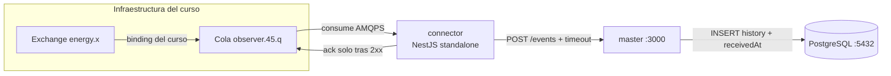
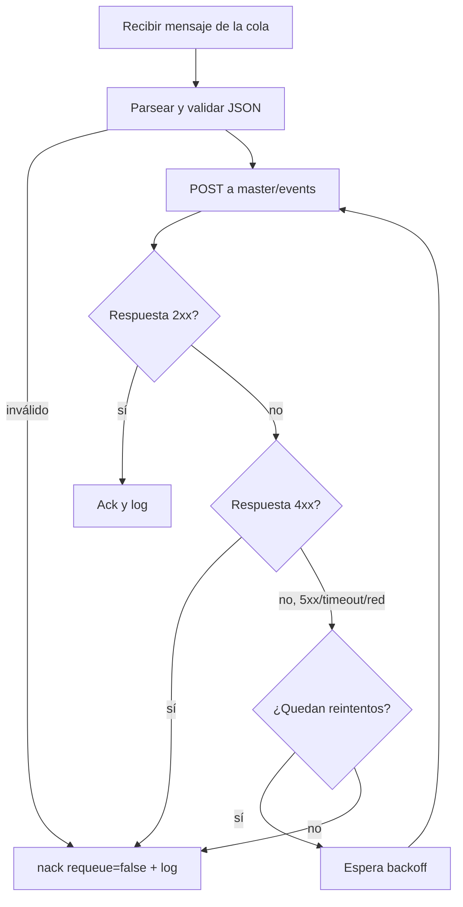

# Etapa 5 — Servicio `connector` (local)

> **Archivo:** `etapas/etapa-05-connector-local.md`
> **Estado:** Verificado localmente
> **Checkpoint objetivo:** CP-L5 — Flujo end-to-end local (RabbitMQ → connector → master → DB) — **alcanzado**

---

## 1. Objetivo de la etapa

Al terminar esta etapa tendremos el servicio **`connector`** corriendo en local como app NestJS standalone que:

1. Se conecta al broker del curso por **AMQPS/TLS** (`broker.iic2173.org:5671`, vhost `energy`) y consume la cola asignada **`observer.45.q`** (confirmada en la Etapa 3).
2. Se **reconecta automáticamente** con backoff exponencial si el broker cae (RNF-3), reutilizando la lógica validada en el PoC.
3. **Reenvía cada evento por HTTP POST** a `POST /events` de `master` (RNF-2) y hace **ack solo tras 2xx**; ante errores transitorios reintenta y, si no se logra, descarta con `nack(requeue: false)` y log.
4. Registra **logging estructurado** (timestamp UTC, niveles, contexto por evento).
5. Cierra el **flujo end-to-end local**: RabbitMQ → connector → master → PostgreSQL (checkpoint CP-L5).

**Alcance:** solo local. La dockerización (Etapa 6), el despliegue en AWS (Etapas 7–8) y las pruebas de resiliencia en producción (Etapa 12) llegan después.

**Prerrequisitos:** Etapa 4 cerrada (`master` en `http://localhost:3000` con DB corriendo), PoC de la Etapa 3 funcionando, Docker Desktop, Node LTS y npm.

---

## 2. Requisitos del enunciado que cubre

| Requisito | Cómo se cubre |
| --- | --- |
| RNF-1 (separación de servicios `connector`/`master`) | `connector` como app independiente que solo consume y reenvía; `master` solo persiste y consulta |
| RNF-2 (`connector` → `master` vía HTTP POST) | Reenvío de cada evento a `POST /events` con reintentos y timeout |
| RNF-3 (resiliencia: reconexión automática a RabbitMQ) | Backoff exponencial + jitter ante caídas del broker; el proceso nunca termina (reutiliza la Etapa 3) |
| RNF-4 (indirecto) | `connector` no tiene base de datos; depende solo de RabbitMQ y de `master` |
| RF1–RF4 (indirecto) | El flujo real alimenta `master`, que ya cubre la persistencia y consulta (Etapa 4) |
| DOC-1 (registro de IA) | Interacciones registradas en `ai_docs/prompts/` |

---

## 3. Teoría general necesaria

### 3.1 Aplicación NestJS standalone (sin servidor HTTP)
- `NestFactory.createApplicationContext(AppModule)` arranca el contenedor de DI **sin levantar un servidor HTTP**. Ideal para un worker/proceso de consumo.
- **Lifecycle hooks**: `OnApplicationBootstrap` (conectar y empezar a consumir) y `OnApplicationShutdown` (cerrar channel y connection de forma ordenada).
- `ConfigModule` (de `@nestjs/config`) con validación fail-fast, igual que en `master`.

### 3.2 `amqplib` (repaso de la Etapa 3)
- `connect(url)` → `ChannelModel`; `createChannel()` → `Channel`; `consume(queue, handler, { noAck: false })`.
- Eventos `error`/`close` de la conexión gatillan la reconexión. Los channels **no sobreviven** a una reconexión: hay que re-crear channel y re-suscribir.
- Ack con `channel.ack(msg)` (elimina el mensaje) y `channel.nack(msg, false, false)` (descarta sin reencolar).

### 3.3 Reenvío HTTP con `fetch` nativo
- Node ≥ 18 trae `fetch` global: suficiente para un `POST` con JSON. `AbortController` permite fijar un **timeout** (contrato de la Etapa 2: 5–10 s).
- Semántica: **2xx** → ack. **4xx** → evento inválido para `master` → descartar con `nack`. **5xx/timeout/red** → error transitorio → reintentar con backoff y tope; si no se logra, `nack` + log (evita mensajes atascados sin ack).

### 3.4 Backoff y reintentos (patrón de la Etapa 3)
- Función pura `computeBackoffDelay(attempt, { baseMs, capMs, jitterMs })`: `min(base * 2^attempt, cap) + jitter`.
- El mismo patrón se aplica a la reconexión AMQP (reintentos infinitos) y, con tope, al reenvío HTTP.

### 3.5 Logging estructurado
- Formato `[timestamp UTC] NIVEL mensaje` con contexto por evento (`tag`, `idpk`, `type`), sin emojis, tal como se dejó en el PoC refactorizado.

---

## 4. Aplicación específica a EnergyShark

| Concepto | Aplicación en el `connector` |
| --- | --- |
| App NestJS standalone | `apps/connector` con `createApplicationContext` (sin HTTP), respetando la carpeta `poc/` existente |
| Conexión AMQP | `amqps://observer.45:<pass>@broker.iic2173.org:5671/energy` (la contraseña solo en `.env`) |
| Cola asignada | `observer.45.q` |
| Consumo | `basic.consume` con `noAck: false`; `channel.prefetch(1)` para procesar de a uno |
| Parsing | `JSON.parse` + validación mínima (`idpk`, `type`, `packageBody`), igual que el PoC |
| Reenvío | `POST {MASTER_URL}/events` con el JSON recibido **tal cual** (contrato Etapa 2) + timeout |
| Ack | Solo tras 2xx. 4xx → `nack(requeue:false)`. 5xx/timeout → reintento con tope → `nack(requeue:false)` |
| Reconexión | Backoff exponencial + jitter, reintentos infinitos, re-suscripción completa |
| Apagado | `onApplicationShutdown`: cerrar channel y connection (no reconectar) |
| Variables de entorno | `RABBITMQ_URL`, `RABBITMQ_QUEUE`, `MASTER_URL`, `NODE_ENV` |

**Contrato `connector → master` (Etapa 2, sección 8.5):**

- El body del `POST /events` es el JSON del evento **sin modificar**.
- `master` es la autoridad sobre `receivedAt` y sobre el `id` propio.
- Éxito = HTTP 2xx → ack. Error/red caída → sin ack + reintento con backoff.
- Timeout de la request configurable (5–10 s).

---

## 5. Decisiones técnicas

| # | Decisión | Alternativas | Recomendación y por qué |
| --- | --- | --- | --- |
| 1 | Tipo de app | Script standalone (PoC) vs NestJS standalone | **NestJS standalone** (decisión #2 de la Etapa 2): DI, ConfigModule, lifecycle hooks y consistencia con `master`. El PoC queda como referencia en `apps/connector/poc/` |
| 2 | Cliente HTTP | `fetch` nativo vs `axios` vs `@nestjs/axios` | **`fetch` nativo** (Node ≥ 18) con `AbortController` para el timeout: cero dependencias para un forward simple |
| 3 | Cliente AMQP | `amqplib` vs `@golevelup/nestjs-rabbitmq` | **`amqplib`** (decisiones #3 Etapa 2 y #3 Etapa 3): control total de reconexión y TLS |
| 4 | Backoff | Copiar vs extraer del PoC | **Extraer/copiar la función pura** `computeBackoffDelay` (patrón ya validado) y centralizarla en `src/amqp/backoff.ts` |
| 5 | Estrategia de ack | Ack tras éxito; 4xx → nack; 5xx/timeout → reintento con tope → nack | **Ack solo tras 2xx** (contrato). Tope de reintentos HTTP (ej. 5 con backoff) para no bloquear la cola; agotado → `nack(requeue: false)` + log |
| 6 | Timeout de request | Sin timeout vs 5–10 s con `AbortController` | **`REQUEST_TIMEOUT_MS` (por defecto 5 000–10 000)**: evita que un `master` lento congele el consumo |
| 7 | Prefetch | Sin prefetch vs `prefetch(1)` | **`prefetch(1)`**: procesa de a un mensaje, respetando el orden y el ack condicional al reenvío |
| 8 | Lifecycle | Bootstrap manual vs `onApplicationBootstrap`/`onApplicationShutdown` | **Lifecycle hooks de Nest**: arranque/cierre ordenado y testeable |
| 9 | Config | `ConfigModule` con validación vs `process.env` directo | **`ConfigModule` + `validate`** (mismo patrón de `master`): fail-fast con mensajes claros |
| 10 | Duplicados | Deduplicar vs tolerar | **Tolerar** (at-least-once, Etapa 2): el reenvío puede duplicar si el ack se pierde; `master` ya tolera duplicados en esta etapa |

---

## 6. Diagramas

### 6.1 Flujo end-to-end local (objetivo de la etapa)



### 6.2 Ciclo de vida de cada mensaje



---

## 7. Sub-etapas

### 7.1 Sub-etapa 5.1 — Scaffold del servicio standalone
Crear la app NestJS standalone en `apps/connector` (sin servidor HTTP), preservando la carpeta `poc/`.

### 7.2 Sub-etapa 5.2 — Consumidor AMQP robusto
Conexión AMQPS/TLS, channel con `prefetch(1)`, consumo de `observer.45.q` y reconexión automática con backoff.

### 7.3 Sub-etapa 5.3 — Reenvío HTTP
`POST {MASTER_URL}/events` con timeout, reintentos con tope y ack/nack según el resultado.

### 7.4 Sub-etapa 5.4 — Logging estructurado
Logger con timestamp UTC, niveles y contexto por evento (reutiliza el patrón del PoC).

### 7.5 Sub-etapa 5.5 — Integración local end-to-end
RabbitMQ → connector → master → DB verificado con un evento real y consultas en `master`.

---

## 8. Pasos concretos — Action Items

### Paso 0 — Prerrequisitos
1. Confirmar `master` corriendo: `curl http://localhost:3000/health` → 200.
2. Confirmar la DB: `docker ps` muestra `energy-postgres` healthy.
3. Confirmar el PoC: `cd apps/connector/poc && npx tsx --env-file=.env amqp-poc.ts` conecta y consume.
4. Tener el `.env` raíz con `RABBITMQ_URL`, `RABBITMQ_QUEUE`, `MASTER_URL`.
5. **Verificar:** todo responde y las variables existen.

### Paso 1 — 5.1 Scaffold NestJS standalone en `apps/connector`
1. Generar el scaffold en una carpeta temporal (para no pisar `apps/connector/poc`):
   ```bash
   npx @nestjs/cli new connector-tmp --package-manager npm --skip-git
   ```
2. Mover el contenido generado a `apps/connector/` (raíz), conservando `apps/connector/poc/`:
   ```bash
   # copiar package.json, tsconfig*, nest-cli.json, jest*, src/, test/ ...
   ```
3. Instalar dependencias del proyecto: `npm i amqplib @nestjs/config` (y `npm i -D @types/amqplib` si hace falta).
4. Convertir a **standalone**: `src/main.ts` usa `NestFactory.createApplicationContext(AppModule)` (sin `listen`, sin platform-express si no se usa).
5. **Verificar:** `npm run build` compila y `npm run start` arranca sin levantar un puerto HTTP.

### Paso 2 — 5.1 Configuración con validación
1. Crear `apps/connector/.env` (no versionado) con:
   ```
   NODE_ENV=development
   RABBITMQ_URL=amqps://observer.45:<password>@broker.iic2173.org:5671/energy
   RABBITMQ_QUEUE=observer.45.q
   MASTER_URL=http://localhost:3000
   REQUEST_TIMEOUT_MS=5000
   ```
2. `ConfigModule.forRoot({ isGlobal: true, envFilePath, validate })` con un `validateConfig` (mismo patrón de `master`).
3. **Verificar:** si falta una variable, el arranque falla con un mensaje claro.

### Paso 3 — 5.2 Utilidad de backoff
1. Crear `src/amqp/backoff.ts` con la función pura `computeBackoffDelay(attempt, options)` (misma fórmula del PoC).
2. Añadir un test rápido opcional (o un `console` en un script) para ver la secuencia 1 s, 2 s, 4 s… hasta el tope.
3. **Verificar:** la secuencia crece y se acota al `capMs`.

### Paso 4 — 5.2 Módulo AMQP (conexión + consumo + reconexión)
1. Crear `AmqpService` (`@Injectable`) que implementa `OnApplicationBootstrap` y `OnApplicationShutdown`:
   - `onApplicationBootstrap` → `connect`, `createChannel`, `prefetch(1)`, `consume(queue, handler, { noAck: false })` y suscribe `error`/`close` → reconexión con `computeBackoffDelay`.
   - `onApplicationShutdown` → cerrar channel y connection (bandera `shuttingDown` para no reconectar).
2. El `handler` delega el procesamiento a un `ForwardService` (separación de responsabilidades).
3. **Verificar:** el connector consume de `observer.45.q` y, si se corta la red (modo caos del PoC como referencia), se reconecta solo.

### Paso 5 — 5.3 Reenvío HTTP con timeout y ack/nack
1. Crear `ForwardService`:
   - `forward(event: unknown, channel, msg)` → `fetch(`${MASTER_URL}/events`, { method: 'POST', headers, body: JSON.stringify(event), signal: AbortSignal.timeout(REQUEST_TIMEOUT_MS) })`.
   - 2xx → `channel.ack(msg)` + log.
   - 4xx → `channel.nack(msg, false, false)` + log de error (evento inválido).
   - 5xx/timeout/red → reintentar con backoff (tope `MAX_FORWARD_RETRIES`, ej. 5); agotado → `nack(requeue: false)` + log.
2. Manejar `AbortError` (timeout) y `TypeError` de red (`fetch` lanza `TypeError` cuando falla la red).
3. **Verificar:** con `master` arriba, cada evento real termina en `ack`; con `master` caído, hay reintentos y, al recuperarse, los eventos pendientes se entregan.

### Paso 6 — 5.4 Logging estructurado
1. Crear `src/common/logger.ts` (o reutilizar el patrón del PoC) con `timestamp()`, niveles `info/warn/error` y mensajes sin emojis.
2. Incluir contexto en los logs del ciclo de vida del mensaje: `tag`, `idpk`, `type`, `deliveryTag`.
3. **Verificar:** los logs muestran timestamp UTC y permiten seguir un evento de la cola hasta la DB.

### Paso 7 — 5.5 Integración local end-to-end
1. Levantar `master` (Etapa 4) + `connector` + PostgreSQL.
2. Esperar eventos reales del curso y verificar:
   - Log del connector: mensaje recibido → `POST /events` → `ack`.
   - `master`: `GET /history` muestra el evento con `receivedAt` en UTC.
   - DB: `psql -c "SELECT idpk, type, receivedAt FROM history ORDER BY receivedAt DESC LIMIT 5;"`.
3. Probar corte de red del broker (reconexión) y caída de `master` (reintentos del forward).
4. Guardar la evidencia en la bitácora (Entrada 12).
5. **Verificar:** un evento real recorre RabbitMQ → connector → master → DB (CP-L5).

### Paso 8 — Cierre y versionado
1. Registrar en la bitácora (Entrada 12) y en `ai_docs/prompts/`.
2. Actualizar `etapas/README.md` (Etapa 5 → Verificado localmente) y la matriz del plan maestro (RNF-1, RNF-2, RNF-3 → Verificado localmente).
3. Commit: `git add apps/connector etapas/ docs/ ai_docs/ && git commit -m "feat(connector): implement standalone AMQP consumer with HTTP forwarding (RNF-2, RNF-3)"`.
4. **Verificar:** `git status` no muestra `.env` y `git log --oneline` muestra el commit.

---

## 9. Comandos necesarios

```bash
# Scaffold (en carpeta temporal, luego mover a apps/connector conservando poc/)
npx @nestjs/cli new connector-tmp --package-manager npm --skip-git

# Dependencias
cd apps/connector
npm i amqplib @nestjs/config
npm i -D @types/amqplib

# .env local (nunca versionado)
# RABBITMQ_URL=amqps://observer.45:<password>@broker.iic2173.org:5671/energy
# RABBITMQ_QUEUE=observer.45.q
# MASTER_URL=http://localhost:3000
# REQUEST_TIMEOUT_MS=5000

# Ejecución
npm run build
npm run start

# Integración end-to-end
curl -s http://localhost:3000/health
psql -h localhost -p 5432 -U postgres -d energy_db -c \
  "SELECT idpk, type, receivedAt FROM history ORDER BY receivedAt DESC LIMIT 5;"
```

---

## 10. Resultados esperados

- `connector` corre como app NestJS standalone y consume `observer.45.q` por AMQPS/TLS.
- Cada evento real se reenvía a `POST /events` y se hace ack solo tras 2xx.
- Ante caída del broker o de la red, el connector se reconecta solo con backoff (RNF-3).
- Ante caída de `master`, el reenvío reintenta con tope y luego descarta con log (sin bloquear la cola).
- El evento real queda en PostgreSQL con `receivedAt` en UTC y visible en `GET /history`.
- Bitácora y `ai_docs/prompts/` actualizados; **CP-L5** verificado.

---

## 11. Métodos de verificación

| Verificación | Cómo realizarla |
| --- | --- |
| Standalone sin HTTP | `npm run start` no abre un puerto; los logs muestran el consumo |
| Consumo AMQP | Log del connector: mensaje recibido con `deliveryTag` y `idpk` |
| Reenvío + ack | Con `master` arriba: cada mensaje termina en `ack`; `GET /history` crece |
| Reconexión | Cortar la red: logs de backoff → reconexión → re-suscripción |
| Reintentos del forward | Detener `master`: logs de reintento con backoff; al volver, los eventos se entregan |
| Persistencia | `psql` muestra los eventos con `receivedAt` en UTC |
| Sin secretos | `git ls-files | grep -E '\.env$'` vacío |
| CP-L5 | Evidencia de la integración end-to-end en la bitácora (Entrada 12) |

---

## 12. Errores comunes y troubleshooting

| Problema probable | Cómo diagnosticarlo / evitarlo |
| --- | --- |
| `ACCESS_REFUSED` / vhost incorrecto | Verificar `RABBITMQ_URL` con `amqps://observer.45:<pass>@broker.iic2173.org:5671/energy` |
| `404 NOT_FOUND - no queue 'observer.45.q'` | Confirmar el nombre de la cola asignada (bitácora Entrada 8) |
| Certificado TLS | El broker usa AMQPS; si hay error de certificado, revisar CAs (ver troubleshooting de la Etapa 3) |
| El connector arranca y no consume | El `prefetch(1)` + `noAck:false` requieren el ack en el handler; revisar que no haya excepción silenciosa en el handler |
| Mensajes atascados sin ack | Si un reenvío nunca termina (timeout no disparado), el mensaje queda *unacked*: asegurar `AbortSignal.timeout` en `fetch` |
| `fetch` lanza `TypeError` | Es el error de red de Node: capturarlo como error transitorio para reintentar (no como fallo fatal) |
| Reconexión en bucle apretado | Verificar `computeBackoffDelay` (base/cap/jitter) y la bandera `reconnecting` para evitar dobles reintentos |
| Duplicados en `master` | Esperado (at-least-once): el ack se pierde si `master` responde pero el cliente no llega a ack; se tolera en esta etapa |
| El scaffold pisa `poc/` | Generar el scaffold en una carpeta temporal y mover el contenido, conservando `apps/connector/poc/` |

---

## 13. Checklist de finalización

- [ ] Scaffold NestJS standalone en `apps/connector` (sin HTTP), conservando `apps/connector/poc/`.
- [ ] `ConfigModule` con validación (`RABBITMQ_URL`, `RABBITMQ_QUEUE`, `MASTER_URL`, `REQUEST_TIMEOUT_MS`).
- [ ] Función `computeBackoffDelay` centralizada (base/cap/jitter).
- [ ] `AmqpService` con `OnApplicationBootstrap`/`OnApplicationShutdown`, `prefetch(1)` y reconexión automática.
- [ ] `ForwardService` con `POST /events`, timeout (`AbortSignal`) y ack solo tras 2xx.
- [ ] Reintentos del forward con tope; `nack(requeue:false)` para 4xx y tras agotar reintentos.
- [ ] Logging estructurado con timestamp UTC y contexto por evento.
- [ ] Integración end-to-end local verificada (evento real → `GET /history` → `psql`).
- [ ] Prueba de caída del broker (reconexión) y de caída de `master` (reintentos).
- [ ] Bitácora (Entrada 12) y `ai_docs/prompts/` actualizados.
- [ ] Estado en `etapas/README.md` (Etapa 5 → Verificado localmente) y matriz de trazabilidad (RNF-1, RNF-2, RNF-3).
- [ ] Commit realizado y pusheado; `.env` no versionado.

---

## 14. Pruebas locales

| # | Prueba | Resultado esperado |
| --- | --- | --- |
| 1 | `npm run start` del connector | Arranca sin servidor HTTP y consume la cola |
| 2 | Evento real del curso | Log: recibido → `POST /events` → ack; `GET /history` lo muestra |
| 3 | Caída de `master` (detener proceso) | Reintentos del forward con backoff; al volver, se entregan los eventos |
| 4 | Corte de red del broker | Reconexión con backoff y re-suscripción sin intervención |
| 5 | Evento malformado (si llega) | `nack(requeue:false)` + log, el connector sigue consumiendo |
| 6 | `psql` sobre `history` | Eventos con `receivedAt` en UTC |
| 7 | Repetir ciclo caída/recuperación ×2 | El proceso sigue vivo y procesando |

---

## 15. Pruebas en producción

No aplica en esta etapa: el connector corre solo en local contra la infraestructura compartida del curso y `master` local. **Cuidado con el entorno compartido:** el connector solo consume su cola asignada y hace ack/nack; no declara exchanges/colas ni publica mensajes. Las primeras pruebas en producción (EC2/RDS) ocurren en las Etapas 7–8.

---

## 16. Registro para la bitácora

Al terminar la etapa, registrar en `docs/bitacora.md`:

- Fecha y objetivo de la etapa (Entrada 12).
- Decisiones técnicas adoptadas (tabla de la sección 5).
- Comandos de scaffold, arranque y pruebas.
- Evidencia de la integración end-to-end (evento real → DB) y de las pruebas de resiliencia.
- Problemas encontrados y soluciones (sección 12).
- Registros de IA generados (`ai_docs/prompts/`).

---

## 17. Siguiente etapa

**Etapa 6 — Dockerización y Docker Compose** (`etapa-06-docker-compose.md`): Dockerfile multi-stage de `master` y `connector`, `docker-compose` de desarrollo (master + connector + postgres en red interna) y HEALTHCHECK por contenedor. La integración end-to-end local de esta etapa se vuelve reproducible con un solo comando.
