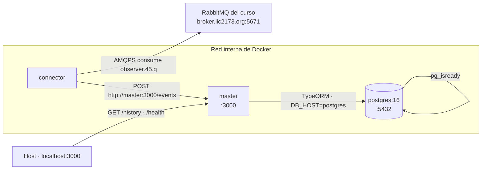
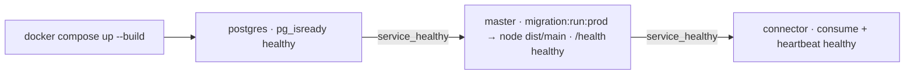

# Etapa 6 — Dockerización y Docker Compose

> **Archivo:** `etapas/etapa-06-docker-compose.md`
> **Estado:** Verificado localmente
> **Checkpoint objetivo:** CP-L6 — Sistema completo en contenedores con health checks — **alcanzado**

---

## 1. Objetivo de la etapa

Al terminar esta etapa tendremos el sistema **completo en contenedores Docker** con un solo comando:

1. **Dockerfile multi-stage** de `master` y de `connector` (build y runtime separados, sin devDependencies en producción).
2. **Docker Compose de desarrollo** con `master` + `connector` + `postgres` en una **red interna** (RNF-6).
3. **HEALTHCHECK por contenedor** (RNF-5): API real para `master`, `pg_isready` para PostgreSQL y validación operativa para `connector`.
4. **Migraciones automáticas** al arrancar `master` (sin `synchronize`).
5. **Pruebas con Compose**: build, arranque, comunicación interna, health checks y logs (checkpoint CP-L6).

**Alcance:** desarrollo local. El Compose de producción (con RDS y sin `postgres` en contenedor) se adapta en la Etapa 8, y las pruebas de resiliencia en producción en la Etapa 12.

**Prerrequisitos:** Etapas 4 y 5 cerradas (`master` y `connector` corriendo en local), Docker Desktop operativo, `.env` raíz con las credenciales del curso.

---

## 2. Requisitos del enunciado que cubre

| Requisito | Cómo se cubre |
| --- | --- |
| RNF-5 (Dockerización + HEALTHCHECK por contenedor) | Dockerfile multi-stage por servicio y HEALTHCHECK real u operativo en cada contenedor |
| RNF-6 (Docker Compose master + connector + postgres local) | `compose.yaml` de desarrollo con red interna, volúmenes y orquestación |
| RNF-1 (indirecto) | Los servicios se comunican por la red interna de Compose (por nombre de servicio) |
| RNF-4 (indirecto) | `master` sigue operativo aunque `connector` o RabbitMQ fallen; se prueba en contenedores |
| DOC-1 | Registro de IA de la etapa |

---

## 3. Teoría general necesaria

### 3.1 Dockerfile multi-stage
- Dos etapas: **build** (compila TS → `dist/`) y **runtime** (solo `dist/` + dependencias de producción).
- En runtime se instala con `npm ci --omit=dev` (sin devDependencies) para imágenes pequeñas y sin toolchain innecesario.
- **`.dockerignore`**: excluir `node_modules/`, `dist/`, `.env`, `*.tsbuildinfo` y (en `connector`) la carpeta `poc/` para no inflar la imagen.

### 3.2 Migraciones en contenedor
- En local se usó `typeorm-ts-node-commonjs` (necesita `ts-node`, devDep) sobre `src/data-source.ts`.
- En runtime no hay TS ni devDeps: se usa la **DataSource compilada** (`dist/data-source.js`) con el binario `typeorm` (es dependencia de producción). Se agrega el script `migration:run:prod`.
- Al arrancar `master`, el comando del contenedor ejecuta primero las migraciones y luego `node dist/main`.

### 3.3 Docker Compose
- **Services**: `postgres`, `master`, `connector`.
- **Red interna**: los contenedores se resuelven por nombre de servicio (`master:3000`); `connector` usa `MASTER_URL=http://master:3000`.
- **Volumen** nombrado para `PGDATA` (persistencia) y **`depends_on`** con condición de salud para ordenar el arranque.
- Variables de entorno inyectadas por `environment:` (no versionadas); el `.env` del host no se monta dentro del contenedor salvo que se documente.

### 3.4 HEALTHCHECK
- `postgres`: `pg_isready` (viene con la imagen oficial).
- `master`: petición real a `GET /health` con `node -e "fetch(...)"` (sin instalar `curl` en Alpine).
- `connector`: **validación operativa** — el servicio escribe un archivo de *heartbeat* periódicamente y el HEALTHCHECK valida que esté actualizado (`stat -c %Y`). Alternativa simple: `pgrep`.

---

## 4. Aplicación específica a EnergyShark

| Servicio | Imagen | Puertos | Healthcheck | Depende de |
| --- | --- | --- | --- | --- |
| `postgres` | `postgres:16` | `5432` (host, dev) | `pg_isready -U postgres` | — |
| `master` | build `apps/master` | `3000` (host) | `fetch http://localhost:3000/health` | `postgres` healthy |
| `connector` | build `apps/connector` | — | heartbeat file actualizado | `master` healthy |

Variables por servicio:

- **`postgres`**: `POSTGRES_USER`, `POSTGRES_PASSWORD`, `POSTGRES_DB`, volumen `energy_pgdata`.
- **`master`**: `NODE_ENV`, `PORT=3000`, `DB_HOST=postgres` (nombre de servicio), `DB_PORT=5432`, `DB_USER`, `DB_PASSWORD`, `DB_NAME`, `DB_SSL=false` (local).
- **`connector`**: `NODE_ENV`, `RABBITMQ_URL` (broker del curso, externo), `RABBITMQ_QUEUE=observer.45.q`, `MASTER_URL=http://master:3000`, `REQUEST_TIMEOUT_MS`, `MAX_FORWARD_RETRIES`.

**Broker RabbitMQ:** es externo (`broker.iic2173.org`); no se conteneriza. Opcional para pruebas controladas: un servicio `rabbitmq:3` con `profile` (fuera del arranque normal).

---

## 5. Decisiones técnicas

| # | Decisión | Alternativas | Recomendación y por qué |
| --- | --- | --- | --- |
| 1 | Imagen base | `node:24-alpine` vs `node:24-slim` vs distroless | **`node:24-alpine`**: pequeño, shell disponible para HEALTHCHECK/entrypoint; distroless complica el healthcheck |
| 2 | Multi-stage | Build + runtime vs una sola imagen | **Multi-stage**: el runtime no lleva TypeScript, `ts-node`, devDeps ni fuente TS |
| 3 | Migraciones en runtime | `typeorm-ts-node-commonjs` (TS) vs DataSource compilada | **`migration:run:prod` con `dist/data-source.js`** y binario `typeorm` (dependencia de producción); sin devDeps en la imagen |
| 4 | Ubicación del Compose | Raíz (`compose.yaml`) vs `infra/` | **Raíz `compose.yaml`**: convencional y visible; la variante de producción se documentará en la Etapa 8 |
| 5 | Comunicación interna | IPs fijas vs nombres de servicio | **Nombres de servicio** en la red de Compose (`master:3000`) |
| 6 | Persistencia | Volumen nombrado vs bind mount | **Volumen nombrado `energy_pgdata`**: portable entre máquinas y seguro |
| 7 | HEALTHCHECK `master` | `curl` vs `node -e fetch` | **`node -e "fetch(...)"`**: sin instalar `curl` en Alpine (menos paquetes, menos superficie) |
| 8 | HEALTHCHECK `connector` | Heartbeat file vs `pgrep` | **Heartbeat file** (validación operativa real: proceso vivo y activo); `pgrep` como alternativa mínima |
| 9 | Variables de entorno | `.env` montado vs `environment:` de Compose | **`environment:` de Compose** (valores desde un `.env` host no versionado si se desea): evita rutas de archivo dentro del contenedor |
| 10 | Orden de arranque | `depends_on` simple vs con condición de salud | **`depends_on` con `condition: service_healthy`**: `connector` solo arranca cuando `master` responda y `master` cuando `postgres` esté listo |

---

## 6. Diagramas

### 6.1 Arquitectura con Compose (desarrollo)



### 6.2 Arranque y health checks



---

## 7. Sub-etapas

### 7.1 Sub-etapa 6.1 — Dockerfile de `master` (multi-stage)
Build y runtime para la API, con migraciones compiladas disponibles.

### 7.2 Sub-etapa 6.2 — Dockerfile de `connector` (multi-stage)
Build y runtime para el consumidor standalone, excluyendo `poc/`.

### 7.3 Sub-etapa 6.3 — Docker Compose de desarrollo
Orquestación de `master` + `connector` + `postgres` con red interna y volúmenes.

### 7.4 Sub-etapa 6.4 — HEALTHCHECK por contenedor
`pg_isready`, `/health` real y heartbeat operativo.

### 7.5 Sub-etapa 6.5 — Pruebas con Compose
Build, arranque, comunicación, health checks y logs (CP-L6).

---

## 8. Pasos concretos — Action Items

### Paso 0 — Prerrequisitos
1. Confirmar Docker Desktop: `docker info` responde.
2. Confirmar `master` y `connector` funcionando fuera de Docker (Etapas 4–5).
3. Tener el `.env` raíz con `DB_*`, `PORT`, `RABBITMQ_URL`, `RABBITMQ_QUEUE` y `MASTER_URL`.
4. **Verificar:** `npm run build` pasa en `apps/master` y `apps/connector`.

### Paso 1 — 6.1 Dockerfile de `master`
1. Crear `apps/master/.dockerignore`:
   ```
   node_modules
   dist
   .env
   .env.*
   !.env.example
   *.tsbuildinfo
   coverage
   ```
2. Crear `apps/master/Dockerfile` (contexto de build = `apps/master`):
   ```dockerfile
   # ---- build ----
   FROM node:24-alpine AS build
   WORKDIR /app
   COPY package*.json ./
   RUN npm ci
   COPY tsconfig*.json nest-cli.json ./
   COPY src src
   RUN npm run build

   # ---- runtime ----
   FROM node:24-alpine AS runtime
   ENV NODE_ENV=production
   WORKDIR /app
   COPY package*.json ./
   RUN npm ci --omit=dev && npm cache clean --force
   COPY --from=build /app/dist ./dist
   EXPOSE 3000
   CMD ["node", "dist/main"]
   ```
3. Agregar el script de migración para producción en `apps/master/package.json`:
   ```json
   "migration:run:prod": "typeorm migration:run -d dist/data-source.js"
   ```
4. **Verificar:** `docker build -t energyshark-master apps/master` compila y la imagen arranca con env mínimos.

### Paso 2 — 6.2 Dockerfile de `connector`
1. Crear `apps/connector/.dockerignore` (excluye además `poc/`):
   ```
   node_modules
   dist
   poc
   .env
   .env.*
   !.env.example
   *.tsbuildinfo
   ```
2. Crear `apps/connector/Dockerfile` (contexto = `apps/connector`):
   ```dockerfile
   # ---- build ----
   FROM node:24-alpine AS build
   WORKDIR /app
   COPY package*.json ./
   RUN npm ci
   COPY tsconfig*.json nest-cli.json ./
   COPY src src
   RUN npm run build

   # ---- runtime ----
   FROM node:24-alpine AS runtime
   ENV NODE_ENV=production
   WORKDIR /app
   COPY package*.json ./
   RUN npm ci --omit=dev && npm cache clean --force
   COPY --from=build /app/dist ./dist
   CMD ["node", "dist/main"]
   ```
3. **Verificar:** `docker build -t energyshark-connector apps/connector` compila y arranca con `RABBITMQ_URL`/`MASTER_URL` mínimos.

### Paso 3 — 6.3 Docker Compose de desarrollo
1. Crear `compose.yaml` en la raíz con tres servicios (ver sección 4 para las variables), red por defecto de Compose, volumen `energy_pgdata` y `depends_on` con condición `service_healthy`.
2. `master` usa `command: ["sh", "-c", "npm run migration:run:prod && node dist/main"]`.
3. `connector` usa `MASTER_URL=http://master:3000`.
4. **Verificar:** `docker compose config` valida la sintaxis.

### Paso 4 — 6.4 HEALTHCHECK por contenedor
1. `postgres`: `test: ["CMD-SHELL", "pg_isready -U $${POSTGRES_USER} -d $${POSTGRES_DB}"]` con `interval/start_period`.
2. `master`: `test: ["CMD", "node", "-e", "fetch('http://localhost:3000/health').then(r=>process.exit(r.ok?0:1)).catch(()=>process.exit(1))"]`.
3. `connector`: implementar el **heartbeat** en `AmqpService` (un `setInterval` que toca `/tmp/connector-heartbeat` cada 5 s, iniciado en `onApplicationBootstrap` y limpiado en `onApplicationShutdown`) y HEALTHCHECK que verifica la antigüedad del archivo:
   ```yaml
   test: ["CMD-SHELL", "test $$(( $$(date +%s) - $$(stat -c %Y /tmp/connector-heartbeat) )) -lt 15"]
   ```
4. **Verificar:** `docker inspect --format '{{json .State.Health}}' <container>` muestra `"status":"healthy"`.

### Paso 5 — 6.5 Pruebas con Compose
1. `docker compose up --build -d`.
2. Verificar orden de arranque y health checks: `docker compose ps` (todo `healthy`).
3. Comprobar logs: `docker compose logs -f master connector`.
4. Probar la API: `curl localhost:3000/health` y `curl localhost:3000/history`.
5. Verificar el flujo real: los eventos del curso llegan por `connector` → `master` → `postgres` y aparecen en `GET /history`.
6. **Verificar:** CP-L6 alcanzado y evidencia en la bitácora (Entrada 14).

### Paso 6 — Pruebas de resiliencia en contenedores
1. `docker compose restart master` → `connector` reintenta (`fetch failed`) y al volver `master` entrega los pendientes (ack).
2. `docker compose restart connector` → se reconecta y vuelve a consumir.
3. Detener `postgres` y arrancarlo → `master` se recupera (health check).
4. **Verificar:** el sistema se recupera solo; nada requiere intervención manual.

### Paso 7 — Cierre y versionado
1. Registrar en la bitácora (Entrada 14) y en `ai_docs/prompts/`.
2. Actualizar `etapas/README.md` (Etapa 6 → Verificado localmente) y la matriz (RNF-5, RNF-6 → Verificado localmente).
3. Commits: `feat(docker)` para Dockerfiles/`compose.yaml`/heartbeat; `docs(bitacora)`, `docs(etapa-06)`, `docs(ai)` para la documentación.
4. **Verificar:** `git status` no muestra `.env` y `git log --oneline` muestra los commits.

---

## 9. Comandos necesarios

```bash
# Build manual de imágenes (debug)
docker build -t energyshark-master apps/master
docker build -t energyshark-connector apps/connector

# Compose (raíz del repo)
docker compose config              # validar sintaxis
docker compose up --build -d       # construir y arrancar
docker compose ps                  # estado + health checks
docker compose logs -f master connector
docker compose restart master      # prueba de resiliencia
docker compose restart connector
docker compose down                # detener (sin borrar volumen)

# Inspección de health
docker inspect --format '{{json .State.Health}}' energyshark-master-1

# Pruebas de la API
curl -s http://localhost:3000/health
curl -s "http://localhost:3000/history?limit=5"
```

---

## 10. Resultados esperados

- Imágenes multi-stage de `master` y `connector` (sin devDependencies en runtime).
- `docker compose up --build` levanta el sistema completo; los tres contenedores quedan `healthy`.
- `master` aplica migraciones antes de arrancar (sin `synchronize`).
- `connector` consume la cola del curso y reenvía a `master:3000` por la red interna.
- El flujo RabbitMQ → connector → master → postgres funciona dentro de Docker.
- `GET /history` y `/health` responden vía `localhost:3000`.
- Bitácora y `ai_docs/prompts/` actualizados; **CP-L6** verificado.

---

## 11. Métodos de verificación

| Verificación | Cómo realizarla |
| --- | --- |
| Imágenes construyen | `docker build` de ambos Dockerfiles sin errores |
| Compose válido | `docker compose config` sin advertencias |
| Todo healthy | `docker compose ps` muestra `healthy` en los tres servicios |
| Migraciones aplicadas | Logs de `master` muestran `migration:run:prod` sin error; `psql \d history` existe |
| Comunicación interna | `connector` loguea `ACK ... status=201` usando `MASTER_URL=http://master:3000` |
| Flujo real | `GET /history` crece con eventos del curso |
| Resiliencia | Tras `restart master`/`connector`, se recuperan solos |
| Sin secretos | `git ls-files | grep -E '\.env$'` vacío |
| CP-L6 | Evidencia en la bitácora (Entrada 14) |

---

## 12. Errores comunes y troubleshooting

| Problema probable | Cómo diagnosticarlo / evitarlo |
| --- | --- |
| `npm ci` falla dentro del build | La imagen base no tiene red o el cache: verificar `npm ci` localmente primero; no montar el `.env` dentro del build |
| `migration:run:prod` no encuentra migraciones | Revisar que `dist/data-source.js` existe tras `nest build` y que `migrations` apunta a `dist/migrations/*.js` |
| `connector` no alcanza `master` | Usar `MASTER_URL=http://master:3000` (nombre de servicio, no `localhost`) |
| `localhost` dentro del contenedor | Dentro de Compose `localhost` es el propio contenedor: usar nombres de servicio |
| Healthcheck de `master` en rojo | `node -e fetch` requiere la app escuchando en `:3000`; revisar logs con `docker compose logs master` |
| `pg_isready` falla al inicio | Es normal durante `start_period`; aumentar `interval`/`start_period` |
| Puertos ocupados en el host (5432/3000) | Servicios locales previos (Etapas 4–5) compiten: `docker compose down` o detener los procesos locales |
| Volumen con datos viejos | El esquema puede estar desactualizado: `docker compose down -v` (borra el volumen) y `up` |
| RabbitMQ del curso inalcanzable desde el contenedor | El host debe tener salida a `broker.iic2173.org:5671`; probar con `docker compose exec connector node -e "fetch(...)"` o revisar TLS |
| `typeorm` no disponible en runtime | `typeorm` debe estar en `dependencies` (ya lo está en `master`) |

---

## 13. Checklist de finalización

- [ ] `.dockerignore` de `master` y `connector` (excluye `poc/`, `node_modules`, `.env`, dist).
- [ ] Dockerfile multi-stage de `master` (build + runtime) y script `migration:run:prod`.
- [ ] Dockerfile multi-stage de `connector`.
- [ ] `compose.yaml` con `postgres` + `master` + `connector`, red interna y volumen `energy_pgdata`.
- [ ] `depends_on` con condición `service_healthy` para ordenar el arranque.
- [ ] HEALTHCHECK de `postgres` (`pg_isready`), `master` (`/health` real) y `connector` (heartbeat).
- [ ] Heartbeat implementado en `AmqpService` (toca el archivo periódicamente).
- [ ] `docker compose up --build` levanta los tres servicios `healthy`.
- [ ] Migraciones aplicadas automáticamente al arrancar `master`.
- [ ] Flujo real verificado (evento del curso → `GET /history`) dentro de Docker.
- [ ] Pruebas de resiliencia (restart de `master`/`connector`) sin intervención manual.
- [ ] Bitácora (Entrada 14) y `ai_docs/prompts/` actualizados.
- [ ] Estado en `etapas/README.md` (Etapa 6 → Verificado localmente) y matriz (RNF-5, RNF-6).
- [ ] Commits realizados y pusheados; `.env` no versionado.

---

## 14. Pruebas locales

| # | Prueba | Resultado esperado |
| --- | --- | --- |
| 1 | `docker build -t energyshark-master apps/master` | Imagen construida sin errores |
| 2 | `docker build -t energyshark-connector apps/connector` | Imagen construida sin errores |
| 3 | `docker compose config` | Sintaxis válida |
| 4 | `docker compose up --build -d` | Los tres servicios arrancan en orden |
| 5 | `docker compose ps` | Todos `healthy` |
| 6 | `curl localhost:3000/health` | `{ status: 'ok', db: 'up' }` |
| 7 | `curl "localhost:3000/history?limit=5"` | `{ items, meta }` con eventos reales |
| 8 | `docker compose restart master` | `connector` reintenta y luego ack; `master` healthy de nuevo |
| 9 | `docker compose logs connector` | `ACK tag=... status=201` |

---

## 15. Pruebas en producción

No aplica en esta etapa (entorno de desarrollo local). El Compose de producción se adapta en la Etapa 8: `postgres` se reemplaza por RDS (endpoint DNS + `DB_SSL=true`), `master`/`connector` corren igual y la exposición pasa por Nginx (Etapa 10).

---

## 16. Registro para la bitácora

Al terminar la etapa, registrar en `docs/bitacora.md`:

- Fecha y objetivo de la etapa (Entrada 14).
- Decisiones técnicas adoptadas (tabla de la sección 5).
- Comandos de build, Compose y health checks.
- Resultado de las pruebas de resiliencia en contenedores.
- Problemas encontrados y soluciones (sección 12).
- Registros de IA generados (`ai_docs/prompts/`).

---

## 17. Siguiente etapa

**Etapa 7 — Infraestructura AWS: EC2 + RDS** (`etapa-07-aws-ec2-rds.md`): teoría AWS (VPC/SG/EC2/RDS), instancia Ubuntu Free Tier, key pair `.pem` (fuera del repo), Docker Engine en EC2, Elastic IP y RDS PostgreSQL con acceso solo desde la EC2.
