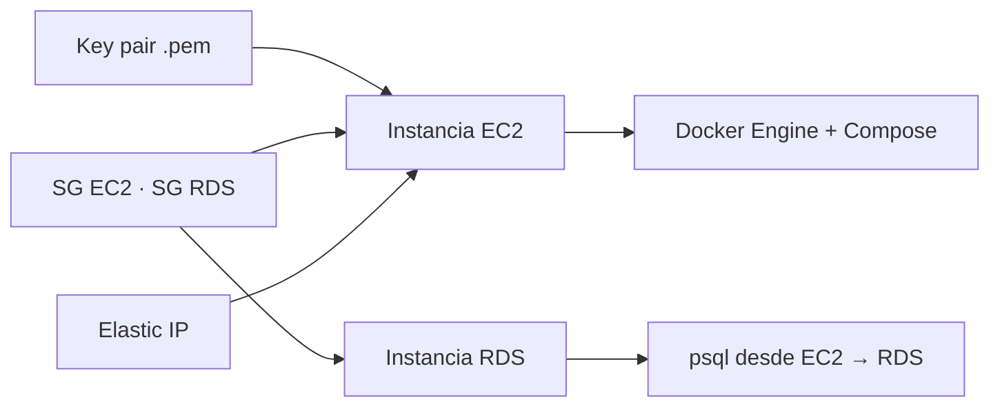

# Etapa 7 — Infraestructura AWS: EC2 + RDS

> **Archivo:** `etapas/etapa-07-aws-ec2-rds.md`
> **Estado:** Verificado en producción
> **Checkpoint objetivo:** CP-P1 — Infraestructura AWS lista (EC2 operativa + RDS alcanzable) — **alcanzado**

---

## 1. Objetivo de la etapa

Al terminar esta etapa tendremos la **infraestructura AWS de producción** lista:

1. Una instancia **EC2 Ubuntu (Free Tier)** accesible por SSH con un usuario propio.
2. **Docker Engine + Compose plugin** instalados en la EC2.
3. Una **Elastic IP** asociada (IP pública fija).
4. Un **RDS PostgreSQL** (Free Tier) alcanzable **solo desde la EC2**.
5. Seguridad base: `.pem` fuera del repo, Security Groups con principio de mínimo privilegio.

**Alcance:** solo infraestructura. La aplicación (`master` + `connector`) se despliega en la **Etapa 8**; dominio/DNS (9), Nginx (10) y HTTPS (11) vienen después. Los checkpoints `[P]` de esta etapa se verifican **en AWS**, no en local.

**Prerrequisitos:** Etapa 6 cerrada (imágenes y Compose listos), AWS CLI autenticado (usuario IAM `energyshark-deploy`, región `us-east-1`), presupuesto/cuenta Free Tier, `.env` de producción en la EC2 preparado (se completa en la Etapa 8).

---

## 2. Requisitos del enunciado que cubre

| Requisito | Cómo se cubre |
| --- | --- |
| RNF-7 (Despliegue en AWS: EC2 + RDS, Free Tier) | Infraestructura creada y verificada; el despliegue de la app completa el requisito en la Etapa 8 |
| RNF-5/RNF-6 (indirecto) | La EC2 ejecutará Docker Engine + Compose con las imágenes de la Etapa 6 |
| RNF-8 (dominio) | La Elastic IP fija es el destino del registro A (Etapa 9) |
| ENT-1 (accesos) | El `.pem` se mantiene fuera del repositorio; los accesos se documentan en la Etapa 15 |

---

## 3. Teoría general necesaria

### 3.1 VPC y subredes
- La **VPC** es la red virtual aislada de la cuenta. AWS crea una VPC por defecto con subredes en las AZ; para el curso se usa la VPC por defecto (Free Tier) y se especifica la subred pública.
- **Subnet pública**: tiene ruta a Internet (IGW); ahí vive la EC2 con su IP pública/Elastic IP.

### 3.2 Security Groups (SG)
- Firewall con estado por recurso. **Se permite explícitamente** cada flujo de entrada:
  - `master`/EC2: SSH (22) **solo desde mi IP**, HTTP (80) y HTTPS (443) **abiertos al mundo** (para Nginx/HTTPS en etapas 10–11). NUNCA abrir el puerto 3000.
  - RDS: PostgreSQL (5432) **solo desde el SG de la EC2** (no desde mi IP ni el mundo).
- Las reglas se referencian entre SGs por `sg-...` (fuente = ID del SG de la EC2).

### 3.3 Key pair y SSH
- Un **key pair** genera un `.pem` privado. El `.pem` **jamás se sube al repositorio** (`.gitignore` ya tiene `*.pem`).
- SSH: `ssh -i ~/.ssh/energyshark.pem ubuntu@<IP>`; el archivo debe tener permisos `400`.

### 3.4 EC2
- Instancia virtual: tipo (t2.micro/t3.micro Free Tier), AMI (Ubuntu 24.04), almacenamiento EBS (gp3/20 GB) y SG.
- **Elastic IP**: IP pública fija asociada a la instancia (gratuita mientras esté asociada); es la que usará el registro A de la Etapa 9.

### 3.5 RDS
- PostgreSQL administrado por AWS: no hay que instalar ni parchear; se accede por **endpoint DNS**.
- Parámetros: engine `postgres`, versión 16, clase `db.t3.micro`/`db.t2.micro` (Free Tier), storage `gp3` 20 GB, **sin Multi-AZ** (Free Tier), SG restringido a la EC2, **public accessibility: no**.
- Costo: se cobra por instancia; detenerla no elimina el cobro de storage. Verificar la capa Free Tier al crear.

### 3.6 Docker en EC2
- En el host se instalan **Docker Engine** y el **plugin Compose** desde los repos oficiales de Docker (no Docker Desktop): `apt`, `docker-ce`, `docker-compose-plugin`, y el usuario en el grupo `docker`.

---

## 4. Aplicación específica a EnergyShark

| Recurso | Parámetro recomendado | Notas |
| --- | --- | --- |
| Región | `us-east-1` | Decisión #8 de la Etapa 2; AWS CLI ya configurado |
| Key pair | `energyshark` | `.pem` en `~/.ssh/energyshark.pem`, `chmod 400`, fuera del repo |
| AMI | Ubuntu 24.04 LTS (HVM, x86_64) | `ami-*` de la región; consistente con el stack |
| Tipo EC2 | `t2.micro` (o `t3.micro` si es Free Tier elegible) | Free Tier estándar |
| Storage EC2 | EBS `gp3`, 20 GB | Suficiente para Docker + imágenes |
| SG EC2 | SSH(22) solo mi IP · 80 · 443 | 3000 **nunca** abierto (solo interno) |
| Elastic IP | `energyshark-eip` | Fija, para el registro A (Etapa 9) |
| RDS | `postgres` 16, `db.t3.micro`, `gp3` 20 GB, sin Multi-AZ | Free Tier |
| SG RDS | 5432 solo desde el SG de la EC2 | `public accessibility: false` |
| Endpoint RDS | `energyshark.c<...>.us-east-1.rds.amazonaws.com` | Se registra en la bitácora (no las credenciales) |
| Usuario EC2 | `ubuntu` (SSH inicial) → `energyshark` (sudo) | Hardening básico |

**Reglas de seguridad irrenunciables:**
- `.pem` y credenciales de RDS **nunca** en el repositorio.
- SG con mínimo privilegio; el RDS solo es alcanzable desde la EC2.
- Billing alerts si la cuenta no está 100% en Free Tier.

---

## 5. Decisiones técnicas

| # | Decisión | Alternativas | Recomendación y por qué |
| --- | --- | --- | --- |
| 1 | Región | us-east-1 vs otras | **us-east-1** (decisión #8 de la Etapa 2): Free Tier estándar del curso |
| 2 | AMI | Ubuntu 24.04 vs Amazon Linux vs Debian | **Ubuntu 24.04 LTS**: coherente con el plan del curso y documentación de Docker/Nginx |
| 3 | Tipo EC2 | `t2.micro` vs `t3.micro` | **`t2.micro`** (Free Tier clásico y estable); `t3.micro` si la cuenta lo ofrece elegible |
| 4 | Key pair | `.pem` local vs AWS Systems Manager (SSM) | **`.pem` local** (fuera del repo, `chmod 400`): simple y auditable; SSM añade complejidad sin necesidad |
| 5 | SG EC2 | Solo SSH vs SSH+80+443 | **SSH (mi IP) + 80 + 443**: prepara Nginx y HTTPS (Etapas 10–11) sin exponer la API directa |
| 6 | RDS Multi-AZ | Sí vs No | **No** (Free Tier): no hay budget para Multi-AZ en la entrega |
| 7 | Acceso al RDS | Público vs solo desde EC2 | **Solo desde la EC2** (SG con fuente = SG de EC2, `public accessibility: false`): mínimo privilegio |
| 8 | Elastic IP | Asociada vs IP dinámica | **Asociada**: IP fija para el registro A (Etapa 9), sin costo mientras esté asociada |
| 9 | Docker en EC2 | Repos oficiales (apt) vs Docker Desktop | **Docker Engine + compose plugin desde repos oficiales**: es un host Linux, no hay GUI |
| 10 | Usuario EC2 | Solo `ubuntu` vs usuario propio | **Usuario propio `energyshark` con sudo** + desactivar acceso por contraseña: hardening básico (7.3) |

---

## 6. Diagramas

### 6.1 Arquitectura AWS (objetivo de la etapa)

```mermaid
flowchart LR
    subgraph AWS[Cuenta AWS · us-east-1]
        subgraph VPC[VPC por defecto]
            subgraph SGEC2[SG EC2 · ssh(mi IP) + 80 + 443]
                EC2[EC2 Ubuntu<br/>t2.micro · Elastic IP]
            end
            subgraph SGRDS[SG RDS · 5432 ← solo SG EC2]
                RDS[(RDS PostgreSQL 16<br/>endpoint interno)]
            end
        end
        EIP[(Elastic IP)]
    end
    MiIP[Mi IP · ssh -i .pem] -->|22| EC2
    EIP --> EC2
    EC2 -->|5432 (vía SG RDS)| RDS
```

### 6.2 Flujo de creación (resumen)



---

## 7. Sub-etapas

### 7.1 Sub-etapa 7.1 — Teoría AWS
Repaso de VPC, subnets, Security Groups, EC2, RDS, key pairs, Elastic IP y Free Tier (sección 3).

### 7.2 Sub-etapa 7.2 — EC2: key pair, SG e instancia
Crear el `.pem` (fuera del repo), el SG de la EC2 (22 mi IP, 80, 443) y la instancia Ubuntu.

### 7.3 Sub-etapa 7.3 — Acceso SSH y hardening básico
Conectarse, actualizar el sistema y crear el usuario propio `energyshark` con sudo.

### 7.4 Sub-etapa 7.4 — Docker Engine + Compose plugin
Instalar Docker desde los repos oficiales y verificar.

### 7.5 Sub-etapa 7.5 — Elastic IP
Asignar y asociar la IP pública fija a la instancia.

### 7.6 Sub-etapa 7.6 — RDS PostgreSQL
Crear el SG del RDS (5432 solo desde EC2), la instancia RDS Free Tier y probar conexión con `psql` desde la EC2.

---

## 8. Pasos concretos — Action Items

### Paso 0 — Prerrequisitos
1. Confirmar AWS CLI autenticado: `aws sts get-caller-identity` (usuario `energyshark-deploy`, región `us-east-1`).
2. Confirmar que `*.pem` está en `.gitignore` (ya lo está) y que no hay ningún `.pem` en el repo: `git ls-files | grep -i pem` → vacío.
3. Confirmar presupuesto Free Tier / billing alerts activadas.
4. **Verificar:** todo responde; las imágenes de la Etapa 6 construyen (`docker build`).

### Paso 1 — 7.1 Teoría AWS
1. Releer la sección 3 de este documento.
2. **Verificar:** puedes explicar la diferencia entre SG y subnet, y por qué el RDS no debe ser público.

### Paso 2 — 7.2 Key pair + SG + instancia EC2
1. Crear el key pair (guardar el `.pem` **fuera del repo**):
   ```bash
   aws ec2 create-key-pair --key-name energyshark \
     --query 'KeyMaterial' --output text > ~/.ssh/energyshark.pem
   chmod 400 ~/.ssh/energyshark.pem
   ```
2. Obtener mi IP pública: `curl -s https://checkip.amazonaws.com` → guardarla como `MI_IP`.
3. Crear el SG de la EC2 y sus reglas:
   ```bash
   SG_EC2=$(aws ec2 create-security-group --group-name energyshark-ec2 \
     --description "EnergyShark EC2: SSH (mi IP), 80 y 443" --query 'GroupId' --output text)
   aws ec2 authorize-security-group-ingress --group-id "$SG_EC2" --protocol tcp --port 22 --cidr "$MI_IP/32"
   aws ec2 authorize-security-group-ingress --group-id "$SG_EC2" --protocol tcp --port 80 --cidr 0.0.0.0/0
   aws ec2 authorize-security-group-ingress --group-id "$SG_EC2" --protocol tcp --port 443 --cidr 0.0.0.0/0
   ```
4. Obtener el AMI de Ubuntu 24.04 en la región:
   ```bash
   aws ec2 describe-images --owners 099720109477 --filters \
     "Name=name,Values=ubuntu/images/hvm-ssd/ubuntu-noble-24.04-amd64-server-*" \
     "Name=state,Values=available" --query 'sort_by(Images,&CreationDate)[-1].ImageId' --output text
   ```
5. Lanzar la instancia:
   ```bash
   aws ec2 run-instances --image-id "$AMI" --instance-type t2.micro \
     --key-name energyshark --security-group-ids "$SG_EC2" \
     --block-device-mappings '[{"DeviceName":"/dev/sda1","Ebs":{"VolumeSize":20,"VolumeType":"gp3"}}]' \
     --tag-specifications 'ResourceType=instance,Tags=[{Key=Name,Value=energyshark}]'
   ```
6. **Verificar:** `aws ec2 describe-instances ... --filters Name=instance-state-name,Values=running` y `aws ec2 describe-instance-status` muestra `ok`.

### Paso 3 — 7.3 SSH y hardening básico
1. Conectarse (IP pública o Elastic IP ya asociada):
   ```bash
   ssh -i ~/.ssh/energyshark.pem ubuntu@<IP_EC2>
   ```
2. Actualizar el sistema:
   ```bash
   sudo apt update && sudo apt upgrade -y
   sudo apt install -y ufw curl git
   ```
3. Crear el usuario propio con sudo y autorizar su clave:
   ```bash
   sudo adduser --gecos "" energyshark
   sudo usermod -aG sudo energyshark
   # copiar la clave pública de ubuntu a energyshark:
   sudo cp -r ~/.ssh /home/energyshark/.ssh && sudo chown -R energyshark:energyshark /home/energyshark/.ssh
   ```
4. (Opcional) Deshabilitar login por contraseña en `/etc/ssh/sshd_config` (`PasswordAuthentication no`) y recargar `sudo systemctl reload ssh`.
5. **Verificar:** `ssh -i ~/.ssh/energyshark.pem energyshark@<IP>` entra sin contraseña y `sudo -v` pide (o confirma) sudo.

### Paso 4 — 7.4 Docker Engine + Compose plugin
1. Instalar los repos oficiales de Docker (script oficial o manual: `apt` + `docker-ce` + `docker-compose-plugin`).
2. Agregar el usuario al grupo docker: `sudo usermod -aG docker energyshark` (reconectar la sesión).
3. **Verificar:** `docker --version`, `docker compose version` y `docker run --rm hello-world`.

### Paso 5 — 7.5 Elastic IP
1. Asignar y asociar:
   ```bash
   EIP=$(aws ec2 allocate-address --domain vpc --query 'AllocationId' --output text)
   INST=$(aws ec2 describe-instances --filters Name=tag:Name,Values=energyshark \
     --query 'Reservations[0].Instances[0].InstanceId' --output text)
   aws ec2 associate-address --allocation-id "$EIP" --instance-id "$INST"
   ```
2. **Verificar:** `aws ec2 describe-addresses` muestra la IP asociada a la instancia y `ssh energyshark@<EIP>` funciona.

### Paso 6 — 7.6 RDS PostgreSQL
1. Crear el SG del RDS (5432 solo desde el SG de la EC2):
   ```bash
   SG_RDS=$(aws ec2 create-security-group --group-name energyshark-rds \
     --description "EnergyShark RDS: 5432 solo desde EC2" --query 'GroupId' --output text)
   aws ec2 authorize-security-group-ingress --group-id "$SG_RDS" \
     --protocol tcp --port 5432 --source-group "$SG_EC2"
   ```
2. Crear la instancia RDS (Free Tier):
   ```bash
   aws rds create-db-instance --db-instance-identifier energyshark \
     --engine postgres --engine-version 16 --db-instance-class db.t3.micro \
     --allocated-storage 20 --storage-type gp3 --master-username energyshark \
     --master-user-password '<fuerte>' --vpc-security-group-ids "$SG_RDS" \
     --db-name energy_db --no-publicly-accessible --backup-retention-period 0
   ```
3. Esperar a `available`: `aws rds describe-db-instances --db-instance-identifier energyshark --query 'DBInstances[0].DBInstanceStatus'`.
4. Probar la conexión **desde la EC2**:
   ```bash
   psql "host=<endpoint> user=energyshark dbname=energy_db sslmode=require" -c "SELECT version();"
   ```
5. **Verificar:** desde la EC2 el comando responde; desde mi IP local **falla** (SG correcto).

### Paso 7 — Verificación CP-P1
1. Recolectar evidencia: `describe-instances`, `describe-db-instances` (endpoint), `docker --version`, `psql SELECT 1`.
2. Registrar en la bitácora (Entrada 16): IDs (`i-`, `sg-`, `rds`), Elastic IP y endpoint RDS (**sin credenciales**).
3. **Verificar:** CP-P1 alcanzado (EC2 operativa + RDS alcanzable desde la EC2).

### Paso 8 — Cierre y versionado
1. Registrar en la bitácora (Entrada 16) y en `ai_docs/prompts/`.
2. Actualizar `etapas/README.md` (Etapa 7 → Verificado en producción) y la matriz (RNF-7 → En progreso; el despliegue en la Etapa 8 lo lleva a producción).
3. Commits: `docs(etapa-07)` para el plan, `docs(bitacora)`, `docs(ai)`; **no** hay código de aplicación en esta etapa.
4. **Verificar:** `git status` no muestra `.pem` ni credenciales y `git log --oneline` muestra los commits.

---

## 9. Comandos necesarios

```bash
# Key pair (fuera del repo)
aws ec2 create-key-pair --key-name energyshark --query 'KeyMaterial' --output text > ~/.ssh/energyshark.pem
chmod 400 ~/.ssh/energyshark.pem

# SG EC2
MI_IP=$(curl -s https://checkip.amazonaws.com)
aws ec2 create-security-group --group-name energyshark-ec2 --description "EnergyShark EC2" --query 'GroupId'
aws ec2 authorize-security-group-ingress --group-id "$SG_EC2" --protocol tcp --port 22 --cidr "$MI_IP/32"
aws ec2 authorize-security-group-ingress --group-id "$SG_EC2" --protocol tcp --port 80 --cidr 0.0.0.0/0
aws ec2 authorize-security-group-ingress --group-id "$SG_EC2" --protocol tcp --port 443 --cidr 0.0.0.0/0

# Instancia
aws ec2 run-instances --image-id "$AMI" --instance-type t2.micro --key-name energyshark \
  --security-group-ids "$SG_EC2" --block-device-mappings '[{"DeviceName":"/dev/sda1","Ebs":{"VolumeSize":20,"VolumeType":"gp3"}}]' \
  --tag-specifications 'ResourceType=instance,Tags=[{Key=Name,Value=energyshark}]'

# Elastic IP
aws ec2 allocate-address --domain vpc --query 'AllocationId'
aws ec2 associate-address --allocation-id "$EIP" --instance-id "$INST"

# RDS
aws rds create-db-instance --db-instance-identifier energyshark --engine postgres --engine-version 16 \
  --db-instance-class db.t3.micro --allocated-storage 20 --storage-type gp3 \
  --master-username energyshark --master-user-password '<fuerte>' \
  --vpc-security-group-ids "$SG_RDS" --db-name energy_db --no-publicly-accessible \
  --backup-retention-period 0
aws rds describe-db-instances --db-instance-identifier energyshark --query 'DBInstances[0].Endpoint.Address'
```

---

## 10. Resultados esperados

- `.pem` creado fuera del repo y verificado que no se versiona.
- EC2 Ubuntu `running`, accesible por SSH (mi IP), con Docker + Compose listos.
- Elastic IP asociada y estable.
- RDS PostgreSQL `available`, alcanzable **solo desde la EC2** (comprobado con `psql`).
- Endpoint e IDs registrados en la bitácora (sin credenciales).
- Bitácora y `ai_docs/prompts/` actualizados; **CP-P1** verificado en AWS.

---

## 11. Métodos de verificación

| Verificación | Cómo realizarla |
| --- | --- |
| AWS CLI autenticado | `aws sts get-caller-identity` muestra `energyshark-deploy` en us-east-1 |
| Instancia running | `aws ec2 describe-instance-status` → `ok/ok` |
| SSH funciona | `ssh -i ~/.ssh/energyshark.pem energyshark@<IP>` sin contraseña |
| Docker listo | `docker --version` y `docker compose version` en la EC2 |
| Elastic IP | `aws ec2 describe-addresses` muestra la asociación; SSH por la IP fija |
| RDS disponible | `describe-db-instances` → `available`; `psql SELECT version()` desde la EC2 |
| RDS no público | `describe-db-instances` → `PubliclyAccessible: false`; conexión desde mi IP falla |
| Sin secretos en el repo | `git ls-files | grep -iE '\.pem|master-user-password'` vacío |
| CP-P1 | Evidencia en la bitácora (Entrada 16) |

---

## 12. Errores comunes y troubleshooting

| Problema probable | Cómo diagnosticarlo / evitarlo |
| --- | --- |
| `Permission denied (publickey)` | Verificar `chmod 400` del `.pem` y que se usa `-i ~/.ssh/energyshark.pem`; el usuario por defecto es `ubuntu` (Amazon Linux usa `ec2-user`) |
| Timeout al conectar por SSH (22) | El SG no permite 22 desde tu IP o tu IP cambió: `curl checkip.amazonaws.com` y re-autorizar el CIDR |
| `Pending`/`stopping` largo | Instancia t2.micro con storage pequeño puede tardar; `describe-instance-status` |
| RDS queda `creating` mucho tiempo | Normal (5–10 min); el SG del RDS debe existir antes del `create-db-instance` |
| `psql` desde la EC2 falla | Verificar que el SG RDS tiene fuente = SG EC2 (no mi IP) y que el cliente `psql` está instalado |
| Conexión al RDS desde mi IP funciona (no debería) | El SG RDS está abierto a 0.0.0.0/0: corregir a `--source-group` |
| Lanzar instancia con AMI inexistente | Buscar el AMI con `describe-images` (owner 099720109477) en `us-east-1` |
| Costo inesperado | Confirmar Free Tier (t2/t3.micro, gp3 20 GB, sin Multi-AZ) y revisar billing alerts |
| `.pem` se subió por error | Rotar el key pair, eliminar del historial y **nunca** reutilizar; `git ls-files | grep -i pem` |

---

## 13. Checklist de finalización

- [x] AWS CLI autenticado en `us-east-1` (`sts get-caller-identity`).
- [x] `.pem` creado en `~/.ssh/` con `chmod 400` y verificado que NO está en el repo.
- [x] SG EC2: 22 (mi IP), 80 y 443 (mundo); 3000 no expuesto.
- [x] Instancia Ubuntu 24.04 `t2.micro` running con 20 GB `gp3`.
- [x] SSH funciona sin contraseña (usuario propio `energyshark` con sudo).
- [x] Sistema actualizado (`apt update && upgrade`).
- [x] Docker Engine + Compose plugin instalados y verificados (`hello-world`).
- [x] Elastic IP asignada y asociada; SSH por la IP fija.
- [x] SG RDS: 5432 solo desde el SG de la EC2.
- [x] RDS PostgreSQL 16 `available`, `PubliclyAccessible: false`.
- [x] `psql` conecta desde la EC2 (SELECT version()); desde mi IP falla.
- [x] Endpoint e IDs registrados en la bitácora (Entrada 16), sin credenciales.
- [x] Estado en `etapas/README.md` (Etapa 7 → Verificado en producción) y matriz (RNF-7 → En progreso).
- [x] Commits realizados y pusheados.

---

## 14. Pruebas locales

| # | Prueba | Resultado esperado |
| --- | --- | --- |
| 1 | `aws sts get-caller-identity` | Identidad del usuario IAM en us-east-1 |
| 2 | `git ls-files | grep -i pem` | Vacío (sin `.pem` versionado) |
| 3 | `aws ec2 describe-instances` (filtro running) | Instancia `energyshark` running con su SG |
| 4 | `aws ec2 describe-addresses` | Elastic IP asociada a la instancia |
| 5 | `aws rds describe-db-instances` | Endpoint, `available`, `PubliclyAccessible: false` |
| 6 | `psql` a RDS desde la EC2 | `SELECT version()` responde (PostgreSQL 16.x) |

---

## 15. Pruebas en producción

Esta etapa **es** producción (AWS). Verificaciones en AWS:
- SSH a la EC2 por su IP pública y Elastic IP.
- Docker/Compose operativos en el host.
- RDS alcanzable desde la EC2 y no desde el exterior.
- Evidencia capturada y registrada en la bitácora (Entrada 16) y en `ai_docs/prompts/`.

---

## 16. Registro para la bitácora

Al terminar la etapa, registrar en `docs/bitacora.md`:

- Fecha y objetivo de la etapa (Entrada 16).
- IDs y recursos creados: key pair, `sg-` (EC2/RDS), `i-` instancia, Elastic IP, endpoint RDS (**sin credenciales**).
- Decisiones técnicas adoptadas (tabla de la sección 5).
- Comandos importantes y resultados de las verificaciones.
- Problemas encontrados y soluciones (sección 12).
- Registros de IA generados (`ai_docs/prompts/`).

---

## 17. Siguiente etapa

**Etapa 8 — Primer despliegue en producción (MVP en EC2)** (`etapa-08-primer-despliegue.md`): clonar el repo en la EC2, crear el `.env` de producción en el host, Compose de producción con `master` + `connector` conectados a RDS, verificación end-to-end y procedimiento de despliegue/rollback documentado.
