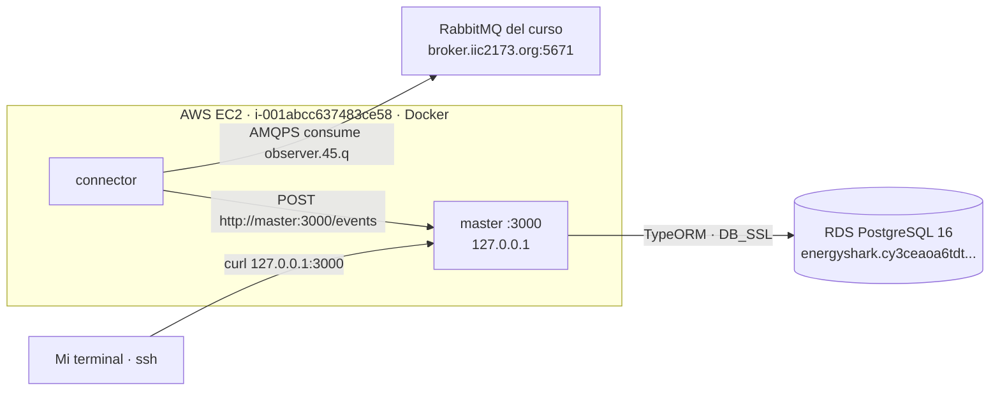
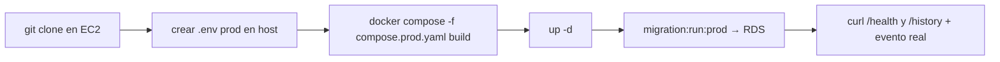

# Etapa 8 — Primer despliegue en producción (MVP en EC2)

> **Archivo:** `etapas/etapa-08-primer-despliegue.md`
> **Estado:** Verificado en producción
> **Checkpoint objetivo:** CP-P2 — MVP desplegado y funcionando en EC2 (evento real → RDS → API) — **alcanzado**

---

## 1. Objetivo de la etapa

Al terminar esta etapa tendremos el **MVP corriendo en AWS**:

1. El repositorio clonado en la EC2 y el **`.env` de producción** en el host (fuera del repo).
2. **Compose de producción** (`master` + `connector`, sin `postgres`) conectado a **RDS**.
3. Migraciones aplicadas a RDS automáticamente al arrancar `master`.
4. **Verificación end-to-end en producción**: evento real del curso → `connector` → `master` → RDS → API.
5. **Procedimiento de despliegue/rollback** documentado.

**Alcance:** MVP funcional en AWS (checkpoint CP-P2). Dominio/DNS (9), Nginx (10) y HTTPS (11) vienen después; en esta etapa la API se verifica de forma interna (por SSH/`curl` desde la EC2), no por el dominio.

**Prerrequisitos:** Etapa 7 cerrada (EC2 `i-001abcc637483ce58` con Docker + Compose, RDS `energyshark.cy3ceaoa6tdt.us-east-1.rds.amazonaws.com` disponible, IP `3.216.254.80`, `.pem` local).

---

## 2. Requisitos del enunciado que cubre

| Requisito | Cómo se cubre |
| --- | --- |
| RNF-7 (Despliegue en AWS: EC2 + RDS, Free Tier) | Se completa: la app corre en EC2 y persiste en RDS |
| RNF-2 (`master` en container recibiendo datos de `connector`) | Compose de producción con `master` + `connector` en la misma red |
| RNF-5 (EC2 Free Tier) | Ya provisionado en la Etapa 7; aquí se usa |
| RNF-6 (Postgres externo asociado) | RDS como persistencia |
| RF1–RF4 | Verificadas en producción (evento real → `GET /history`) |
| RNF-1 (connector resiste caídas del broker) | Se verifica en producción (reconexión automática) |
| DOC/ENT | README y accesos se completan en la Etapa 15 |

---

## 3. Teoría general necesaria

### 3.1 Despliegue en EC2
- **Clonar el repo** en el host y ubicar el proyecto en una carpeta estable (ej. `/home/energyshark/energyshark`).
- **`.env` de producción** vive en el host, **fuera del repo** (no versionado). Compose interpola `${VAR}` desde el `.env` del directorio del proyecto.
- Construir las imágenes en la EC2 con `docker compose build` (sin registry/ECR, más simple para el curso).

### 3.2 Compose de producción vs desarrollo
- El Compose de producción **no incluye `postgres`**: `master` apunta al endpoint de RDS (`DB_HOST=<endpoint>`, `DB_PORT=5432`, `DB_SSL=true`).
- `master` expone `3000` **solo en `127.0.0.1`** del host (Nginx lo alcanzará en la Etapa 10; el SG no abre 3000 al mundo).
- `connector` usa `MASTER_URL=http://master:3000` (red interna de Compose) y `RABBITMQ_URL` del broker del curso (externo).

### 3.3 RDS y SSL
- RDS acepta conexiones con SSL; se usa `DB_SSL=true` → `{ rejectUnauthorized: false }` (decisión de la Etapa 4, apta para el curso). Opcional: pinnar la CA de RDS (`rds-ca-2019`).
- Las migraciones (`migration:run:prod`) corren contra RDS con la DataSource compilada (`dist/data-source.js`).

### 3.4 Procedimiento de despliegue y rollback
- **Despliegue:** `git pull` (o `git checkout <tag>`) → `docker compose -f compose.prod.yaml build` → `up -d`.
- **Rollback:** `git checkout <commit/tag anterior>` → rebuild → `up -d`. La persistencia vive en RDS (no se pierde al reiniciar contenedores); no hay volumen local que restaurar.

---

## 4. Aplicación específica a EnergyShark

| Elemento | Valor (producción) |
| --- | --- |
| EC2 | `i-001abcc637483ce58`, IP `3.216.254.80` |
| RDS | `energyshark.cy3ceaoa6tdt.us-east-1.rds.amazonaws.com`, PostgreSQL 16 |
| Carpeta del proyecto | `/home/energyshark/energyshark` |
| `.env` prod | `/home/energyshark/energyshark/.env` (no versionado) |
| Compose prod | `compose.prod.yaml` (raíz del repo) |
| `master` | `DB_HOST=<endpoint RDS>`, `DB_SSL=true`, `PORT=3000`, publica `127.0.0.1:3000` |
| `connector` | `RABBITMQ_URL=<curso>`, `RABBITMQ_QUEUE=observer.45.q`, `MASTER_URL=http://master:3000` |
| Broker del curso | externo: `amqps://observer.45:<pass>@broker.iic2173.org:5671/energy` |

Variables de `compose.prod.yaml` (interpoladas desde el `.env` del host):

- `DB_USER`, `DB_PASSWORD`, `DB_NAME`, `DB_HOST`, `DB_PORT`, `DB_SSL`
- `RABBITMQ_URL`, `RABBITMQ_QUEUE`
- `REQUEST_TIMEOUT_MS`, `MAX_FORWARD_RETRIES` (opcionales con default)

---

## 5. Decisiones técnicas

| # | Decisión | Alternativas | Recomendación y por qué |
| --- | --- | --- | --- |
| 1 | Archivo de Compose prod | `compose.prod.yaml` separado vs override vs editar `compose.yaml` | **`compose.prod.yaml` separado**: deja el de desarrollo intacto y hace explícito el cambio (sin `postgres`) |
| 2 | Sin `postgres` en prod | postgres en contenedor vs RDS | **RDS** (decisión de la Etapa 2/7): persistencia administrada y obligatoria para el enunciado |
| 3 | Puerto de `master` | `0.0.0.0:3000` vs `127.0.0.1:3000` | **`127.0.0.1:3000`**: solo alcanzable desde el host (Nginx en la Etapa 10); el SG no abre 3000 |
| 4 | Build de imágenes | Build en EC2 vs push a ECR | **Build en EC2** (`docker compose build`): simple y suficiente para el curso |
| 5 | SSL a RDS | `rejectUnauthorized: false` vs CA pinnada | **`rejectUnauthorized: false`** (Etapa 4), apto para el curso; pinnar CA como mejora opcional |
| 6 | Migraciones | En el arranque de `master` (`migration:run:prod`) vs job separado | **En el arranque de `master`**: idempotente y sin contenedor extra (mismo patrón de la Etapa 6) |
| 7 | `.env` prod | En el host, fuera del repo | **`/home/energyshark/energyshark/.env`**: nunca versionado, interpolado por Compose |
| 8 | Restart policy | `unless-stopped` vs `always` vs `no` | **`unless-stopped`**: resiste reinicios de la instancia, sin arrancar tras un `stop` manual |
| 9 | Rollback | `git checkout <tag>` + rebuild | **Tags/commits + rebuild**: la data vive en RDS (no se toca); sin volumen local que restaurar |
| 10 | Verificación end-to-end | `curl` interno (SSH) vs exponer puerto | **`curl` desde la EC2** (`127.0.0.1:3000`): no requiere abrir el SG; la exposición pública llega con Nginx |

---

## 6. Diagramas

### 6.1 Arquitectura de producción (objetivo de la etapa)



### 6.2 Flujo de despliegue



---

## 7. Sub-etapas

### 7.1 Sub-etapa 8.1 — Código en la EC2
Clonar el repositorio y crear el `.env` de producción en el host.

### 7.2 Sub-etapa 8.2 — Compose de producción
`compose.prod.yaml` con `master` + `connector` conectados a RDS; build y arranque.

### 7.3 Sub-etapa 8.3 — Verificación end-to-end
Health check, `GET /history` y evento real → RDS → API en producción.

### 7.4 Sub-etapa 8.4 — Procedimiento de despliegue/rollback
Documentar el procedimiento reproducible de despliegue y vuelta atrás.

---

## 8. Pasos concretos — Action Items

### Paso 0 — Prerrequisitos
1. EC2 accesible: `ssh -i ~/.ssh/energyshark.pem energyshark@3.216.254.80`.
2. RDS `available`: `aws rds describe-db-instances --db-instance-identifier energyshark --query 'DBInstances[0].DBInstanceStatus'`.
3. Repo local pusheado (los cambios de la Etapa 7 ya están en `main`).
4. **Verificar:** SSH, Docker (`docker --version`) y Compose (`docker compose version`) en la EC2.

### Paso 1 — 8.1 Código en la EC2
1. Conectarse por SSH y clonar:
   ```bash
   ssh -i ~/.ssh/energyshark.pem energyshark@3.216.254.80
   git clone https://github.com/Pedr0sit0s/iic2173-energyshark.git
   cd iic2173-energyshark
   ```
2. Crear el `.env` de producción (no versionado):
   ```
   NODE_ENV=production
   DB_HOST=energyshark.cy3ceaoa6tdt.us-east-1.rds.amazonaws.com
   DB_PORT=5432
   DB_USER=energyshark
   DB_PASSWORD=<secreto>
   DB_NAME=energy_db
   DB_SSL=true
   RABBITMQ_URL=amqps://observer.45:<pass>@broker.iic2173.org:5671/energy
   RABBITMQ_QUEUE=observer.45.q
   ```
3. **Verificar:** `ls -la .env` existe y `git status` no lo lista.

### Paso 2 — 8.2 Compose de producción
1. Crear `compose.prod.yaml` (servicios `master` y `connector`, sin `postgres`):
   - `master`: `build: ./apps/master`, `DB_HOST: ${DB_HOST}`, `DB_SSL: "true"`, `ports: ["127.0.0.1:3000:3000"]`, `command: sh -c "npm run migration:run:prod && node dist/main"`, `depends_on` no aplica (RDS externo), `restart: unless-stopped`, HEALTHCHECK.
   - `connector`: `build: ./apps/connector`, `MASTER_URL: http://master:3000`, `RABBITMQ_URL`/`RABBITMQ_QUEUE` interpolados, `restart: unless-stopped`, HEALTHCHECK (heartbeat).
2. Construir y arrancar:
   ```bash
   docker compose -f compose.prod.yaml build
   docker compose -f compose.prod.yaml up -d
   ```
3. **Verificar:** `docker compose -f compose.prod.yaml ps` muestra `master` y `connector` `healthy`; los logs de `master` muestran la migración aplicada.

### Paso 3 — 8.3 Verificación end-to-end
1. Health check: `curl -s http://127.0.0.1:3000/health` → `{ status: "ok", db: "up" }`.
2. Historial: `curl -s "http://127.0.0.1:3000/history?limit=5"` → `{ items, meta }`.
3. Evento real: esperar unos segundos y verificar que `total` crece (connector → master → RDS).
4. RDS directamente desde la EC2: `psql` (o `docker compose exec master` con el cliente) → `SELECT count(*) FROM history;`.
5. **Verificar:** CP-P2 alcanzado (evento real recorrió RabbitMQ → connector → master → RDS → API).

### Paso 4 — 8.3 Resiliencia en producción
1. `docker compose -f compose.prod.yaml restart connector` → reconexión y re-suscripción sin intervención.
2. `docker compose -f compose.prod.yaml restart master` → `connector` reintenta y recupera.
3. **Verificar:** todo vuelve a `healthy` y el flujo continúa.

### Paso 5 — 8.4 Procedimiento de despliegue/rollback
1. Documentar en el README (y/o en la bitácora) el procedimiento:
   ```bash
   # Despliegue
   cd ~/iic2173-energyshark && git pull
   docker compose -f compose.prod.yaml build
   docker compose -f compose.prod.yaml up -d
   # Rollback
   git checkout <commit-anterior>
   docker compose -f compose.prod.yaml build
   docker compose -f compose.prod.yaml up -d
   ```
2. **Verificar:** el procedimiento está documentado y es reproducible.

### Paso 6 — Cierre y versionado
1. Registrar en la bitácora (Entrada 18) y en `ai_docs/prompts/`.
2. Actualizar `etapas/README.md` (Etapa 8 → Verificado en producción) y la matriz (RF1–RF4, RNF-7 → Verificado en producción; RNF-1..4 → Verificado en producción según evidencia o quedan para la Etapa 12).
3. Commits: `feat(deploy)` para `compose.prod.yaml`; `docs(bitacora)`, `docs(etapa-08)`, `docs(ai)`.
4. **Verificar:** `git status` no muestra `.env` ni `.pem`; `git log --oneline` muestra los commits.

---

## 9. Comandos necesarios

```bash
# Acceso y clonado
ssh -i ~/.ssh/energyshark.pem energyshark@3.216.254.80
git clone https://github.com/Pedr0sit0s/iic2173-energyshark.git
cd iic2173-energyshark

# .env de producción (host, no versionado)

# Compose de producción
docker compose -f compose.prod.yaml config   # validar
docker compose -f compose.prod.yaml build
docker compose -f compose.prod.yaml up -d
docker compose -f compose.prod.yaml ps
docker compose -f compose.prod.yaml logs -f master connector

# Verificación (desde la EC2)
curl -s http://127.0.0.1:3000/health
curl -s "http://127.0.0.1:3000/history?limit=5"

# RDS (desde la EC2)
PGPASSWORD="$DB_PASSWORD" psql -h energyshark.cy3ceaoa6tdt.us-east-1.rds.amazonaws.com \
  -U energyshark -d energy_db -c "SELECT count(*) FROM history;"

# Rollback
git checkout <commit-anterior> && docker compose -f compose.prod.yaml build && docker compose -f compose.prod.yaml up -d
```

---

## 10. Resultados esperados

- Repo clonado en la EC2 con `.env` de producción en el host (no versionado).
- `compose.prod.yaml` levanta `master` + `connector` (sin `postgres`) conectados a RDS.
- Migraciones aplicadas a RDS automáticamente.
- `GET /health` y `GET /history` responden en producción; un evento real del curso queda persistido y consultable.
- Resiliencia verificada (restart de `master`/`connector`).
- Procedimiento de despliegue/rollback documentado; **CP-P2** verificado.

---

## 11. Métodos de verificación

| Verificación | Cómo realizarla |
| --- | --- |
| Contenedores healthy | `docker compose -f compose.prod.yaml ps` |
| Migraciones aplicadas | Logs de `master`; `SELECT count(*) FROM history` en RDS |
| API en producción | `curl http://127.0.0.1:3000/health` (desde la EC2) |
| Flujo real | `GET /history` crece con eventos del curso; `psql` confirma `receivedAt` UTC |
| Resiliencia | Restart de `master`/`connector` → recuperación automática |
| Sin secretos | `.env` y `.pem` no versionados (en el host, fuera del repo) |
| CP-P2 | Evidencia en la bitácora (Entrada 18) |

---

## 12. Errores comunes y troubleshooting

| Problema probable | Cómo diagnosticarlo / evitarlo |
| --- | --- |
| `master` no conecta a RDS | Revisar `DB_HOST`/`DB_SSL` y que el SG de RDS permita 5432 desde el SG de la EC2; probar `psql` desde la EC2 |
| Error SSL de RDS | Asegurar `DB_SSL=true`; si `rejectUnauthorized:false` no alcanza, pinnar la CA de RDS |
| Migración falla al arrancar | Revisar logs de `master`; la DataSource compilada debe existir (`dist/data-source.js`) |
| Build sin memoria / lento | `t2.micro` con 1 GB: construir de a uno (`docker compose build master`); no correr `up` mientras compila pesado |
| `connector` no alcanza `master` | Usar `MASTER_URL=http://master:3000` (nombre de servicio), no `localhost` |
| `connector` no consume | Verificar `RABBITMQ_URL`/`RABBITMQ_QUEUE` y salida a `broker.iic2173.org:5671` (TLS) |
| Puerto 3000 no accesible | Es esperado (solo `127.0.0.1`); la exposición pública llega con Nginx (Etapa 10) |
| `.env` no interpolado | El `.env` debe estar en el directorio donde corre `docker compose` (raíz del proyecto) |
| Cambios no reflejados | Rehacer `git pull` + `docker compose build` (las imágenes no se actualizan solas) |

---

## 13. Checklist de finalización

- [x] Repo clonado en la EC2 (`~/iic2173-energyshark`).
- [x] `.env` de producción creado en el host (no versionado).
- [x] `compose.prod.yaml` con `master` + `connector` (sin `postgres`).
- [x] `master` apunta a RDS (`DB_HOST`/`DB_SSL=true`) y publica `127.0.0.1:3000`.
- [x] Migraciones aplicadas a RDS (logs de `master`).
- [x] `docker compose ps` muestra ambos contenedores `healthy`.
- [x] `GET /health` → `{ status: ok, db: up }` en producción.
- [x] Evento real del curso persistido y consultable (`GET /history` + `psql`).
- [x] Resiliencia verificada (restart de `master`/`connector`).
- [x] Procedimiento de despliegue/rollback documentado.
- [x] Bitácora (Entrada 18) y `ai_docs/prompts/` actualizados.
- [x] Estado en `etapas/README.md` (Etapa 8 → Verificado en producción) y matriz (RF1–RF4, RNF-7 → Verificado en producción).
- [x] Commits realizados y pusheados; `.env`/`.pem` no versionados.

---

## 14. Pruebas locales

| # | Prueba | Resultado esperado |
| --- | --- | --- |
| 1 | `docker compose -f compose.prod.yaml config` | Sintaxis válida |
| 2 | Build de `master` y `connector` (local, antes de subir) | Sin errores |
| 3 | `npm run build`/`typecheck`/`lint` de ambas apps | Sin errores |

---

## 15. Pruebas en producción

| # | Prueba | Resultado esperado |
| --- | --- | --- |
| 1 | `ssh` + `docker compose up -d` | Ambos contenedores `healthy` |
| 2 | `curl 127.0.0.1:3000/health` | `{ status: ok, db: up }` |
| 3 | `curl "127.0.0.1:3000/history?limit=5"` | `{ items, meta }` con eventos reales |
| 4 | `psql` → `SELECT count(*)` en RDS | Crece con los eventos del curso |
| 5 | `restart connector` | Reconexión + re-suscripción automática |
| 6 | `restart master` | `connector` reintenta y recupera; API vuelve a `healthy` |

---

## 16. Registro para la bitácora

Al terminar la etapa, registrar en `docs/bitacora.md`:

- Fecha y objetivo de la etapa (Entrada 18).
- Decisiones técnicas adoptadas (tabla de la sección 5).
- Comandos de despliegue, build y verificación.
- Evidencia end-to-end (evento real → RDS → API) y de resiliencia.
- Procedimiento de despliegue/rollback.
- Problemas encontrados y soluciones (sección 12).
- Registros de IA generados (`ai_docs/prompts/`).

---

## 17. Siguiente etapa

**Etapa 9 — Dominio y DNS** (`etapa-09-dominio-dns.md`): registrar/verificar el dominio `persito.online` en Namecheap, crear el **registro A** apuntando a la Elastic IP `3.216.254.80` y verificar la propagación con `dig`.
