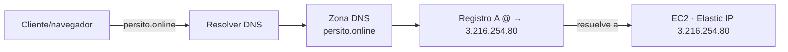

# Etapa 9 — Dominio y DNS

> **Archivo:** `etapas/etapa-09-dominio-dns.md`
> **Estado:** Verificado en producción
> **Checkpoint objetivo:** CP-P3 — Dominio resolviendo correctamente a la EC2 — **alcanzado**

---

## 1. Objetivo de la etapa

Al terminar esta etapa tendremos el **dominio apuntando a la EC2**:

1. El dominio `persito.online` (Namecheap) verificado y con su DNS bajo control.
2. Un **registro A** apuntando a la Elastic IP `3.216.254.80` (apex `@` y, opcional, `www`).
3. **Verificación de propagación** con `dig`/`nslookup` y verificadores online.

**Alcance:** solo DNS. Nginx (Etapa 10) y HTTPS (Etapa 11) usarán este dominio después; en esta etapa aún no hay servidor web respondiendo en 80/443 (eso llega con Nginx).

**Prerrequisitos:** Etapa 8 cerrada (MVP en EC2), dominio registrado (`persito.online`, bitácora Entrada 3) y Elastic IP `3.216.254.80` asociada.

---

## 2. Requisitos del enunciado que cubre

| Requisito | Cómo se cubre |
| --- | --- |
| RNF-4 (nombre de dominio bajo TLD público) | `persito.online` apuntando a la EC2 |
| RNF-3/RNF-8 (Nginx/HTTPS) | El dominio es el prerrequisito del server block (Etapa 10) y del certificado (Etapa 11) |
| ENT-1 (accesos) | El dominio forma parte de los accesos documentados en la Etapa 15 |

---

## 3. Teoría general necesaria

### 3.1 DNS y registros
- **DNS** traduce un nombre (`persito.online`) a una IP. La jerarquía: root → TLD (`.online`) → dominio (`.persito`) → subdominios (`www`, `api`, etc.).
- **Registro A**: nombre → dirección IPv4. Es lo que se usa aquí (`persito.online` → `3.216.254.80`).
- **Registro CNAME**: nombre → otro nombre (no una IP). Para `www` se puede usar un CNAME al apex o un registro A propio.
- **TTL** (time-to-live): cuánto tiempo cachean los resolvers un registro; bajarlo (300 s) durante la configuración acelera la propagación.

### 3.2 Nameservers y zona DNS
- El dominio "delega" su DNS a un conjunto de **nameservers** (NS). Los registros A/CNAME se crean en la **zona DNS** administrada por esos nameservers.
- Opciones: **Namecheap BasicDNS** (nameservers de Namecheap, panel propio) o el DNS del hosting (`cPanel` en `server352.web-hosting.com`, bitácora Entrada 3). Hay que **elegir una única fuente** de DNS para evitar conflictos.

### 3.3 Propagación
- El cambio de un registro no es instantáneo: se propaga por la caché de los resolvers según el TTL anterior. Con TTL bajo, la propagación global suele tardar minutos, pero algunos resolvers/ISPs pueden tardar más (hasta 24–48 h en casos extremos).

### 3.4 Verificación con `dig`
- `dig +short persito.online` → muestra la IP resuelta.
- `dig +trace persito.online` → sigue la cadena de delegación (útil para depurar NS).
- `nslookup persito.online 8.8.8.8` → consulta a un resolver específico (Google).

---

## 4. Aplicación específica a EnergyShark

| Elemento | Valor |
| --- | --- |
| Dominio | `persito.online` (registrado en Namecheap, bitácora Entrada 3) |
| Elastic IP | `3.216.254.80` (asociada a la EC2 en la Etapa 7) |
| Registro A (apex) | `@` → `3.216.254.80` |
| Registro para `www` | `www` → CNAME a `persito.online` (o registro A a la misma IP) |
| TTL durante la prueba | 300 s (o "Automatic") |
| DNS a usar | Namecheap BasicDNS (recomendado) o el cPanel del hosting; **una sola fuente** |

**Decisión clave:** el dominio ya tiene un hosting con cPanel (`server352.web-hosting.com`). Si los nameservers apuntan al hosting, los registros se crean en cPanel (Zona DNS); si se prefiere centralizar, se cambia a **Namecheap BasicDNS** y se crea el registro A en el panel de Namecheap. Ambas rutas son válidas; se elige la que ya esté en uso para no romper otros servicios del dominio.

---

## 5. Decisiones técnicas

| # | Decisión | Alternativas | Recomendación y por qué |
| --- | --- | --- | --- |
| 1 | Fuente de DNS | Namecheap BasicDNS vs cPanel del hosting | **La que ya esté en uso** (bitácora: cPanel en `server352.web-hosting.com`). Si no hay servicios activos, Namecheap BasicDNS simplifica (un solo panel) |
| 2 | Registro A del apex | `@` → Elastic IP vs CNAME | **Registro A** `@` → `3.216.254.80` (CNAME en apex no es estándar) |
| 3 | `www` | CNAME a apex vs registro A propio | **CNAME `www` → `persito.online`**: un solo punto de verdad |
| 4 | TTL | 300 s vs 86400 s | **300 s** durante la configuración; subir a 3600–86400 s al estabilizar |
| 5 | Verificación | `dig` + verificadores online (`dnschecker.org`, `whatsmydns.net`) | Ambos: `dig` local es preciso; los online muestran la propagación global |
| 6 | IPv6 | AAAA vs ignorar | **Ignorar** por ahora (la EC2 no requiere IPv6 para la entrega) |

---

## 6. Diagramas

### 6.1 Flujo de resolución (objetivo de la etapa)



---

## 7. Sub-etapas

### 7.1 Sub-etapa 9.1 — Dominio en Namecheap
Verificar el dominio y decidir/confirmar la fuente de DNS (Namecheap o hosting).

### 7.2 Sub-etapa 9.2 — Registro A
Crear el registro A del apex (y `www`) apuntando a la Elastic IP.

### 7.3 Sub-etapa 9.3 — Verificación de propagación
Comprobar con `dig`/`nslookup` y verificadores online que el dominio resuelve a `3.216.254.80`.

---

## 8. Pasos concretos — Action Items

### Paso 0 — Prerrequisitos
1. Confirmar el dominio: entrar al panel de Namecheap → Domain List → `persito.online` (activo).
2. Confirmar la Elastic IP: `aws ec2 describe-addresses` → `3.216.254.80` asociada.
3. **Verificar:** tienes acceso al panel de Namecheap (y al cPanel del hosting si aplica).

### Paso 1 — 9.1 Dominio y fuente de DNS
1. En Namecheap → `persito.online` → **Nameservers**: ver si apunta a `dns1/dns2.registrar-servers.com` (BasicDNS) o a los NS del hosting (`ns1/ns2.web-hosting.com`).
2. Decidir la fuente única de DNS y anotarlo en la bitácora.
3. **Verificar:** el dominio está activo y la fuente de DNS es una sola.

### Paso 2 — 9.2 Registro A
1. Crear el registro A del apex:
   - Host: `@` · Value: `3.216.254.80` · TTL: 300 (o Automatic).
2. Crear el registro de `www`:
   - Host: `www` · Type: CNAME · Value: `persito.online` (o un registro A `www` → `3.216.254.80`).
3. Guardar los cambios.
4. **Verificar:** en el panel se listan `@` → `3.216.254.80` y `www` → CNAME.

### Paso 3 — 9.3 Verificación de propagación
1. Local:
   ```bash
   dig +short persito.online
   dig +short www.persito.online
   dig +short persito.online @8.8.8.8
   ```
2. Online: `dnschecker.org` / `whatsmydns.net` para `persito.online` → `3.216.254.80`.
3. **Verificar:** la mayoría de los resolvers devuelve `3.216.254.80` (CP-P3).

### Paso 4 — Cierre y versionado
1. Registrar en la bitácora (Entrada 20) y en `ai_docs/prompts/`.
2. Actualizar `etapas/README.md` (Etapa 9 → Verificado en producción) y la matriz (RNF-4 → Verificado en producción).
3. Commits: `docs(etapa-09)` para el plan, `docs(bitacora)`, `docs(ai)`; **no** hay código de aplicación.
4. **Verificar:** `git status` limpio y `git log --oneline` muestra los commits.

---

## 9. Comandos necesarios

```bash
# Resolución local
dig +short persito.online
dig +short www.persito.online
dig +short persito.online @8.8.8.8
dig +trace persito.online

# Alternativas
nslookup persito.online 8.8.8.8
host persito.online

# Elastic IP (confirmar que sigue asociada)
aws ec2 describe-addresses --query 'Addresses[*].[PublicIp, AssociationId]' --output text
```

---

## 10. Resultados esperados

- Dominio `persito.online` con DNS bajo una única fuente.
- Registro A `@` → `3.216.254.80` y `www` → CNAME al apex.
- `dig +short persito.online` devuelve `3.216.254.80` desde la mayoría de los resolvers.
- Bitácora y `ai_docs/prompts/` actualizados; **CP-P3** verificado.

---

## 11. Métodos de verificación

| Verificación | Cómo realizarla |
| --- | --- |
| Registro A creado | Panel de DNS muestra `@` → `3.216.254.80` |
| Resolución local | `dig +short persito.online` → `3.216.254.80` |
| Resolución por resolver público | `dig +short persito.online @8.8.8.8` → `3.216.254.80` |
| Propagación global | `dnschecker.org`/`whatsmydns.net` mayoritariamente verde |
| `www` resuelve | `dig +short www.persito.online` → `3.216.254.80` |
| CP-P3 | Evidencia en la bitácora (Entrada 20) |

---

## 12. Errores comunes y troubleshooting

| Problema probable | Cómo diagnosticarlo / evitarlo |
| --- | --- |
| `dig` devuelve la IP vieja del hosting | TTL alto: esperar a que expire la caché o bajar el TTL y volver a consultar |
| `dig` no devuelve nada | El registro no se guardó o los nameservers no son los que administran la zona: verificar NS y la fuente de DNS |
| Resuelve en Google (8.8.8.8) pero no en mi red | Caché local/ISP: `sudo dscacheutil -flushcache` (macOS) o probar otro resolver |
| Conflicto con registros del cPanel | Hay registros A en dos fuentes: dejar una sola fuente de DNS |
| `www` no resuelve | Falta el CNAME/registro A de `www`; crearlo |
| Error en el panel de Namecheap | Verificar que el dominio está activo y no vencido |
| La IP cambió (Elastic IP perdida) | La Elastic IP debe seguir asociada; re-verificar `describe-addresses` y re-asociar |

---

## 13. Checklist de finalización

- [x] Dominio `persito.online` activo en Namecheap.
- [x] Fuente de DNS única definida (Namecheap o hosting) y documentada.
- [x] Registro A `@` → `3.216.254.80` creado.
- [x] `www` → CNAME (o A) creado.
- [x] TTL bajo (300 s) durante la configuración.
- [x] `dig +short persito.online` → `3.216.254.80` (local y @8.8.8.8).
- [x] Propagación global verificada (verificadores online).
- [x] Bitácora (Entrada 20) y `ai_docs/prompts/` actualizados.
- [x] Estado en `etapas/README.md` (Etapa 9 → Verificado en producción) y matriz (RNF-4 → Verificado en producción).
- [x] Commits realizados y pusheados.

---

## 14. Pruebas locales

| # | Prueba | Resultado esperado |
| --- | --- | --- |
| 1 | `dig +short persito.online` | `3.216.254.80` |
| 2 | `dig +short www.persito.online` | `3.216.254.80` |
| 3 | `dig +short persito.online @8.8.8.8` | `3.216.254.80` |

---

## 15. Pruebas en producción

| # | Prueba | Resultado esperado |
| --- | --- | --- |
| 1 | `dnschecker.org` para `persito.online` | Mayoría de nodos → `3.216.254.80` |
| 2 | `whatsmydns.net` para `persito.online` | Mapa mayoritariamente verde |
| 3 | `curl http://persito.online` (tras Nginx, Etapa 10) | Responde (aún no en esta etapa) |

---

## 16. Registro para la bitácora

Al terminar la etapa, registrar en `docs/bitacora.md`:

- Fecha y objetivo de la etapa (Entrada 20).
- Fuente de DNS elegida y nameservers.
- Registros creados (`@` → `3.216.254.80`, `www`).
- Resultado de `dig` y de los verificadores online.
- Problemas encontrados y soluciones (sección 12).
- Registros de IA generados (`ai_docs/prompts/`).

---

## 17. Siguiente etapa

**Etapa 10 — Nginx como reverse proxy (en el host)** (`etapa-10-nginx-reverse-proxy.md`): instalar Nginx en la EC2 (no en contenedor), configurar el server block HTTP con `server_name persito.online` y `proxy_pass` a `127.0.0.1:3000`, cerrar puertos directos vía Security Groups y revisar logs.
