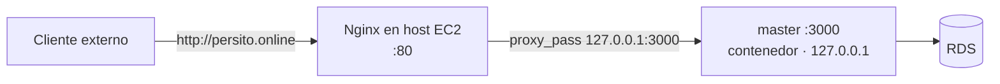

# Etapa 10 — Nginx como reverse proxy (en el host)

> **Archivo:** `etapas/etapa-10-nginx-reverse-proxy.md`
> **Estado:** Verificado en producción
> **Checkpoint objetivo:** CP-P4 — Nginx sirviendo la API por el dominio (HTTP) — **alcanzado**

---

## 1. Objetivo de la etapa

Al terminar esta etapa tendremos la API accesible por el dominio vía **Nginx**:

1. **Nginx instalado en el host EC2** (no en contenedor, como exige el enunciado).
2. Un **server block HTTP** con `server_name persito.online` y `proxy_pass` a `127.0.0.1:3000` (el contenedor `master`).
3. **Puertos directos cerrados** (3000 no expuesto; solo 80/443 vía Security Groups).
4. **Logs de Nginx** configurados y revisados.

**Alcance:** solo HTTP por el puerto 80. HTTPS con Let's Encrypt llega en la Etapa 11.

**Prerrequisitos:** Etapa 9 cerrada (`persito.online` → `3.216.254.80`), Etapa 8 cerrada (`master` corriendo en `127.0.0.1:3000` en la EC2), SG EC2 con 80 y 443 abiertos.

---

## 2. Requisitos del enunciado que cubre

| Requisito | Cómo se cubre |
| --- | --- |
| RNF-3 (proxy inverso apuntando a la app, en el host EC2, no en contenedor) | Nginx instalado directamente en el host y `proxy_pass` a `master` |
| RNF-4 (dominio público) | `server_name persito.online` (registro A de la Etapa 9) |
| RNF-8 (dominio y DNS) | Se usa el dominio ya resuelto a la EC2 |
| RNF-9 (Nginx reverse proxy) | Esta etapa completa el requisito |

---

## 3. Teoría general necesaria

### 3.1 Reverse proxy
- Nginx recibe las peticiones externas en el puerto 80 y las **reenvía** al backend (`master`) en `127.0.0.1:3000`. El cliente nunca habla directo con la API.
- Ventajas: un único punto de entrada, terminación de TLS (Etapa 11), logging unificado y ocultar el backend.

### 3.2 Server block y `proxy_pass`
- **`server_name`**: el dominio que atiende este bloque (`persito.online` y `www.persito.online`).
- **`proxy_pass http://127.0.0.1:3000`**: destino del reenvío (el `master` publicado solo en localhost).
- **Cabeceras de proxy**: `Host`, `X-Real-IP`, `X-Forwarded-For`, `X-Forwarded-Proto` para que el backend conozca al cliente original.

### 3.3 Nginx en el host (no en contenedor)
- Instalación por `apt` (`nginx`), gestionado por **systemd** (`systemctl enable/start nginx`).
- Configuración en `/etc/nginx/sites-available/` + symlink en `/etc/nginx/sites-enabled/` (o `/etc/nginx/conf.d/`).
- La **configuración versionada** vive en `infra/nginx/` del repositorio (regla del plan maestro).

### 3.4 Logs
- `/var/log/nginx/access.log` (peticiones) y `/var/log/nginx/error.log` (errores).
- Se revisan con `tail -f` para confirmar el tráfico del dominio y depurar.

---

## 4. Aplicación específica a EnergyShark

| Elemento | Valor |
| --- | --- |
| Host | EC2 `i-001abcc637483ce58`, IP `3.216.254.80` |
| Dominio | `persito.online` (+ `www.persito.online`) |
| Backend | `master` en `127.0.0.1:3000` (contenedor, `compose.prod.yaml`) |
| Puerto público | 80 (SG ya abierto); 3000 **no** expuesto |
| Config versionada | `infra/nginx/energyshark.conf` |

**Server block de referencia** (se versiona en `infra/nginx/energyshark.conf`):

```nginx
server {
    listen 80;
    listen [::]:80;
    server_name persito.online www.persito.online;

    location / {
        proxy_pass http://127.0.0.1:3000;
        proxy_http_version 1.1;
        proxy_set_header Host $host;
        proxy_set_header X-Real-IP $remote_addr;
        proxy_set_header X-Forwarded-For $proxy_add_x_forwarded_for;
        proxy_set_header X-Forwarded-Proto $scheme;
    }
}
```

---

## 5. Decisiones técnicas

| # | Decisión | Alternativas | Recomendación y por qué |
| --- | --- | --- | --- |
| 1 | Nginx en el host vs contenedor | Host vs Docker | **Host** (obligatorio por RNF-3): instalado por `apt`, gestionado por systemd |
| 2 | Destino del `proxy_pass` | `127.0.0.1:3000` vs `master:3000` (red Docker) | **`127.0.0.1:3000`**: Nginx está en el host (fuera de la red de Compose) y `master` publica en localhost |
| 3 | `server_name` | `persito.online` vs `persito.online www.persito.online` | **Ambos**: apex y `www` (registros de la Etapa 9) |
| 4 | Ubicación de la config | `/etc/nginx/sites-available` + symlink vs `conf.d` | **`sites-available`/`sites-enabled`**: patrón estándar de Ubuntu |
| 5 | Versionado de la config | `infra/nginx/energyshark.conf` (repo) | **`infra/nginx/`**: regla del plan maestro (sección 2) |
| 6 | Cabeceras de proxy | Completas (`Host`, `X-Real-IP`, `X-Forwarded-*`) | **Completas**: el backend necesita la IP/el dominio original del cliente |
| 7 | Puertos | 80 abierto, 3000 cerrado | **Solo 80/443 en el SG**: 3000 nunca se expone al mundo |
| 8 | `default_server` | Dejar el default de Ubuntu vs reemplazar | **Reemplazar/ajustar** para que `persito.online` sea el bloque por defecto y evitar servir otros nombres |

---

## 6. Diagramas

### 6.1 Flujo con Nginx (objetivo de la etapa)



---

## 7. Sub-etapas

### 7.1 Sub-etapa 10.1 — Instalación de Nginx
Instalar y habilitar Nginx en el host EC2.

### 7.2 Sub-etapa 10.2 — Server block HTTP
Configurar `server_name persito.online` + `proxy_pass` a `master`.

### 7.3 Sub-etapa 10.3 — Cierre de puertos directos
Verificar que solo 80/443 están abiertos y 3000 no se expone.

### 7.4 Sub-etapa 10.4 — Logs de Nginx
Revisar `access.log`/`error.log` con tráfico real.

---

## 8. Pasos concretos — Action Items

### Paso 0 — Prerrequisitos
1. EC2 accesible: `ssh -i ~/.ssh/energyshark.pem energyshark@3.216.254.80`.
2. `master` corriendo: `docker compose -f compose.prod.yaml ps` → `healthy`.
3. Dominio resuelve: `dig +short persito.online` → `3.216.254.80`.
4. **Verificar:** `curl -s http://127.0.0.1:3000/health` responde desde la EC2.

### Paso 1 — 10.1 Instalación de Nginx
1. Instalar y arrancar:
   ```bash
   sudo apt update && sudo apt install -y nginx
   sudo systemctl enable nginx
   sudo systemctl start nginx
   ```
2. **Verificar:** `systemctl status nginx` (active) y `curl -s http://3.216.254.80` devuelve la página por defecto de Nginx.

### Paso 2 — 10.2 Server block HTTP
1. Crear la config versionada en el repo (`infra/nginx/energyshark.conf`) con el bloque de la sección 4.
2. En el host, copiarla y habilitarla:
   ```bash
   sudo cp infra/nginx/energyshark.conf /etc/nginx/sites-available/energyshark
   sudo ln -sf /etc/nginx/sites-available/energyshark /etc/nginx/sites-enabled/energyshark
   # quitar el default si compite:
   sudo rm -f /etc/nginx/sites-enabled/default
   sudo nginx -t
   sudo systemctl reload nginx
   ```
3. **Verificar:** `curl -s http://persito.online/health` → `{ status: ok, db: up }` desde fuera.

### Paso 3 — 10.3 Cierre de puertos directos
1. Confirmar que el SG de la EC2 solo abre 22 (mi IP), 80 y 443 (no 3000).
2. Confirmar que `master` publica solo en `127.0.0.1` (`compose.prod.yaml`).
3. **Verificar:** desde el exterior `curl http://3.216.254.80:3000` falla (timeout), pero `http://persito.online` responde.

### Paso 4 — 10.4 Logs de Nginx
1. Revisar los logs con tráfico real:
   ```bash
   sudo tail -f /var/log/nginx/access.log
   sudo tail -f /var/log/nginx/error.log
   ```
2. **Verificar:** las peticiones a `/health` y `/history` aparecen en `access.log` con código 200.

### Paso 5 — Verificación end-to-end y cierre
1. `curl -s http://persito.online/history?limit=5` responde con eventos reales.
2. Registrar en la bitácora (Entrada 22) y en `ai_docs/prompts/`.
3. Actualizar `etapas/README.md` (Etapa 10 → Verificado en producción) y la matriz (RNF-9 → Verificado en producción).
4. Commits: `feat(nginx)` para la config versionada; `docs(bitacora)`, `docs(etapa-10)`, `docs(ai)`.
5. **Verificar:** CP-P4 alcanzado.

---

## 9. Comandos necesarios

```bash
# Instalación
sudo apt update && sudo apt install -y nginx
sudo systemctl enable --now nginx

# Server block
sudo cp infra/nginx/energyshark.conf /etc/nginx/sites-available/energyshark
sudo ln -sf /etc/nginx/sites-available/energyshark /etc/nginx/sites-enabled/energyshark
sudo rm -f /etc/nginx/sites-enabled/default
sudo nginx -t && sudo systemctl reload nginx

# Verificación
curl -s http://persito.online/health
curl -s "http://persito.online/history?limit=5"
sudo tail -n 20 /var/log/nginx/access.log
```

---

## 10. Resultados esperados

- Nginx corriendo en el host EC2 (systemd, `active`).
- `http://persito.online/health` y `/history` responden vía Nginx (proxy a `master`).
- El puerto 3000 no es accesible desde el exterior; solo 80/443 lo son.
- Logs de Nginx registran el tráfico real del dominio.
- Configuración versionada en `infra/nginx/energyshark.conf`; **CP-P4** verificado.

---

## 11. Métodos de verificación

| Verificación | Cómo realizarla |
| --- | --- |
| Nginx activo | `systemctl status nginx` |
| Sintaxis de config | `sudo nginx -t` sin errores |
| Proxy funciona | `curl http://persito.online/health` → `{ status: ok, db: up }` |
| Puerto 3000 cerrado | `curl http://3.216.254.80:3000` → timeout desde fuera |
| Logs | `tail /var/log/nginx/access.log` muestra las peticiones |
| Config versionada | `infra/nginx/energyshark.conf` en el repo |
| CP-P4 | Evidencia en la bitácora (Entrada 22) |

---

## 12. Errores comunes y troubleshooting

| Problema probable | Cómo diagnosticarlo / evitarlo |
| --- | --- |
| `502 Bad Gateway` | `master` no responde en `127.0.0.1:3000`: verificar `docker compose ps` y `curl 127.0.0.1:3000/health` desde el host |
| `nginx -t` falla | Error de sintaxis en el server block: revisar `;` y llaves; corregir y reintentar |
| El default de Ubuntu sigue sirviendo | No se deshabilitó `sites-enabled/default` o falta el symlink del bloque |
| `server_name` no matchea | El Host usado no es `persito.online`/`www`; revisar `curl -H "Host: persito.online" http://3.216.254.80` |
| Puerto 80 no responde | El SG no abre 80 (Etapa 7): agregar la regla de entrada 80 |
| Config en el repo desincronizada del host | Cada cambio en `infra/nginx/` debe copiarse al host y hacer `nginx -t` + reload |
| Logs vacíos | Nginx no recibe tráfico: verificar que el dominio resuelve a la IP correcta |

---

## 13. Checklist de finalización

- [x] Nginx instalado y `active` en el host EC2 (systemd).
- [x] Server block `persito.online` + `www` con `proxy_pass http://127.0.0.1:3000`.
- [x] Configuración versionada en `infra/nginx/energyshark.conf`.
- [x] `default` deshabilitado (o `server_name` correcto) para no servir otros nombres.
- [x] Cabeceras de proxy (`Host`, `X-Real-IP`, `X-Forwarded-*`) configuradas.
- [x] `sudo nginx -t` sin errores y reload aplicado.
- [x] `http://persito.online/health` → `{ status: ok, db: up }`.
- [x] Puerto 3000 no accesible desde el exterior (SG sin 3000).
- [x] Logs de Nginx revisados con tráfico real.
- [x] Bitácora (Entrada 22) y `ai_docs/prompts/` actualizados.
- [x] Estado en `etapas/README.md` (Etapa 10 → Verificado en producción) y matriz (RNF-9 → Verificado en producción).
- [x] Commits realizados y pusheados.

---

## 14. Pruebas locales

| # | Prueba | Resultado esperado |
| --- | --- | --- |
| 1 | `sudo nginx -t` | Sintaxis correcta |
| 2 | `curl http://127.0.0.1:3000/health` (desde EC2) | `{ status: ok, db: up }` |

---

## 15. Pruebas en producción

| # | Prueba | Resultado esperado |
| --- | --- | --- |
| 1 | `curl http://persito.online/health` | 200 `{ status: ok, db: up }` vía Nginx |
| 2 | `curl "http://persito.online/history?limit=5"` | `{ items, meta }` con eventos reales |
| 3 | `curl http://3.216.254.80:3000` desde fuera | Timeout (puerto cerrado) |
| 4 | `sudo tail /var/log/nginx/access.log` | Peticiones al dominio con 200 |

---

## 16. Registro para la bitácora

Al terminar la etapa, registrar en `docs/bitacora.md`:

- Fecha y objetivo de la etapa (Entrada 22).
- Decisiones técnicas adoptadas (tabla de la sección 5).
- Comandos de instalación, server block y reload.
- Evidencia de `curl` al dominio y de los logs.
- Problemas encontrados y soluciones (sección 12).
- Registros de IA generados (`ai_docs/prompts/`).

---

## 17. Siguiente etapa

**Etapa 11 — HTTPS con Let's Encrypt** (`etapa-11-https-letsencrypt.md`): instalar Certbot (plugin Nginx), emitir el certificado para `persito.online`, configurar el server block 443 con redirección HTTP→HTTPS y renovación automática (≥ 2×/día).
