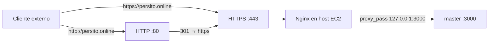
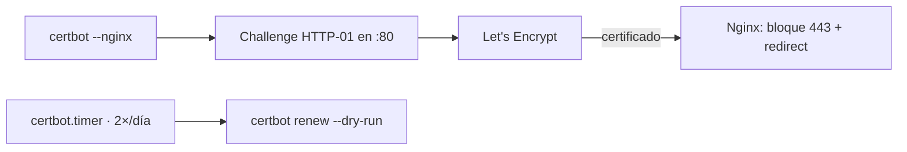

# Etapa 11 — HTTPS con Let's Encrypt (parte variable elegida)

> **Archivo:** `etapas/etapa-11-https-letsencrypt.md`
> **Estado:** Verificado en producción
> **Checkpoint objetivo:** CP-P5 — HTTPS activo, redirección HTTP→HTTPS y renovación automática — **alcanzado**

---

## 1. Objetivo de la etapa

Al terminar esta etapa tendremos el sitio bajo **HTTPS** (parte variable elegida):

1. **Certbot** instalado con el plugin de Nginx.
2. **Certificado Let's Encrypt** emitido para `persito.online` (+ `www`).
3. **Server block 443** y **redirección HTTP → HTTPS**.
4. **Renovación automática** (timer de systemd, chequeo ≥ 2×/día) verificada con `dry-run`.
5. **Verificación del certificado** (navegador, `curl`, `openssl`).

**Alcance:** HTTPS activo y auto-renovable (checkpoint CP-P5, RNF-10). Con esto se cierra la parte variable elegida (25 % de la nota).

**Prerrequisitos:** Etapa 10 cerrada (Nginx sirviendo `persito.online` en HTTP), dominio resuelto a la EC2, puertos 80 y 443 abiertos en el SG.

---

## 2. Requisitos del enunciado que cubre

| Requisito | Cómo se cubre |
| --- | --- |
| Parte variable · RNF1 (dominio asegurado con SSL de Let's Encrypt) | Certificado emitido por Certbot para `persito.online`/`www` |
| Parte variable · RNF2 (redirección HTTP → HTTPS) | El plugin `nginx` de Certbot configura la redirección 301 |
| Parte variable · RNF3 (chequeo de expiración ≥ 2×/día, renovación solo si corresponde) | Timer de systemd de Certbot (2×/día) + `certbot renew --dry-run` |

---

## 3. Teoría general necesaria

### 3.1 TLS/HTTPS y Let's Encrypt
- **HTTPS** cifra la conexión cliente-servidor con TLS. Un **certificado** firmado por una CA valida que el dominio nos pertenece.
- **Let's Encrypt** es una CA gratuita que emite certificados de **90 días**; por eso la renovación automática es imprescindible.
- **ACME** es el protocolo con el que Certbot solicita/renueva certificados.

### 3.2 Certbot y el plugin Nginx
- **`certbot`** es el cliente ACME. El **plugin `nginx`**:
  - Detecta el server block, realiza el *challenge* **HTTP-01** (sirve un archivo temporal en el puerto 80) y, al validar, edita la configuración para añadir el bloque 443 y la redirección 80→443.
- Después de la emisión, la configuración de Nginx queda modificada; conviene **reflejar ese cambio en la versión del repositorio** (`infra/nginx/energyshark.conf`).

### 3.3 Renovación automática
- El paquete de Certbot instala **`certbot.timer`** (systemd) que ejecuta `certbot renew` **dos veces al día** (a las 00:00 y 12:00), renovando solo si falta menos de ~30 días para expirar.
- `certbot renew --dry-run` simula la renovación sin emitir para verificar el flujo.

### 3.4 Verificación
- `curl -I https://persito.online` → `HTTP/2 200` (o `HTTP/1.1 200`).
- `curl http://persito.online` → redirección `301` a `https://...`.
- `openssl s_client -connect persito.online:443 -servername persito.online` muestra el certificado y su emisor (Let's Encrypt).

---

## 4. Aplicación específica a EnergyShark

| Elemento | Valor |
| --- | --- |
| Dominio | `persito.online` + `www.persito.online` |
| Backend | `master` en `127.0.0.1:3000` (vía Nginx, Etapa 10) |
| Paquete | `certbot` + `python3-certbot-nginx` |
| Emisión | `sudo certbot --nginx -d persito.online -d www.persito.online` |
| Renovación | `certbot.timer` (systemd, 2×/día) |
| Verificación | `curl -I https://persito.online/health`, `openssl s_client`, navegador |
| Config versionada | `infra/nginx/energyshark.conf` (se actualiza con el bloque 443 + redirección) |

---

## 5. Decisiones técnicas

| # | Decisión | Alternativas | Recomendación y por qué |
| --- | --- | --- | --- |
| 1 | Método de desafío | Plugin `nginx` (HTTP-01) vs `standalone` vs `webroot` | **Plugin `nginx`**: detecta el server block, emite y reconfigura automáticamente |
| 2 | Dominios del certificado | `persito.online` vs `+ www` | **Ambos** (`-d persito.online -d www.persito.online`): cubre el apex y el `www` |
| 3 | Renovación | `certbot.timer` (systemd) vs cron | **`certbot.timer`**: viene con el paquete, 2×/día por defecto y manejado por systemd |
| 4 | Redirección HTTP→HTTPS | Automática (plugin) vs manual en la config | **Automática** y luego **versionarla** en `infra/nginx/` (regla del plan maestro) |
| 5 | Actualización de la config versionada | Reflejar lo que generó Certbot | **Sí**: `infra/nginx/energyshark.conf` debe quedar sincronizado con el host |
| 6 | Verificación | `curl` + `openssl` + navegador | **Las tres**: evidencia técnica y visual |

---

## 6. Diagramas

### 6.1 Flujo con HTTPS (objetivo de la etapa)



### 6.2 Flujo de emisión y renovación



---

## 7. Sub-etapas

### 7.1 Sub-etapa 11.1 — Instalación de Certbot
Instalar `certbot` y el plugin de Nginx en la EC2.

### 7.2 Sub-etapa 11.2 — Emisión del certificado
Emitir el certificado para `persito.online` y `www`.

### 7.3 Sub-etapa 11.3 — Configuración HTTPS
Verificar el server block 443 y la redirección HTTP → HTTPS; versionar el cambio.

### 7.4 Sub-etapa 11.4 — Renovación automática
Verificar el timer de systemd y un `certbot renew --dry-run`.

### 7.5 Sub-etapa 11.5 — Verificación del certificado
Comprobar con `curl`, `openssl` y navegador.

---

## 8. Pasos concretos — Action Items

### Paso 0 — Prerrequisitos
1. EC2 accesible: `ssh -i ~/.ssh/energyshark.pem energyshark@3.216.254.80`.
2. Nginx corriendo: `systemctl status nginx`.
3. Dominio resuelve: `dig +short persito.online` → `3.216.254.80`.
4. Puertos 80/443 abiertos en el SG (verificar en AWS Console o CLI).
5. **Verificar:** `curl -I http://persito.online` responde (HTTP, Etapa 10).

### Paso 1 — 11.1 Instalación de Certbot
1. Instalar:
   ```bash
   sudo apt update && sudo apt install -y certbot python3-certbot-nginx
   ```
2. **Verificar:** `certbot --version`.

### Paso 2 — 11.2 Emisión del certificado
1. Emitir:
   ```bash
   sudo certbot --nginx -d persito.online -d www.persito.online --redirect
   ```
   (El flag `--redirect` asegura la redirección HTTP→HTTPS.)
2. **Verificar:** al terminar, Certbot indica el certificado emitido y la expiración.

### Paso 3 — 11.3 Configuración HTTPS
1. Revisar el server block generado:
   ```bash
   sudo cat /etc/nginx/sites-available/energyshark
   sudo nginx -t && sudo systemctl reload nginx
   ```
2. **Actualizar la configuración versionada** `infra/nginx/energyshark.conf` en el repo para reflejar el bloque 443 (con `ssl_certificate`, `ssl_certificate_key`) y la redirección 301.
3. **Verificar:** `curl http://persito.online` → `301` a `https://`.

### Paso 4 — 11.4 Renovación automática
1. Verificar el timer:
   ```bash
   systemctl list-timers certbot.timer
   systemctl status certbot.timer
   ```
2. Simular la renovación:
   ```bash
   sudo certbot renew --dry-run
   ```
3. **Verificar:** `dry-run` termina con éxito (al menos 2×/día).

### Paso 5 — 11.5 Verificación del certificado
1. `curl -I https://persito.online/health` → `200`.
2. `curl -I http://persito.online/health` → `301` a HTTPS.
3. `echo | openssl s_client -connect persito.online:443 -servername persito.online 2>/dev/null | openssl x509 -noout -issuer -dates`.
4. Abrir `https://persito.online` en el navegador (candado válido).
5. **Verificar:** certificado emitido por Let's Encrypt, válido y sin advertencias.

### Paso 6 — Cierre y versionado
1. Registrar en la bitácora (Entrada 24) y en `ai_docs/prompts/`.
2. Actualizar `etapas/README.md` (Etapa 11 → Verificado en producción) y la matriz (RNF-10 → Verificado en producción).
3. Commits: `feat(nginx)` para la config con HTTPS; `docs(bitacora)`, `docs(etapa-11)`, `docs(ai)`.
4. **Verificar:** CP-P5 alcanzado y repositorio sincronizado.

---

## 9. Comandos necesarios

```bash
# Instalación
sudo apt update && sudo apt install -y certbot python3-certbot-nginx

# Emisión
sudo certbot --nginx -d persito.online -d www.persito.online --redirect

# Renovación
systemctl list-timers certbot.timer
sudo certbot renew --dry-run

# Verificación
curl -I https://persito.online/health
curl -I http://persito.online/health
echo | openssl s_client -connect persito.online:443 -servername persito.online 2>/dev/null \
  | openssl x509 -noout -issuer -dates
```

---

## 10. Resultados esperados

- Certificado Let's Encrypt emitido para `persito.online` y `www`.
- `https://persito.online` responde con la API; `http://` redirige (301) a HTTPS.
- Renovación automática activa (`certbot.timer`, 2×/día) y `dry-run` exitoso.
- Configuración de Nginx actualizada y versionada en `infra/nginx/`.
- **CP-P5** verificado (HTTPS activo y auto-renovable).

---

## 11. Métodos de verificación

| Verificación | Cómo realizarla |
| --- | --- |
| Certificado emitido | `certbot certificates` o `openssl s_client ... -issuer` (Let's Encrypt) |
| HTTPS responde | `curl -I https://persito.online/health` → 200 |
| Redirección | `curl -I http://persito.online/health` → 301 a HTTPS |
| Timer activo | `systemctl status certbot.timer` → `active` |
| Renovación funcional | `sudo certbot renew --dry-run` → éxito |
| Expiración | `openssl x509 -dates` → dentro de ~90 días |
| CP-P5 | Evidencia en la bitácora (Entrada 24) |

---

## 12. Errores comunes y troubleshooting

| Problema probable | Cómo diagnosticarlo / evitarlo |
| --- | --- |
| Certbot falla con "domain did not resolve" | El registro A no apunta a la IP o la propagación no terminó; esperar y verificar `dig` |
| Challenge HTTP-01 falla | El puerto 80 debe estar abierto y Nginx sirviendo el dominio; verificar SG |
| "Duplicate certificate" | Ya existe un cert: usar `certbot certificates` o añadir el dominio con `--expand` |
| No hay redirección | Reemitir con `--redirect` o añadir el `return 301` manualmente |
| Timer no existe | Instalar `certbot` completo (trae `certbot.timer`); si no, crearlo |
| `dry-run` falla | Revisar el error (suele ser DNS/puerto o límite); corregir y reintentar |
| Navegador marca el cert inválido | Verificar que el `server_name` incluye `www` o que el cert cubre el dominio usado |
| Certificado no se renovó | Revisar `journalctl -u certbot.timer` y que el timer esté `enabled` |

---

## 13. Checklist de finalización

- [x] `certbot` y `python3-certbot-nginx` instalados.
- [x] Certificado emitido para `persito.online` y `www` (Let's Encrypt).
- [x] Server block 443 configurado (Certbot lo generó).
- [x] Redirección HTTP → HTTPS activa (301).
- [x] Configuración actualizada y versionada en `infra/nginx/energyshark.conf`.
- [x] `certbot.timer` activo (2×/día).
- [x] `sudo certbot renew --dry-run` exitoso.
- [x] `curl -I https://persito.online/health` → 200.
- [x] `openssl` muestra emisor Let's Encrypt y fechas válidas.
- [x] Navegador sin advertencias de seguridad.
- [x] Bitácora (Entrada 24) y `ai_docs/prompts/` actualizados.
- [x] Estado en `etapas/README.md` (Etapa 11 → Verificado en producción) y matriz (RNF-10 → Verificado en producción).
- [x] Commits realizados y pusheados.

---

## 14. Pruebas locales

| # | Prueba | Resultado esperado |
| --- | --- | --- |
| 1 | `curl -I https://persito.online/health` | `200 OK` (HTTPS) |
| 2 | `curl -I http://persito.online/health` | `301` → `https://persito.online/...` |

---

## 15. Pruebas en producción

| # | Prueba | Resultado esperado |
| --- | --- | --- |
| 1 | `echo \| openssl s_client -connect persito.online:443 -servername persito.online \| openssl x509 -issuer -dates` | Emisor Let's Encrypt; fechas dentro de ~90 días |
| 2 | `sudo certbot renew --dry-run` | Renovación simulada exitosa |
| 3 | Navegador → `https://persito.online` | Candado válido, sin advertencias |
| 4 | `systemctl list-timers certbot.timer` | Timer activo, 2×/día |

---

## 16. Registro para la bitácora

Al terminar la etapa, registrar en `docs/bitacora.md`:

- Fecha y objetivo de la etapa (Entrada 24).
- Decisiones técnicas adoptadas (tabla de la sección 5).
- Comandos de emisión, renovación y verificación.
- Evidencia de `curl`/`openssl`/navegador y del `dry-run`.
- Problemas encontrados y soluciones (sección 12).
- Registros de IA generados (`ai_docs/prompts/`).

---

## 17. Siguiente etapa

**Etapa 12 — Pruebas de resiliencia y health checks** (`etapa-12-resiliencia-healthchecks.md`): caída/recuperación de RabbitMQ, reinicios de `connector`/`master`, consultas durante fallos, volumen de datos (paginación profunda y filtros con índices) y revisión de health checks y logs en producción.
