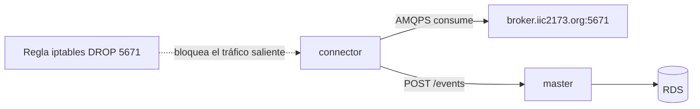

# Etapa 12 — Pruebas de resiliencia y health checks

> **Archivo:** `etapas/etapa-12-resiliencia-healthchecks.md`
> **Estado:** Verificado en producción
> **Checkpoint objetivo:** CP-P6 — Resiliencia y health checks verificados en producción — **alcanzado**

---

## 1. Objetivo de la etapa

Al terminar esta etapa tendremos la **resiliencia del sistema verificada en producción** (checkpoint CP-P6):

1. **Caída/recuperación de RabbitMQ**: el `connector` no termina y se reconecta solo.
2. **Reinicios de `connector` y `master`**: el sistema se recupera sin intervención.
3. **`/history` operativo durante fallos** (RNF-4: `master` no depende del broker).
4. **Volumen de datos**: miles de eventos con paginación profunda y filtros eficientes (índices).
5. **Health checks en producción** (`docker ps`, `docker inspect`).
6. **Revisión de logs** (reconexiones, errores, envíos).

**Alcance:** producción (EC2 + RDS + broker del curso). Se usan los contenedores de `compose.prod.yaml` y el tráfico real.

**Prerrequisitos:** Etapas 8–11 cerradas (MVP en producción, dominio, HTTPS), SSH a la EC2, y acceso a los logs de los contenedores.

---

## 2. Requisitos del enunciado que cubre

| Requisito | Cómo se cubre |
| --- | --- |
| RNF-1 (connector no termina permanentemente; se reconecta sin intervención) | Caída simulada del broker + recuperación |
| RNF-3 (resiliencia: reconexión automática) | Escenarios 12.1 y 12.2 |
| RNF-4 (`master` continúa atendiendo consultas ante caídas del broker) | Escenario 12.3 (`/history` durante el fallo) |
| RNF-5 (HEALTHCHECK por contenedor) | `docker ps`/`docker inspect` en producción |
| RF3 (paginación) | Paginación profunda con miles de registros |
| RF4 (filtros con índices) | Filtros temporales y por `type` con `EXPLAIN` |

---

## 3. Teoría general necesaria

### 3.1 Resiliencia y semántica at-least-once
- Ante fallos parciales (broker caído, `master` caído), el sistema se **degrada o se recupera solo**, nunca colapsa.
- El `connector` usa backoff exponencial y reintentos infinitos de conexión (RNF-3); el reenvío HTTP reintenta con tope y solo hace ack tras 2xx.
- Semántica **at-least-once**: si el ack se pierde, RabbitMQ reentrega → posibles duplicados tolerados.

### 3.2 Simular caída del broker sin tocar la infraestructura del curso
- El broker del curso es **compartido** y el usuario `observer.45` solo tiene permiso de consumo; **no se detiene**.
- Se simula la caída bloqueando temporalmente el tráfico saliente a `broker.iic2173.org:5671` desde la EC2 con **iptables** (regla reversible). El tráfico de los contenedores pasa por la cadena OUTPUT del host, así que la regla afecta al `connector`.

### 3.3 Health checks y estado en Docker
- `docker compose ps` muestra el estado (`running`/`healthy`) y los healthchecks.
- `docker inspect --format '{{json .State.Health}}' <container>` detalla intervalos, retries y la última salida.

### 3.4 Volumen, paginación profunda e índices
- Con `LIMIT/OFFSET`, una página muy profunda recorre más filas; para la entrega se valida el comportamiento con miles de registros y latencia aceptable.
- Los índices btree de `type`, `receivedAt` y `validUntil` aceleran los filtros; se confirman con `EXPLAIN ANALYZE`.

---

## 4. Aplicación específica a EnergyShark

| Elemento | Valor |
| --- | --- |
| Broker del curso | `amqps://observer.45:<pass>@broker.iic2173.org:5671/energy` (compartido) |
| Cola | `observer.45.q` |
| `connector`/`master` | Contenedores de `compose.prod.yaml` en la EC2 |
| RDS | `energyshark.cy3ceaoa6tdt.us-east-1.rds.amazonaws.com` (miles de eventos reales) |
| Healthcheck `master` | `fetch http://localhost:3000/health` |
| Healthcheck `connector` | heartbeat file (`/tmp/connector-heartbeat`) |

Escenarios de prueba (todos en producción):

| # | Escenario | Método | Resultado esperado |
| --- | --- | --- | --- |
| 1 | Caída/recuperación del broker | iptables DROP a 5671 y luego DELETE | `connector` loguea backoff y reconecta solo |
| 2 | Reinicio de `connector` | `docker compose restart connector` | Reconexión y re-suscripción; sigue consumiendo |
| 3 | Reinicio de `master` | `docker compose restart master` | `/history` vuelve; `connector` reintenta y recupera |
| 4 | `/history` durante el fallo | Consultas mientras el broker está "caído" | `master` responde 200 (RNF-4) |
| 5 | Volumen/paginación | `?page=N&limit=25` con miles de eventos | Latencia aceptable, `meta.total` correcto |
| 6 | Filtros con índices | `?type=demand-set&receivedAtFrom=...` + `EXPLAIN` | Usa índice (bitmap/btree), no seq scan total |

---

## 5. Decisiones técnicas

| # | Decisión | Alternativas | Recomendación y por qué |
| --- | --- | --- | --- |
| 1 | Simular caída del broker | iptables (DROP egress 5671) vs esperar caída real | **iptables**: controlado y reversible, sin tocar el broker compartido |
| 2 | Datos de prueba | Generados vs reales | **Reales**: la RDS ya tiene miles de eventos del curso |
| 3 | Paginación profunda | `OFFSET` alto vs keyset | **`OFFSET`** (ya implementado): validar latencia; keyset solo si se degrada |
| 4 | Confirmar índices | `EXPLAIN ANALYZE` vs confiar | **`EXPLAIN ANALYZE`** en los filtros: evidencia de que se usa el índice |
| 5 | Health checks | `docker ps` vs `docker inspect` | **Ambos**: `ps` para el estado general y `inspect` para el detalle del healthcheck |
| 6 | Logs | Solo contenedores vs + Nginx | **Contenedores** (`docker compose logs`) y **Nginx** (`/var/log/nginx/access.log`) |
| 7 | Duración del fallo simulado | 30–60 s vs minutos | **~60 s**: suficiente para ver el backoff crecer y la reconexión |

---

## 6. Diagramas

### 6.1 Escenario de caída del broker (simulada)



---

## 7. Sub-etapas

### 7.1 Sub-etapa 12.1 — Caída/recuperación de RabbitMQ
Simular la caída del broker y verificar la reconexión automática del `connector`.

### 7.2 Sub-etapa 12.2 — Reinicios de `connector` y `master`
Reiniciar cada contenedor y verificar recuperación sin intervención.

### 7.3 Sub-etapa 12.3 — Consultas durante fallos
Confirmar que `/history` responde mientras el broker está caído.

### 7.4 Sub-etapa 12.4 — Volumen de datos
Miles de eventos: paginación profunda y filtros con índices.

### 7.5 Sub-etapa 12.5 — Health checks en producción
Estado de los contenedores y detalle de los healthchecks.

### 7.6 Sub-etapa 12.6 — Revisión de logs
Reconexiones, errores y envíos en los logs de contenedores y Nginx.

---

## 8. Pasos concretos — Action Items

### Paso 0 — Prerrequisitos
1. SSH a la EC2: `ssh -i ~/.ssh/energyshark.pem energyshark@3.216.254.80`.
2. Contenedores arriba: `cd ~/iic2173-energyshark && docker compose -f compose.prod.yaml ps` → ambos `healthy`.
3. Registrar el `total` actual de `/history` como línea base (ej. 2166+).
4. **Verificar:** acceso a logs y `sudo` (para iptables).

### Paso 1 — 12.1 Caída/recuperación de RabbitMQ (simulada)
1. Bloquear el egress al broker:
   ```bash
   sudo iptables -I OUTPUT -p tcp --dport 5671 -d broker.iic2173.org -j DROP
   ```
2. Observar los logs del `connector` (~60 s): `docker compose -f compose.prod.yaml logs -f connector` → `ERROR de RabbitMQ` / `Conexión cerrada` y `BACKOFF intento=1..N` con espera creciente.
3. Confirmar que el **proceso sigue vivo** y que el **heartbeat** del healthcheck no lo marca muerto (healthcheck es operativo, no de conexión).
4. Restaurar:
   ```bash
   sudo iptables -D OUTPUT -p tcp --dport 5671 -d broker.iic2173.org -j DROP
   ```
5. **Verificar:** el `connector` loguea `CONEXIÓN TCP establecida` + `ESCUCHANDO` y vuelve a consumir/ack sin intervención.

### Paso 2 — 12.2 Reinicios de contenedores
1. `docker compose -f compose.prod.yaml restart connector` → logs de reconexión y re-suscripción; sigue consumiendo.
2. `docker compose -f compose.prod.yaml restart master` → el `connector` loguea `REINTENTO ... fetch failed` y, al volver `master`, `ACK status=201`.
3. **Verificar:** ambos vuelven a `healthy` y el flujo continúa.

### Paso 3 — 12.3 `/history` durante fallos
1. Mientras el broker está bloqueado (Paso 1) o `connector` reiniciado, consultar:
   ```bash
   curl -s "https://persito.online/history?limit=25" | head -c 200
   ```
2. **Verificar:** `200` con eventos previamente almacenados (RNF-4: `master` no depende del broker).

### Paso 4 — 12.4 Volumen de datos
1. Paginación profunda:
   ```bash
   curl -s "https://persito.online/history?page=50&limit=25"   # y page=200, etc.
   ```
2. Filtros con `receivedAt`/`type` y medir el tiempo de respuesta.
3. En la EC2 (o RDS vía `psql`), confirmar el uso de índices:
   ```sql
   EXPLAIN ANALYZE SELECT * FROM history WHERE type = 'demand-set' AND "receivedAt" >= now() - interval '1 day' ORDER BY "receivedAt" DESC LIMIT 25;
   ```
4. **Verificar:** latencia aceptable, `meta.total` correcto y el plan usa índices (no `Seq Scan` masivo).

### Paso 5 — 12.5 Health checks en producción
1. `docker compose -f compose.prod.yaml ps` → `healthy` en ambos.
2. `docker inspect --format '{{json .State.Health}}' energyshark-master-1` y `...connector-1`.
3. **Verificar:** `Status: healthy`, con logs de los checks.

### Paso 6 — 12.6 Revisión de logs
1. `docker compose -f compose.prod.yaml logs --tail=200 connector` → reconexiones, acks, nacks.
2. `docker compose -f compose.prod.yaml logs --tail=200 master`.
3. `sudo tail -n 50 /var/log/nginx/access.log` → peticiones con códigos 200/301.
4. **Verificar:** sin errores inesperados y evidencia de reconexión/reenvío.

### Paso 7 — Cierre y versionado
1. Registrar resultados en la bitácora (Entrada 26) y en `ai_docs/prompts/`.
2. Actualizar `etapas/README.md` (Etapa 12 → Verificado en producción) y la matriz (RNF-1..4, RF3, RF4 → Verificado en producción).
3. Commits: `docs(etapa-12)`, `docs(bitacora)`, `docs(ai)`.
4. **Verificar:** CP-P6 alcanzado.

---

## 9. Comandos necesarios

```bash
# Estado y health checks
docker compose -f compose.prod.yaml ps
docker inspect --format '{{json .State.Health}}' energyshark-master-1
docker inspect --format '{{json .State.Health}}' energyshark-connector-1

# Simulación de caída del broker (reversible)
sudo iptables -I OUTPUT -p tcp --dport 5671 -d broker.iic2173.org -j DROP
# ... observar logs ~60 s ...
sudo iptables -D OUTPUT -p tcp --dport 5671 -d broker.iic2173.org -j DROP

# Reinicios
docker compose -f compose.prod.yaml restart connector
docker compose -f compose.prod.yaml restart master

# Volumen y filtros
curl -s "https://persito.online/history?page=50&limit=25"
curl -s "https://persito.online/history?type=demand-set&receivedAtFrom=2026-08-30"

# Logs
docker compose -f compose.prod.yaml logs --tail=200 connector
docker compose -f compose.prod.yaml logs --tail=200 master
sudo tail -n 50 /var/log/nginx/access.log

# Índices (desde la EC2, psql a RDS)
psql "host=energyshark.cy3ceaoa6tdt.us-east-1.rds.amazonaws.com user=energyshark dbname=energy_db sslmode=require" \
  -c "EXPLAIN ANALYZE SELECT * FROM history WHERE type='demand-set' AND \"receivedAt\" >= now() - interval '1 day' ORDER BY \"receivedAt\" DESC LIMIT 25;"
```

---

## 10. Resultados esperados

- `connector` sobrevive a la caída del broker y se reconecta solo (backoff creciente, RNF-3).
- Reinicios de `connector`/`master` sin pérdida ni intervención.
- `/history` responde 200 durante el fallo del broker (RNF-4).
- Paginación profunda y filtros con miles de registros: latencia aceptable y uso de índices.
- Health checks `healthy` en producción (RNF-5).
- Logs revisados sin errores inesperados.
- Bitácora y `ai_docs/prompts/` actualizados; **CP-P6** verificado.

---

## 11. Métodos de verificación

| Verificación | Cómo realizarla |
| --- | --- |
| Reconexión del connector | Logs: `BACKOFF` → `CONEXIÓN TCP establecida` → `ESCUCHANDO` |
| Proceso vivo durante el fallo | `docker compose ps` (connector sigue `running`/`healthy`) |
| `/history` durante el fallo | `curl https://persito.online/history?limit=25` → 200 |
| Recuperación tras reinicio | `docker compose ps` → `healthy`; logs con `ACK 201` |
| Paginación profunda | `?page=50&limit=25` responde con `meta` correcto |
| Índices usados | `EXPLAIN ANALYZE` muestra índice, no `Seq Scan` masivo |
| Health checks | `docker inspect ... .State.Health` → `healthy` |
| CP-P6 | Evidencia en la bitácora (Entrada 26) |

---

## 12. Errores comunes y troubleshooting

| Problema probable | Cómo diagnosticarlo / evitarlo |
| --- | --- |
| La regla iptables no afecta al connector | Verificar la ruta de red del contenedor (bridge + NAT por el host); probar también `iptables -I OUTPUT -p tcp --dport 5671 -j DROP` (todo destino) si hace falta |
| El healthcheck del connector marca unhealthy | El heartbeat es operativo (no de conexión): verificar que el proceso escribe `/tmp/connector-heartbeat`; si el fallo es real, revisar logs |
| `master` con 502 tras reinicio | El healthcheck de `master` requiere que la app escuche en `:3000`; esperar `start_period` y revisar logs |
| Paginación lenta | Con `OFFSET` alto la latencia sube: medir y, si degrada mucho, evaluar keyset (documentado en la Etapa 2) |
| `EXPLAIN` muestra `Seq Scan` | El índice no se usa por el orden del `ORDER BY` o por cardinalidad baja: revisar `ANALYZE` y las condiciones |
| No veo los `ACK` tras reiniciar `master` | Los mensajes pendientes están en la cola; el `connector` reintenta con backoff hasta que `master` responde |
| Duplicados en `/history` | Esperado (at-least-once): el `idpk` único (Etapa 4 fix) evita duplicados persistidos |

---

## 13. Checklist de finalización

- [x] Línea base de `/history` registrada.
- [x] Caída simulada del broker (iptables) → `connector` con backoff y reconexión automática.
- [x] Regla iptables restaurada (sin dejar el broker bloqueado).
- [x] `docker compose restart connector` y `restart master` recuperados sin intervención.
- [x] `/history` responde 200 durante el fallo (RNF-4).
- [x] Paginación profunda (`page=50`+) con `meta` correcto.
- [x] Filtros con `EXPLAIN ANALYZE` usando índices.
- [x] Health checks `healthy` en `docker ps` y `docker inspect`.
- [x] Logs de contenedores y Nginx revisados.
- [x] Bitácora (Entrada 26) y `ai_docs/prompts/` actualizados.
- [x] Estado en `etapas/README.md` (Etapa 12 → Verificado en producción) y matriz (RNF-1..4, RF3, RF4).
- [x] Commits realizados y pusheados.

---

## 14. Pruebas locales

| # | Prueba | Resultado esperado |
| --- | --- | --- |
| 1 | `curl https://persito.online/health` | 200 (línea base) |
| 2 | `curl "https://persito.online/history?limit=5"` | `{ items, meta }` |

(Las pruebas de resiliencia se ejecutan en producción, sección 15.)

---

## 15. Pruebas en producción

| # | Prueba | Resultado esperado |
| --- | --- | --- |
| 1 | iptables DROP 5671 ~60 s | `connector` con backoff creciente; al restaurar, reconecta y consume |
| 2 | `restart connector` | Reconexión + re-suscripción + `ACK` |
| 3 | `restart master` | `connector` reintenta (`fetch failed`) y recupera (`ACK 201`) |
| 4 | `/history` durante el fallo | 200 (master operativo sin broker) |
| 5 | `?page=50&limit=25` | Latencia aceptable; `meta.total` correcto |
| 6 | `EXPLAIN ANALYZE` de filtros | Índices usados |
| 7 | `docker inspect .State.Health` | `healthy` en `master` y `connector` |

---

## 16. Registro para la bitácora

Al terminar la etapa, registrar en `docs/bitacora.md`:

- Fecha y objetivo de la etapa (Entrada 26).
- Escenarios ejecutados y sus resultados (tabla de la sección 15).
- Comandos de simulación (iptables), reinicios y verificación.
- Línea base y `total` de `/history` (evidencia de volumen).
- Resultado de `EXPLAIN ANALYZE`.
- Problemas encontrados y soluciones (sección 12).
- Registros de IA generados (`ai_docs/prompts/`).

---

## 17. Siguiente etapa

**Etapa 13 — Trazabilidad de requisitos y auditoría** (`etapa-13-trazabilidad-auditoria.md`): matriz de trazabilidad actualizada con evidencia por requisito, auditoría completa contra el enunciado y cierre de brechas.
