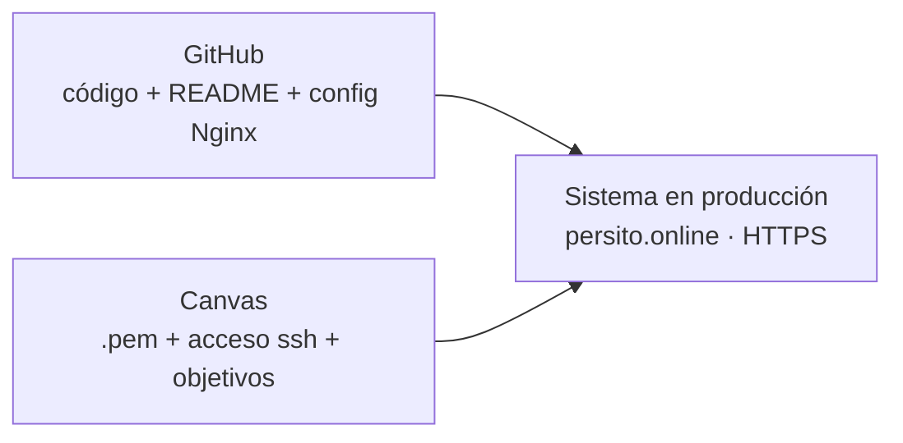

# Etapa 15 — Preparación de la entrega final

> **Archivo:** `etapas/etapa-15-entrega-final.md`
> **Estado:** Completado
> **Checkpoint objetivo:** CP-P7 — Verificación end-to-end final y entrega lista — **alcanzado**

---

## 1. Objetivo de la etapa

Al terminar esta etapa tendremos la **entrega final lista**:

1. **README completo** con consideraciones generales, dominio, método de acceso (`ssh` con `.pem`) y **puntos logrados/no logrados** (DOC-2).
2. **Checklist final de producción**: servicios healthy, dominio, HTTPS, RabbitMQ, paginación y filtros.
3. **Accesos para Canvas**: archivo `.pem`, comando `ssh` y objetivos logrados; el `.pem` **nunca** se sube al repositorio (ENT-1).
4. **Verificación end-to-end final** en producción.

**Alcance:** es la etapa de cierre del roadmap (entrega).

**Prerrequisitos:** Etapas 1–14 cerradas.

---

## 2. Requisitos del enunciado que cubre

| Requisito | Cómo se cubre |
| --- | --- |
| DOC-2 (README con logrados/no logrados) | Sección de entrega en el README |
| ENT-1 (accesos Canvas + `.pem` entregado, NO en GitHub) | Accesos preparados y verificado que `.pem` no está en el repo |
| CP-P7 (verificación end-to-end final) | Checklist + curl final en producción |
| Causas de rechazo (enunciado) | Evitar `.pem` en GitHub, entregas no healthy, dominio sin apuntar |

---

## 3. Teoría general necesaria

### 3.1 README de entrega (enunciado)
El enunciado exige un README que señale:
- **Consideraciones generales** (stack, arquitectura, decisiones).
- **Nombre del dominio**.
- **Método de acceso** al servidor con `.pem` y `ssh` (**sin publicar las credenciales en el repositorio**).
- **Puntos logrados o no logrados** y comentarios por aspecto a evaluar (parte mínima y variable).

### 3.2 Entregables para Canvas
- El **`.pem`** se sube al buzón de Canvas (no al repo); no subirlo implica no corrección.
- Se entregan también la **IP pública/dominio** y el **comando de acceso SSH**.

### 3.3 Checklist final de producción
Verificación de que todo lo desplegado está healthy y accesible: servicios, dominio, HTTPS, consumo de RabbitMQ, paginación y filtros.

---

## 4. Aplicación específica a EnergyShark

| Elemento | Valor |
| --- | --- |
| Dominio | `https://persito.online` |
| Acceso SSH | `ssh -i ~/.ssh/energyshark.pem energyshark@3.216.254.80` |
| Repositorio | `https://github.com/Pedr0sit0s/iic2173-energyshark` |
| `.pem` | Se entrega por Canvas; **verificado que NO está en GitHub** |
| Parte variable | HTTPS con Let's Encrypt (elegida) |
| Servicios | `master` + `connector` en EC2 (Compose), RDS, Nginx + HTTPS |

---

## 5. Decisiones técnicas

| # | Decisión | Alternativas | Recomendación y por qué |
| --- | --- | --- | --- |
| 1 | README de entrega | Reescribir el README vs añadir sección | **Añadir sección de entrega** al README existente (ya tiene arquitectura, quickstart y requisitos) |
| 2 | `.pem` | En el repo vs fuera | **Fuera del repo**: se sube solo a Canvas; verificar con `git ls-files` |
| 3 | Accesos | Solo IP vs IP + dominio + ssh | **IP + dominio + comando ssh**: lo que pide el enunciado para la corrección |
| 4 | Checklist | Manual vs script | **Manual con comandos reproducibles** (curl, docker ps, dig, openssl) |
| 5 | Verificación final | Solo local vs producción | **Producción**: todo lo que no está en prod "no está terminado" (enunciado) |

---

## 6. Diagramas

### 6.1 Entregables finales



---

## 7. Sub-etapas

### 7.1 Sub-etapa 15.1 — README completo
Arquitectura, despliegue, requisitos logrados/no logrados y consideraciones.

### 7.2 Sub-etapa 15.2 — Checklist final de producción
Servicios healthy, dominio, HTTPS, RabbitMQ, paginación y filtros.

### 7.3 Sub-etapa 15.3 — Accesos para Canvas + `.pem`
Preparar los accesos y verificar que el `.pem` no está en GitHub.

### 7.4 Sub-etapa 15.4 — Verificación end-to-end final
Comprobación final del flujo en producción (CP-P7).

---

## 8. Pasos concretos — Action Items

### Paso 0 — Prerrequisitos
1. Etapas 1–14 cerradas y pusheadas.
2. Acceso a la EC2 (`.pem` local) y al panel de Canvas.
3. **Verificar:** `git status` limpio.

### Paso 1 — 15.1 README completo
1. Revisar el README actual (arquitectura, quickstart, estado, requisitos).
2. Añadir la **sección de entrega**: consideraciones, dominio, método de acceso, y **tabla de logrados/no logrados** (parte mínima y variable).
3. **Verificar:** el README responde a lo que pide el enunciado.

### Paso 2 — 15.2 Checklist final de producción
1. Ejecutar y anotar:
   ```bash
   curl -s https://persito.online/health
   curl -s "https://persito.online/history?page=2&limit=25&type=demand-set"
   dig +short persito.online
   echo | openssl s_client -connect persito.online:443 -servername persito.online 2>/dev/null | openssl x509 -issuer -dates
   # en la EC2:
   docker compose -f compose.prod.yaml ps          # healthy
   docker compose -f compose.prod.yaml logs --tail=50 connector   # consume + ack
   ```
2. **Verificar:** todo healthy; dominio resuelve; HTTPS válido; RabbitMQ consumiendo; paginación y filtros responden.

### Paso 3 — 15.3 Accesos para Canvas + `.pem`
1. Verificar que el `.pem` **no** está en el repositorio:
   ```bash
   git ls-files | grep -i pem    # debe estar vacío
   ```
2. Preparar el texto de entrega para Canvas: dominio, IP, comando `ssh -i ... energyshark@3.216.254.80`, y objetivos logrados.
3. **Verificar:** sin `.pem` en GitHub (ENT-1).

### Paso 4 — 15.4 Verificación end-to-end final
1. `POST` indirecto: confirmar que `connector` consume de `observer.45.q` (logs) y que `GET /history` crece (puedes anotar `meta.total` dos veces separadas por minutos).
2. Verificar `/history/:id` con un id real y un 404.
3. **Verificar:** CP-P7 alcanzado (flujo completo en producción).

### Paso 5 — Cierre y versionado
1. Registrar en la bitácora (Entrada 32) y en `ai_docs/prompts/`.
2. Actualizar `etapas/README.md` (Etapa 15 → Completado) y la matriz (DOC-2, ENT-1 → Completado).
3. Commits: `docs(readme)` para la entrega, `docs(bitacora)`, `docs(etapa-15)`, `docs(ai)`; tag final `v1.0` opcional.
4. **Verificar:** `git push origin main` y working tree limpio.

---

## 9. Comandos necesarios

```bash
# Checklist de producción
curl -s https://persito.online/health
curl -s "https://persito.online/history?page=2&limit=25&type=demand-set"
curl -s -o /dev/null -w "%{http_code}" https://persito.online/history/$(uuidgen)
dig +short persito.online
echo | openssl s_client -connect persito.online:443 -servername persito.online 2>/dev/null | openssl x509 -issuer -dates

# En la EC2
docker compose -f compose.prod.yaml ps
docker compose -f compose.prod.yaml logs --tail=50 connector

# Seguridad
git ls-files | grep -i pem   # vacío

# Acceso (para Canvas)
ssh -i ~/.ssh/energyshark.pem energyshark@3.216.254.80
```

---

## 10. Resultados esperados

- README con la sección de entrega completa (consideraciones, dominio, acceso, logrados/no logrados).
- Checklist final de producción todo en verde.
- Accesos preparados para Canvas; `.pem` fuera del repo (verificado).
- Verificación end-to-end final (CP-P7).
- Matriz: DOC-2 y ENT-1 → Completado.
- Bitácora y `ai_docs/prompts/` actualizados; entrega lista.

---

## 11. Métodos de verificación

| Verificación | Cómo realizarla |
| --- | --- |
| README de entrega | Contiene las 4 secciones pedidas por el enunciado |
| Servicios healthy | `docker compose ps` (EC2) |
| Dominio y HTTPS | `dig`, `openssl`, `curl https://persito.online/health` |
| RabbitMQ | Logs del `connector` con `ACK`/consumo |
| Paginación y filtros | `curl "?page=2&limit=25&type=demand-set"` |
| `.pem` fuera del repo | `git ls-files | grep -i pem` vacío |
| CP-P7 | Evidencia en la bitácora (Entrada 32) |

---

## 12. Errores comunes y troubleshooting

| Problema probable | Cómo diagnosticarlo / evitarlo |
| --- | --- |
| `.pem` subido por error | **Rechazo directo (nota 1)**: verificar `git ls-files | grep -i pem`; si apareció, rotar y limpiar historial |
| Entrega no healthy | `docker compose ps` y `/health` en rojo → corregir antes de subir |
| Dominio sin apuntar | `dig` no resuelve a la EIP → revisar registro A (Etapa 9) |
| HTTPS con certificado vencido | Verificar fechas con `openssl`; el timer debería renovar |
| README sin la sección de logrados | Revisar contra el enunciado (DOC-2) |

---

## 13. Checklist de finalización

- [x] README con consideraciones, dominio, acceso y logrados/no logrados.
- [x] Checklist final de producción en verde (healthy, dominio, HTTPS, RabbitMQ, paginación, filtros).
- [x] `.pem` fuera del repositorio (verificado).
- [x] Texto de entrega para Canvas preparado (dominio, IP, ssh, objetivos).
- [x] Verificación end-to-end final (CP-P7).
- [x] Bitácora (Entrada 32) y `ai_docs/prompts/` actualizados.
- [x] Matriz: DOC-2 y ENT-1 → Completado.
- [x] Estado en `etapas/README.md` (Etapa 15 → Completado).
- [x] Commits realizados, pusheados y working tree limpio.

---

## 14. Pruebas locales

| # | Prueba | Resultado esperado |
| --- | --- | --- |
| 1 | `git ls-files | grep -i pem` | Vacío |
| 2 | `curl https://persito.online/health` | 200 ok |

---

## 15. Pruebas en producción

| # | Prueba | Resultado esperado |
| --- | --- | --- |
| 1 | `docker compose ps` (EC2) | `master` y `connector` `healthy` |
| 2 | `curl https://persito.online/history?page=2&limit=25&type=demand-set` | 200 con `meta` |
| 3 | `curl -o /dev/null -w "%{http_code}" https://persito.online/history/<id-inexistente>` | 404 |
| 4 | Logs del `connector` | Consumo + `ACK` recientes |
| 5 | `dig` + `openssl` | Dominio → EIP; certificado válido |

---

## 16. Registro para la bitácora

Al terminar la etapa, registrar en `docs/bitacora.md`:

- Fecha y objetivo de la etapa (Entrada 32).
- Resultado del checklist final de producción.
- Evidencia de la verificación end-to-end (CP-P7).
- Confirmación de que el `.pem` no está en GitHub.
- Entregables preparados para Canvas.

---

## 17. Siguiente etapa

**No hay**: esta es la etapa final del roadmap. Tras ella, el proyecto queda entregado (checkpoint final CP-P7).
